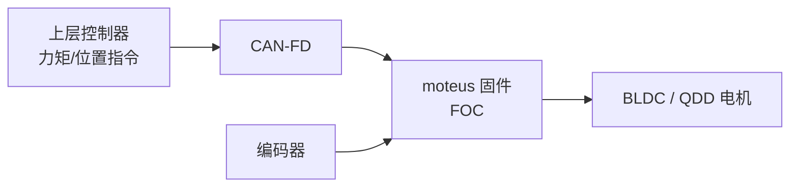

# moteus（mjbots 关节驱动器）

## 一句话定义

**moteus** 是 [mjbots](https://mjbots.com) 的开源无刷电机控制器栈（[GitHub](https://github.com/mjbots/moteus)）：驱动 PCB、固件、FOC、编码器与 **CAN-FD**，面向腿足/机械臂关节的位置、速度与力矩控制。

## 英文缩写速查

| 缩写 | 英文全称 | 简要说明 |
|------|----------|----------|
| FOC | Field-Oriented Control | 无刷电机的磁场定向控制 |
| CAN-FD | Controller Area Network with Flexible Data-rate | 更高载荷的 CAN 变体，关节总线常用 |
| BLDC | Brushless DC Motor | 无刷直流电机 |
| PCB | Printed Circuit Board | 印制电路板 |
| QDD | Quasi-Direct Drive | 准直驱，低减速比、高背驱动性的作动方案 |

## 为什么重要

- 在 [开源 QDD 执行器学习路线](../comparisons/open-source-qdd-actuator-projects.md) 中，它是 **SimpleFOC 之后** 学「真关节驱动板」的优先选项。
- Urs 等 3D 打印开源执行器论文选用 **moteus r4.5** 作为驱动，说明其在学术 QDD 原型中的普及度。
- 与 [执行器驱动链选型闭环](../queries/actuator-drive-chain-selection-loop.md) 第②层（FOC 固件）对齐：可对照自研板 vs 成品驱动。

## 核心结构/机制

| 模块 | 内容 |
|------|------|
| 硬件 | 开源驱动 PCB（亦有商业成品） |
| 固件 | FOC 电流环与运动模式 |
| 传感 | 编码器接口 |
| 总线 | CAN-FD |
| 模式 | 位置 / 速度 / 力矩 |

## 工程实践

- 精读原理图：功率级、栅极驱动、电流采样、保护与 CAN-FD 收发——对应 [力矩电机路线 Stage 4](../../roadmap/depth-torque-motor-design.md)。
- 与 [SimpleFOC](./simplefoc.md) 分工：SimpleFOC 学算法与低功率组合；moteus 学关节级集成与总线。
- 与 [Tinymovr](./tinymovr.md) 对照：二者都适合「从零看小型驱动」；moteus 生态更偏多轴腿足。

## 局限与风险

- 商业板与开源设计并存，BOM/认证与安全回路需按整机规范自行补齐。
- 力矩精度仍受电流采样、\(K_t\) 标定与热降额约束——驱动开源 ≠ 力矩闭环验收完成。

## 关联页面

- [开源 QDD 执行器项目对比](../comparisons/open-source-qdd-actuator-projects.md)
- [SimpleFOC](./simplefoc.md)
- [Tinymovr](./tinymovr.md)
- [3D 打印开源腿式执行器论文](./paper-3d-printed-open-source-actuators-legged.md)
- [磁场定向控制（FOC）](../concepts/field-oriented-control.md)

## 参考来源

- [sources/repos/moteus.md](../../sources/repos/moteus.md)
- [开源 QDD 执行器学习策展](../../sources/personal/open_source_qdd_actuator_learning_curator.md)

## 推荐继续阅读

- 仓库：<https://github.com/mjbots/moteus>
- 产品站：<https://mjbots.com>
