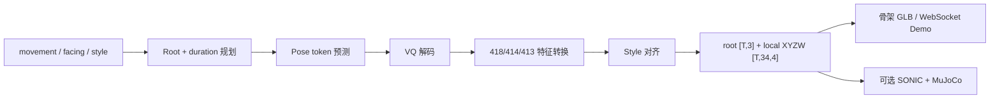
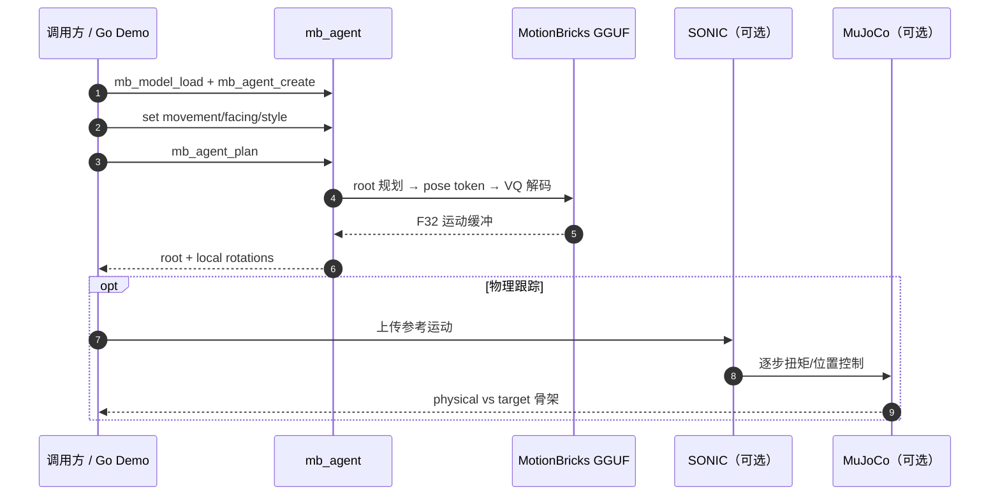

# motion-bricks.cpp（C++/GGML 本地 MotionBricks 运行时）

**motion-bricks.cpp**（[localai-org/motion-bricks.cpp](https://github.com/localai-org/motion-bricks.cpp)）把 NVIDIA [MotionBricks](../methods/motionbricks.md) 的 **G1 batch-one 生成路径** 移植为 **独立 C++ 推理引擎**：运行时 **不依赖 Python/PyTorch**，用 pinned [GGML](https://github.com/ggml-org/ggml) 在 **CPU 或 Vulkan** 上把运动/朝向/风格命令变成 **34 关节** 局部旋转与 root 平移。

## 一句话定义

**MotionBricks 的本地运行时**：GGUF 潜空间生成骨干 + style 资产，经 stateful agent 规划与回放；输出是运动学轨迹，不是扭矩指令。

## 英文缩写速查

| 缩写 | 英文全称 | 简要说明 |
|------|----------|----------|
| GGML | Georgi Gerganov Machine Learning | 本仓推理后端；pinned submodule |
| GGUF | GGML Unified Format | G1 F32 运行时包与 style `.mbstyle` 容器 |
| VQ | Vector Quantization | pose token 离散化与解码环节 |
| SONIC | Supersizing Motion Tracking for Natural Humanoid WBC | 可选 GGML 物理跟踪后端（MuJoCo 闭环） |
| G1 | Unitree G1 Humanoid | 34 关节目标平台 |
| WBC | Whole-Body Control | MotionBricks 上游意图层；本仓只做生成侧 |
| API | Application Programming Interface | 稳定 C ABI；PureGo 绑定无 cgo |

## 为什么重要

- **把 GR00T 预览栈拆成可嵌入运行时**：官方 [GR00T-WholeBodyControl/motionbricks](https://github.com/NVlabs/GR00T-WholeBodyControl/tree/main/motionbricks) 绑定 Python 与 Git LFS；现场、游戏引擎或无 Python 进程需要 **C ABI + GGUF**。
- **G1 路径已端到端验收**：183M F32 参数、15 种上游 style、14-plan CPU 开放环 strict parity；可选 **RTX 5070 Ti** 上 CPU/Vulkan bounded-error parity。
- **与 kimodo.cpp 同生态不同任务**：Kimodo 做 **文本→运动扩散**；MotionBricks 做 **速度/朝向/风格/关键帧式 Smart Locomotion**；Demo 可把 **Kimodo 动画** 作为 SONIC 跟踪输入（GLB→`.mbstyle` 仍待集成）。

## 核心原理

高层流程：`mb_model_load` → `mb_agent_create` → 设 movement/facing/style → `mb_agent_plan` → 播放时 `mb_agent_advance` 用已生成运动作下一窗口上下文。

| 模块 | 作用 |
|------|------|
| Planner | 根据命令与历史上下文决定 duration 与 root |
| Pose head | Gumbel 采样 pose token（默认）；argmax 供诊断 |
| Decoder | VQ + 特征转换还原连续关节运动 |
| Style | 15 种上游预转换 `.mbstyle`；运行时切换 |
| SONIC（可选） | GGML 策略 + MuJoCo 3.12 物理跟踪 |

## 源码运行时序图

最短复现：`cmake --preset debug && ctest --preset debug` → `go run ./demo`；权重由 `scripts/download_gguf_weights.py` 自动校验下载。

## 工程实践

| 项 | 做法 |
|----|------|
| 构建 | C++23、CMake preset（`debug` / `asan-ubsan` / `sonic-cpu`）；可选 Nix |
| 绑定 | PureGo 动态加载 `libmotionbricks`；推荐 `CGO_ENABLED=0` |
| 权重 | [MotionBricks-G1-GGML](https://huggingface.co/LocalAI-io/MotionBricks-G1-GGML)；NVIDIA Open Model License |
| 上游对照 | [GR00T motionbricks 预览](https://github.com/NVlabs/GR00T-WholeBodyControl/tree/main/motionbricks) + `reference/README.md` open-loop parity |
| 下游 | 运动学轨迹进 [SONIC](../methods/sonic-motion-tracking.md) / [ProtoMotions](./protomotions.md)；勿当真机扭矩 |

## 局限与风险

- **不是 NVIDIA 官方仓**：社区移植；上游 preview revision 或 tokenizer 变更需自行回归 parity。
- **能力子集**：Smart Object 全作者工具链、Kimodo GLB 直转 style、量化 GGUF **尚未实现**；复杂物体交互仍走 Python 预览栈。
- **与 [kimodo.cpp](./kimodo-cpp.md) 勿混用**：前者 **命令式 locomotion**，后者 **文本扩散**；选型见 [MotionBricks](../methods/motionbricks.md) vs [Kimodo](./kimodo.md)。

## 关联页面

- [MotionBricks（方法页）](../methods/motionbricks.md) — Smart Primitives 与 GR00T 角色
- [paper-motionbricks](./paper-motionbricks.md) — 论文与官方开源边界
- [Kimodo](./kimodo.md) — Demo 可选动画来源；文本约束生成仍走官方 Python
- [SONIC 运动跟踪](../methods/sonic-motion-tracking.md) — 可选 GGML 跟踪后端
- [GR00T-WholeBodyControl](./gr00t-wholebodycontrol.md) — 官方预览代码母仓

## 参考来源

- [sources/repos/motion-bricks-cpp.md](../../sources/repos/motion-bricks-cpp.md)
- [sources/sites/motionbricks-project.md](../../sources/sites/motionbricks-project.md)
- [MotionBricks-G1-GGML（HF）](https://huggingface.co/LocalAI-io/MotionBricks-G1-GGML)

## 推荐继续阅读

- [motion-bricks.cpp README](https://github.com/localai-org/motion-bricks.cpp) — API 选择与 SONIC 性能剖析
- [NVIDIA MotionBricks 项目页](https://nvlabs.github.io/motionbricks/)
