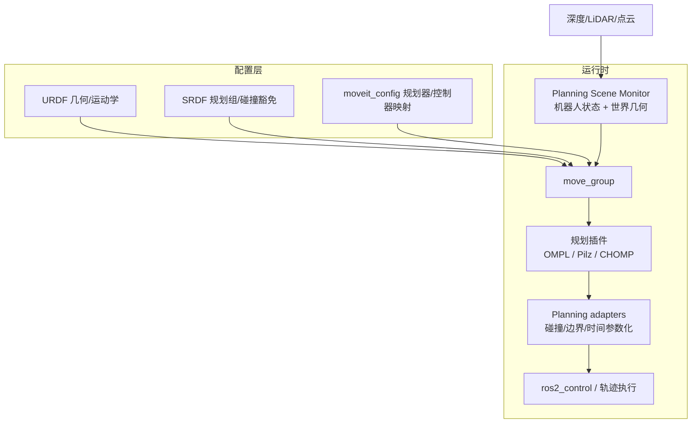

---

type: entity
tags: [ros2, motion-planning, manipulation, inverse-kinematics, collision-checking, ompl, moveit, pick-and-place, linux-foundation]
status: complete
date: 2026-06-15
updated: 2026-06-15
related:
  - ../tasks/manipulation.md
  - ../concepts/ros2-basics.md
  - ../methods/model-predictive-control.md
  - ../methods/trajectory-optimization.md
  - ./curobo.md
  - ./crocoddyl.md
  - ./pinocchio.md
  - ./urdf-studio.md
  - ./cad-skills.md
  - ./navigation2.md
sources:
  - ../../sources/sites/moveit-official-portal.md
  - ../../sources/sites/moveit2-picknik-documentation.md
  - ../../sources/sites/moveit1-noetic-tutorials.md
  - ../../sources/repos/moveit-moveit2.md
  - ../../sources/repos/moveit-moveit1.md
  - ../../sources/repos/ros-planning-srdfdom.md
summary: "MoveIt 2 是 ROS 2 上事实标准的机械臂运动规划与操作框架：move_group + Planning Scene + URDF/SRDF 配置，插件化 OMPL/Pilz/CHOMP 规划，经 ros2_control 执行；MoveIt 1（Noetic）为 ROS 1 遗留线，MoveIt Pro 为商业扩展。"
---

# MoveIt 2

## 一句话定义

**MoveIt 2** 是面向 **ROS 2** 的开源 **运动规划、操作与运动学** 框架（[moveit/moveit2](https://github.com/moveit/moveit2)）：以 **`move_group`** 为核心节点，在 **Planning Scene** 中做碰撞感知规划，经 **插件化规划器**（默认 **OMPL**，亦含 **Pilz**、**CHOMP** 等）生成时间参数化轨迹，并通过 **ros2_control** 等接口下发执行；配置依赖 **URDF + SRDF + moveit_config** 三件套。

## 英文缩写速查

| 缩写 | 英文全称 | 简要说明 |
|------|----------|----------|
| ROS 2 | Robot Operating System 2 | 机器人系统集成与通信的常用中间件 |
| URDF | Unified Robot Description Format | 统一机器人描述格式（link/joint 几何与运动学） |
| SRDF | Semantic Robot Description Format | 语义机器人描述：规划组、碰撞豁免、末端执行器等 |
| IK | Inverse Kinematics | 满足末端/姿态约束求解关节角的运动学逆解 |
| OMPL | Open Motion Planning Library | 开源运动规划算法库，MoveIt 默认规划后端之一 |
| CHOMP | Covariant Hamiltonian Optimization for Motion Planning | 基于优化的轨迹规划方法 |
| MTC | MoveIt Task Constructor | 多 stage 可组合 pick-and-place 任务管线 |
| FK | Forward Kinematics | 由关节角计算末端位姿 |
| LiDAR | Light Detection and Ranging | 激光雷达，用于场景占用与避障感知 |

## 为什么重要

- **操作栈事实标准**：门户称 MoveIt 已用于 **150+ 机器人**；[Manipulation](../tasks/manipulation.md) 中「感知→抓取→执行」的 **可达性/碰撞过滤** 常落点 MoveIt 或与其集成的 GPU 规划器（如 [cuRobo](./curobo.md) / Isaac ROS cuMotion）。
- **ROS 2 生态枢纽**：与 [ROS 2 基础](../concepts/ros2-basics.md)、**ros2_control**、Gazebo/Ignition 仿真、RViz 可视化形成 **「描述—规划—控制—仿真」** 闭环；移动底盘侧对照 [Navigation2](./navigation2.md)。
- **配置即产品**：**Setup Assistant** 向导生成 `moveit_config`；语义层 **SRDF** 由 [srdfdom](https://github.com/ros-planning/srdfdom) 解析，与 [URDF-Studio](./urdf-studio.md)、[CAD Skills](./cad-skills.md) 等 URDF/SRDF 产出工具上下游衔接。

## MoveIt 1 vs MoveIt 2 vs MoveIt Pro

| 线 | ROS | 状态（据 [moveit.ai](https://moveit.ai/)） | 一手资料 |
|----|-----|-------------------------------------------|----------|
| **MoveIt 2 Jazzy 2.12** | ROS 2 | **最新稳定 LTS，推荐** | [moveit.picknik.ai](https://moveit.picknik.ai/) |
| **MoveIt 2 Humble 2.5** | ROS 2 | 维护中 | 同上（`humble/` 文档分支） |
| **MoveIt 2 Rolling** | ROS 2 | 持续开发 | 同上（`main/`） |
| **MoveIt 1 Noetic 1.1** | ROS 1 | 维护中（遗留） | [moveit/moveit](https://github.com/moveit/moveit)、[Noetic 教程](https://moveit.github.io/moveit_tutorials/) |
| **MoveIt Pro** | ROS 2 | 商业支持（PickNik） | [picknik.ai/pro](https://picknik.ai/pro) |

新 ROS 2 项目应默认 **MoveIt 2**；Noetic 仅作迁移对照或遗留系统维护。

## 核心结构

| 组件 | 角色 |
|------|------|
| **`move_group`** | 聚合规划 action/service、场景监控与执行接口的关键节点 |
| **Planning Scene / PSM** | 机器人状态 + 世界几何 + 附着物体；**Planning Scene Monitor** 融合传感器（深度/LiDAR）与用户输入 |
| **Motion Planning Plugin** | 插件接口对接 OMPL、Pilz、CHOMP 等；Request→适配器链→Result |
| **Planning adapters** | 起始状态边界/碰撞检查、工作空间验证、**时间参数化** 等后处理 |
| **Kinematics** | FK/IK 求解器插件（含冗余臂） |
| **Collision checking** | 自碰、环境碰、attached object；支持 primitive / mesh / 点云 |
| **Perception** | Occupancy map monitor、Octomap、depth image updater 等 |
| **Controllers** | 经 **ros2_control** / simple controller manager 执行轨迹 |
| **MTC** | 多子任务依赖的 pick-and-place 组合（官方 Concepts + 教程） |

## 流程总览

## 与相邻规划栈的对照

- **[cuRobo](./curobo.md)**：GPU 并行 **IK + 几何规划 + 轨迹优化**；经 **Isaac ROS cuMotion** 等以 **MoveIt 插件** 形态集成，适合 **高吞吐重规划**；MoveIt 2 仍是 **ROS 语义、场景与执行** 的宿主。
- **[Crocoddyl](./crocoddyl.md)** / **[Pinocchio](./pinocchio.md)**：最优控制 / 动力学侧对照；MoveIt 默认更偏 **几何碰撞 + 采样/工业规划器**，动力学约束需额外模块或 Pilz 等工业轨迹类型。
- **学习式抓取**（[AnyGrasp](./anygrasp.md) 等）：网络输出抓取候选后，常仍用 MoveIt **IK + 碰撞过滤** 做可执行性筛选（见 [grasp-pose-estimation](../methods/grasp-pose-estimation.md)）。

## 常见误区或局限

- **误区：装好 MoveIt 即可生产抓取。** 仍需可靠 **URDF/SRDF 标定**、控制器 tuning、感知延迟与 **人类安全区域**；MoveIt 输出的是 **几何可行轨迹**，不保证接触力控或工艺成功。
- **误区：MoveIt 2 与 MoveIt 1 launch/API 可直接互换。** 须按 [MIGRATION_GUIDE](https://github.com/moveit/moveit2/blob/main/doc/MIGRATION_GUIDE.md) 迁移 action 名、参数与 ros2_control 映射。
- **误区：SRDF 可选。** 无 SRDF 则无法正确定义 **planning group**、**disabled collisions** 与 **end effector**，Setup Assistant 产物不完整。
- **局限：** 默认栈面向 **机械臂/移动操作** 几何规划；**全向移动底盘导航** 用 Nav2；**腿式/人形全身 WBC** 不在 MoveIt 核心范围（可部分借 IK/碰撞库，但非主战场）。

## 关联页面

- [Manipulation（操作任务）](../tasks/manipulation.md) — 抓取、放置与移动操作任务语境
- [ROS 2 基础](../concepts/ros2-basics.md) — 中间件与 launch 前提
- [cuRobo](./curobo.md) — GPU 运动生成与 MoveIt 插件集成
- [URDF-Studio](./urdf-studio.md) — Web 端 URDF/MJCF 编辑；与 MoveIt 配置上下游
- [CAD Skills](./cad-skills.md) — SRDF/URDF Agent Skills 与 MoveIt 语义层
- [Model Predictive Control](../methods/model-predictive-control.md) / [Trajectory Optimization](../methods/trajectory-optimization.md) — 规划算法对照

## 推荐继续阅读

- [MoveIt 2 官方文档](https://moveit.picknik.ai/main/)
- [MoveIt 门户与版本矩阵](https://moveit.ai/)
- [move_group 概念](https://moveit.picknik.ai/main/doc/concepts/move_group.html)
- [Motion Planning 概念](https://moveit.picknik.ai/main/doc/concepts/motion_planning.html)
- [MoveIt 1 Noetic 教程](https://moveit.github.io/moveit_tutorials/)（迁移对照）

## 参考来源

- [MoveIt 官方门户（moveit.ai）](../../sources/sites/moveit-official-portal.md)
- [MoveIt 2 官方文档（moveit.picknik.ai）](../../sources/sites/moveit2-picknik-documentation.md)
- [MoveIt 1 Noetic 教程站](../../sources/sites/moveit1-noetic-tutorials.md)
- [moveit/moveit2 仓库归档](../../sources/repos/moveit-moveit2.md)
- [moveit/moveit（MoveIt 1）仓库归档](../../sources/repos/moveit-moveit1.md)
- [ros-planning/srdfdom 仓库归档](../../sources/repos/ros-planning-srdfdom.md)
