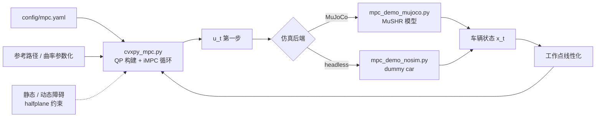
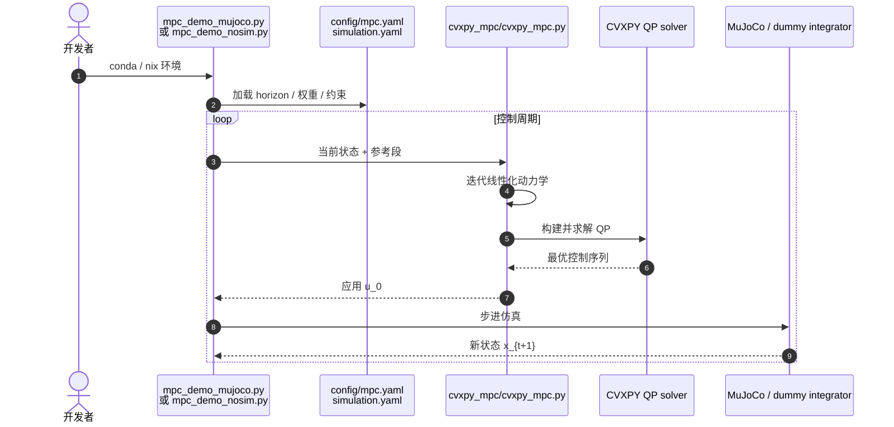

# mpc_python

**mpc_python**（[mcarfagno/mpc_python](https://github.com/mcarfagno/mpc_python)）是一个 **MIT** 开源教学仓库：用 **[CVXPY](https://www.cvxpy.org/)** 实现 **迭代线性化 MPC（iMPC）** 做路径跟踪，可选 **MuJoCo + [MuSHR](./mushr.md)** 阿克曼小车仿真，或 headless dummy car；并附带从模型推导到障碍 halfplane 约束的 Jupyter 笔记链。

## 一句话定义

**用 CVXPY 把「滚动 QP + 迭代线性化」的 iMPC 路径跟踪写清楚，并接到 MuJoCo/MuSHR 上跑通静态与动态避障 demo——适合作为从基础控制到实时凸优化的第一套可改代码。**

## 英文缩写速查

| 缩写 | 英文全称 | 简要说明 |
|------|----------|----------|
| MPC | Model Predictive Control | 滚动时域优化控制 |
| iMPC | Iterative MPC | 每步对非线性模型线性化后重复解 QP |
| QP | Quadratic Programming | 二次规划，CVXPY 主求解形式 |
| LMPC | Linear MPC | 固定线性化点的线性 MPC（对照 iMPC） |
| NMPC | Nonlinear Model Predictive Control | 非线性动力学直接 NLP 求解（本仓非主路径） |

## 为什么重要

- **QP 优先、易读：** 刻意用 CVXPY 维持 **严格 QP** 框架，通过 **迭代线性化** 桥接非线性车辆运动学——比直接上 CasADi/Acados NLP 更适合 **第一遍理解 MPC 闭环**。
- **双入口 demo：** `mpc_demo_mujoco.py`（MuJoCo + MuSHR）与 `mpc_demo_nosim.py`（无物理）覆盖 **有/无仿真** 两种实验路径；Nix flake 提供可复现 shell。
- **与站内导航主线互链：** 路径跟踪 MPC 是 [自动驾驶核心算法](../overview/autonomous-driving-core-algorithms-series.md) 与 [导航栈](../overview/navigation-slam-autonomy-stack.md) 的局部控制一环；本仓与 [PythonRobotics](./python-robotics.md) 的 MPC 章节、Borrelli 材料形成 **Python 教学三角**。
- **障碍约束仍在演进：** halfplane 静态/动态避障 demo 已有，notebook 3.x 标注 **WIP**——读代码时注意约束版本与 notebook 可能不同步。

## 核心信息

| 项 | 内容 |
|----|------|
| **机构** | 独立维护者（mcarfagno）；MuSHR 模型源自华盛顿大学 PRL |
| **许可** | MIT |
| **求解器** | CVXPY（QP） |
| **仿真** | MuJoCo + MuSHR 模型（源自 prl-mushr） |
| **配置** | `config/mpc.yaml`、`config/simulation.yaml` |
| **开源** | **已开源** 代码 + demo + 笔记 + Nix flake |

## 核心原理

### 迭代线性化 MPC（iMPC）

在每个控制周期：

1. 在当前状态附近 **线性化** 非完整约束车辆运动学；
2. 用 CVXPY 构建 **有限时域 QP**（跟踪参考路径 + 控制正则）；
3. 执行 **第一步** 控制，测量新状态，**重复线性化**。

这与固定工作点的 LMPC 不同：非线性由 **外环迭代** 处理，内环保持 **凸 QP** 结构与可读性。

### 流程总览

## 源码运行时序图

节点对齐 [`sources/repos/mpc_python.md`](../../sources/repos/mpc_python.md) 与 README。

- **改参起点：** `config/mpc.yaml`（预测步长、Q/R、迭代次数等）。
- **障碍 demo：** README 展示 static / moving obstacle GIF；notebook `3.x` 约束推导仍 **WIP**，以 `cvxpy_mpc.py` 当前实现为准。

## 工程实践

| 项 | 建议 |
|----|------|
| 环境 | Conda `env.yml` 或 Nix flake（`nix run .#mujoco-demo`） |
| GUI | Nix 下 MuJoCo 需 `nixGL python mpc_python/mpc_demo_mujoco.py` |
| 学习顺序 | notebooks `1.x` 模型 → `2.x` iMPC → `3.x` 障碍（WIP） |
| 对照 | [MPC 方法页](../methods/model-predictive-control.md) 理论；[PythonRobotics](./python-robotics.md) Path Tracking MPC |
| 硬件 | 真机需自行接 ROS/Nav2；本仓 **不含** 真机驱动 |

## 局限与风险

- **教学规模，非工业栈：** 无 ROS 2 / Nav2 集成、无安全监控与硬实时保证。
- **CVXPY 实时性：** 适合学习与小规模 demo；高频人形/赛车 NMPC 应看 Acados / OSQP 工程栈（见 [MPC 方法页](../methods/model-predictive-control.md)）。
- **iMPC 收敛：** 强非线性或大参考曲率时需调线性化迭代与 horizon；notebook 2.x 记录多种坐标系/简化变体。
- **障碍模块未完成：** 3.x notebook 标注 WIP；部署前以代码与 demo 行为为准。

## 结论

**mpc_python 的价值在于「把 iMPC + CVXPY QP 闭环写短、写透、并能用 MuSHR 看见」——它是理解 MPC 如何接路径跟踪与半平面避障的轻量动手入口，而不是量产控制器。**

- **优先读 `config/mpc.yaml` + `cvxpy_mpc.py`：** 改 horizon/权重即可观察跟踪与迭代线性化行为，比先啃 NLP 求解器更省时间。
- **MuJoCo 与 headless 二选一即可验证：** 前者看 MuSHR 物理与避障 GIF 同款场景，后者快速扫 QP 逻辑。
- **与 PythonRobotics / MuSHR 联读：** 算法直觉（PythonRobotics）→ iMPC 实现（本仓）→ ROS 教育平台（MuSHR）→ 工程 Nav2。
- **勿当 CasADi/Acados 替代品：** 需要毫秒级 NMPC 或复杂接触约束时，应迁移到专用求解器栈。

## 关联页面

- [Model Predictive Control](../methods/model-predictive-control.md)
- [MuSHR](./mushr.md) — demo 车辆模型来源
- [PythonRobotics](./python-robotics.md) — 同类 Python 导航/跟踪教学仓
- [Quadratic Programming](../formalizations/quadratic-programming.md)
- [导航·SLAM·自动驾驶栈总览](../overview/navigation-slam-autonomy-stack.md)

## 参考来源

- [mpc_python 仓库归档](../../sources/repos/mpc_python.md)
- [mcarfagno/mpc_python](https://github.com/mcarfagno/mpc_python)

## 推荐继续阅读

- [Prof. Borrelli — Kinematic MPC 材料](https://borrelli.me.berkeley.edu/pdfpub/IV_KinematicMPC_jason.pdf)
- [alexliniger/MPCC](https://github.com/alexliniger/MPCC)
- [CMU Optimal Control 2025 — Convex MPC](../entities/cmu-optimal-control-curriculum.md)
