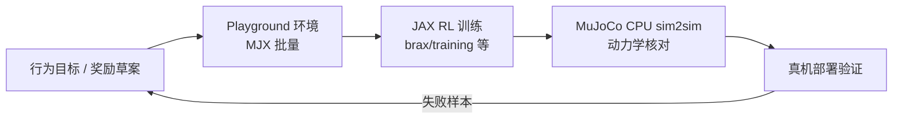

# MuJoCo Playground

**MuJoCo Playground**（[google-deepmind/mujoco_playground](https://github.com/google-deepmind/mujoco_playground)）是 Google DeepMind 维护的 **MJX 机器人学习环境库**：提供四足、人形、灵巧手、机械臂等多类任务，并把 **环境搭建 → 并行训练 → 批量渲染 → sim2real 部署** 组织成更易复现的路径。它不试图取代 [Isaac Lab](./isaac-lab.md) 级重平台，而是缩短 **从想法到真机可见策略** 的墙钟。

## 一句话定义

> **time-to-robot 导向的 MuJoCo 生态训练入口**——在透明物理与 GPU 批量（MJX）之间，优先降低「奖励迭代 + 部署验证」的工程摩擦。

## 英文缩写速查

| 缩写 | 英文全称 | 简要说明 |
|------|----------|----------|
| MJX | MuJoCo JAX | MuJoCo 的 JAX/XLA 后端，支持可微与批量仿真 |
| MuJoCo | Multi-Joint dynamics with Contact | 接触丰富的刚体物理仿真引擎 |
| RL | Reinforcement Learning | 通过与环境交互最大化长期回报来学习策略的范式 |
| Sim2Real | Simulation to Real | 把仿真中学到的策略迁移落地真机的工程主线 |
| JAX | JAX | 支持自动微分与 XLA 编译的数值计算库 |
| GPU | Graphics Processing Unit | MJX 批量 rollout 的算力基础 |
| Isaac Lab | NVIDIA Isaac Lab | 大平台层：多模态传感与 USD 场景工作台 |

## 为什么重要

- **分层而非替代：** 与 [Isaac Lab](./isaac-lab.md) 不在同一竞争平面——Playground 偏 **快速原型与真机检查点**；Isaac Lab 偏 **复杂场景与多传感大规模训练**（见 [训练栈分层地图](../overview/robot-training-stack-layers-technology-map.md)）。
- **社区默认入口：** [Brax](./brax.md) README 已将新环境工作导向 Playground + `brax/training`；[mjlab_playground](./mjlab-playground.md)、[Open Duck Playground](./open-duck-playground.md)、LIFT 等管线均以 Playground/MJX 为预训练或任务模板。
- **复现摩擦：** 奖励常需多轮迭代；环境安装、资产对齐、部署脚本若分散，会吞噬实验墙钟——Playground 把这类成本显式当作产品目标。

## 流程总览

## 常见误区或局限

- **误区：Playground = 又一个 env 列表。** 其价值在 **链路组织**（time-to-robot），而非单环境 benchmark 分数。
- **误区：可完全替代 Isaac Lab。** 多相机、重 USD 场景、企业级传感器仿真仍倾向 Omniverse 栈。
- **局限：** 与 [mjlab](./mjlab.md) 的 manager-based 长期模块化是不同路线；复杂任务维护可能迁移到 mjlab 端口（见 [mjlab_playground](./mjlab-playground.md)）。

## 关联页面

- [MuJoCo](./mujoco.md) — 底层物理与 sim2sim 文化
- [MuJoCo MJX](./mujoco-mjx.md) — Playground 的计算后端
- [mjlab](./mjlab.md) — Isaac Lab API + MuJoCo Warp 的轻量组合
- [Newton Physics](./newton-physics.md) — 官方列出的兼容上层框架之一
- [仿真器选型指南](../queries/simulator-selection-guide.md)

## 参考来源

- [MuJoCo Playground 仓库归档（本站）](../../sources/repos/mujoco_playground.md)
- [具身智能研究室：训练栈分层解读](../../sources/blogs/wechat_embodied_ai_lab_robot_training_stack_layers_2026.md)
- [MuJoCo Playground（GitHub）](https://github.com/google-deepmind/mujoco_playground)

## 推荐继续阅读

- [playground.mujoco.org](https://playground.mujoco.org/) — 官方项目页与任务浏览
