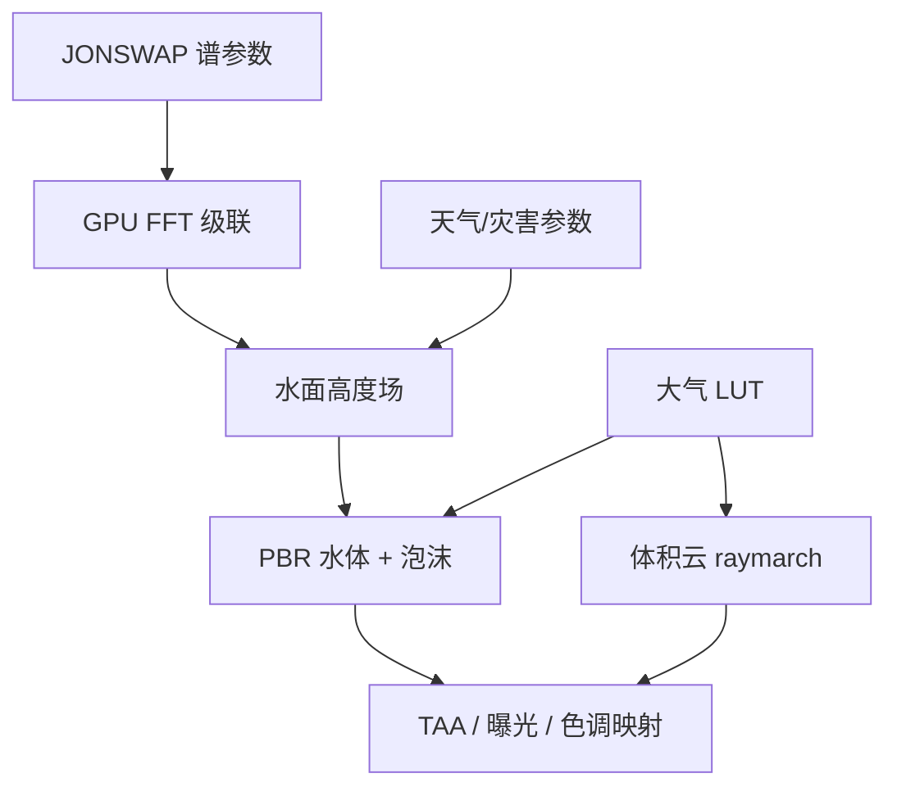

# natural-disasters（ABYSSAL）

**natural-disasters**（品牌名 **ABYSSAL**，[`Token-Gremlin/natural-disasters`](https://github.com/Token-Gremlin/natural-disasters)，MIT，~232★）是 **浏览器 Tab 内运行的全程序化海洋与极端天气** 演示：无纹理、无预制网格、无 HDRI——波浪、云、泡沫、闪电与海啸墙均在 **GPU 运行时生成**（Three.js r169 + WebGL2/GLSL3）。在线演示：[token-gremlin.github.io/natural-disasters](https://token-gremlin.github.io/natural-disasters/)。

## 一句话定义

**纯数学驱动的实时海洋+天气电影级场景**——技术上是图形学 demo，对机器人栈的价值是 **程序化环境场与 FFT 海面管线** 的可参考实现，而非可训练的物理仿真器。

## 英文缩写速查

| 缩写 | 英文全称 | 简要说明 |
|------|----------|----------|
| FFT | Fast Fourier Transform | 频域海浪演化 + butterfly IFFT |
| JONSWAP | Joint North Sea Wave Project | 海浪能量谱模型 |
| PBR | Physically Based Rendering | 水体 GGX/Fresnel/SSS 着色 |
| LUT | Look-Up Table | 预计算大气散射表 |
| TAA | Temporal Anti-Aliasing | 时域抗锯齿后处理 |
| EV100 | Exposure Value 100 | 自动曝光单位 |

## 为什么重要

- **零资产程序化**：与机器人 sim 里「程序化地形/天气 DR」同哲学——用参数化场替代手工关卡；适合理解 **无限域环境** 如何 O(1) 采样（对照 [Procedural Terrain Generation](../concepts/procedural-terrain-generation.md)）。
- **GPU 海洋管线样板**：多级联 FFT + Jacobian 泡沫 + 屏幕空间网格，是海事/两栖机器人 **可视化与数字孪生背景** 的常见技术栈参考。
- **灾害场与水面耦合**：飓风、海啸、水龙卷等 **变形同一水面高度场**——比贴花式特效更接近「环境力场」思维（虽无刚体动力学）。

## 核心信息

| 项 | 内容 |
|----|------|
| **作者** | Token-Gremlin |
| **许可** | MIT |
| **体积** | ~400 KB JS/GLSL（README） |
| **构建** | Vite；Node 20.19+ / 22.12+ |
| **模式** | Cinematic 自动风暴序列 / Sandbox 自由飞行触发灾害 |

## 核心原理

**海洋：** JONSWAP + 方向扩散 → GPU 多级联谱演化 → butterfly IFFT；泡沫由 Jacobian/波陡时间积分；PBR 水体 + 各向异性足迹粗糙度。

**大气：** Bruneton/Hillaire 风格散射 LUT；Perlin-Worley 体积云 + 天气图控制细胞尺度；云影投射到水面。

**灾害：** 暴雨、喷雾、分支闪电、水龙卷（射线步进漏斗）、飓风眼墙、Rogue wave、不对称海啸浅水剖面——均修改 **同一解析水面场**；屏幕空间网格与射线求交保持几何稳定。

### 流程总览



## 源码运行时序图

**不适用** — 单页 WebGL 应用，无 ROS/训练循环；运行时为主线程渲染循环 + 可选 sandbox 事件触发器。

## 工程实践

```bash
git clone https://github.com/Token-Gremlin/natural-disasters.git
cd natural-disasters && npm install && npm run dev
npm run build   # → dist/ 任意静态托管
```

| 项 | 说明 |
|----|------|
| 质量档位 | 运行时自适应帧预算（README Quality presets） |
| URL 参数 | 支持分享特定天气/相机状态（见 README） |
| CI | GitHub Actions `ci.yml` |

## 实验与评测

非学术论文项目；性能以目标 GPU 上维持帧预算为准，README 提供 **Performance** 与 **Browser support** 小节。

## 结论

ABYSSAL 是 **图形学向的程序化海洋+极端天气参考实现**——若目标是 RL 训练环境，应接 Isaac/MuJoCo 等物理引擎；若目标是 **理解 FFT 海面、体积天气与无资产部署**，本仓值得精读 shader 与谱参数接口。

1. **MIT 已开源**，Pages 即 `main` 构建产物。
2. **无/contact 动力学** — 不能替代 sim2real 物理验证。
3. 灾害触发适合 **演示与可视化**，不宜直接当机器人扰动模型。
4. 与 [img2threejs](./img2threejs.md) 同属 **浏览器 WebGL 程序化内容** 生态，但本仓是 **实时仿真着色** 而非代码生成。
5. 程序化户外几何还可对照 Terrain Diffusion 等索引（见 [Generative World Models](../methods/generative-world-models.md)）。

## 局限与风险

- **非机器人仓库** — 无 URDF、无传感器模型、无 RL API。
- **WebGL2 依赖** — 老旧浏览器/无 GPU 环境不可用。
- 物理参数为 **视觉可信** 而非 CFD 标定。

## 关联页面

- [Procedural Terrain Generation](../concepts/procedural-terrain-generation.md)
- [Domain Randomization](../concepts/domain-randomization.md)
- [仿真物理保真度枢纽](../overview/hub-physics-fidelity.md)
- [img2threejs](./img2threejs.md)
- [Arnis](./arnis.md) — OSM+高程真实地理 → Minecraft 体素（与 ABYSSAL 同属程序化环境生成邻域）

## 参考来源

- [natural_disasters 仓库摘录](../../sources/repos/natural_disasters.md)

## 推荐继续阅读

- [Live demo](https://token-gremlin.github.io/natural-disasters/)
- [GitHub 仓库](https://github.com/Token-Gremlin/natural-disasters)
- Tessendorf, *Simulating Ocean Water* — FFT 海面经典参考
