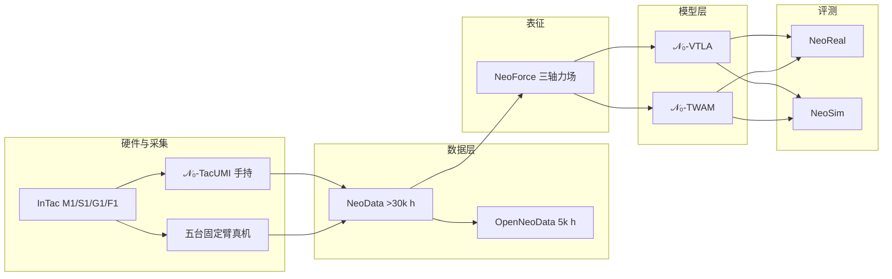

# 新智具身智能（NeoteAI）

**新智具身智能**（上海新智具身智能科技有限公司，[NeoteAI](https://www.neoteai.com)）源自 **复旦大学可信具身智能研究院（TEAI）**，以触觉为具身原生模态，产品线覆盖 **InTac 视触觉传感器 → 精细操作数据平台 → N 系列 VTLA / 触觉世界模型**；研究站 [research.neoteai.com](https://research.neoteai.com) 于 **2026-07-25** 发布 **𝒩₀-Foundation / 𝒩₀-VTLA / 𝒩₀-TWAM** 技术报告三件套。

| 机构 | 新智具身智能（NeoteAI）；合作署名复旦 TEAI |
|------|-------------------------------------------|
| 官网 | <https://www.neoteai.com> |
| 研究站 | <https://research.neoteai.com> |
| 核心栈 | **InTac** · **NeoData / OpenNeoData** · **𝒩₀-VTLA** · **𝒩₀-TWAM** |
| 开源状态 | **部分开源**（见下方） |

## 一句话定义

**用工业视触觉硬件与大规模同步视触觉数据，把「摸得到的接触状态」做成 VTLA 与世界–动作模型的一等公民。**

## 英文缩写速查

| 缩写 | 英文全称 | 简要说明 |
|------|----------|----------|
| VTLA | Vision-Tactile-Language-Action | 视觉–触觉–语言–动作多模态策略 |
| TWAM | Tactile World Action Model | 触觉原生世界–动作模型（𝒩₀-TWAM） |
| NeoData | NeoData corpus | >30k h 视触觉操作语料（闭源全量） |
| OpenNeoData | Open NeoData subset | 5k h 开源子集（门禁 + NC 许可） |
| InTac | InTac visuotactile sensor | 公司视触觉指尖传感器产品线 |
| TEAI | Trusted Embodied AI Institute | 复旦可信具身智能研究院 |
| ALTER | Advantage Labeling from Trajectory Events and Relative Progress | 𝒩₀-VTLA 离线 RL 标签配方 |

## 为什么重要

- **触觉原生产业栈**：相对 [RoboScience VLOA](./roboscience-vloa.md) 等偏视觉/3D 轨迹路线，NeoteAI 明确 **传感器—数据—模型** 一体，并以 **InTac** 规格公开力场/帧率指标。
- **可核验的研究发布**：三件套有项目页、技术报告 PDF 与 GitHub 组织；**OpenNeoData** 可下载（门禁），便于与 [Deform360](./paper-deform360-deformable-visuotactile-dataset.md) 等视触觉数据对照。
- **策略谱系齐全**：同一数据底座上同时给 [VLA](../methods/vla.md)（𝒩₀-VTLA）与 [WAM](../concepts/world-action-models.md)（𝒩₀-TWAM），方便做路线选型。

## 流程总览

## 核心结构

### 传感器（官网规格摘要）

| 型号 | 定位 | 要点 |
|------|------|------|
| **InTac M1** | 标准平动夹爪 | ~30 μm/px；法向 0–30 N；30 fps；148 g |
| **InTac S1** | 紧凑 / 灵巧手 | ~20 μm/px；法向 0–10 N；**120 fps**；40 g |
| **InTac G1 / F1** | 一体化 / 超小指尖 | 产品页叙事；规格以官网为准 |

输出流：原始视频 / 多维分布力图 / 三维力矢量；Type-C；SDK（Ubuntu/Windows）。配套软件仓：[neoteai-release](https://gitcode.com/neoteai/neoteai-release)。

### 研究三件套

| 页面 | 角色 |
|------|------|
| [𝒩₀-Foundation](./paper-n0-foundation.md) | 硬件 + NeoData + NeoForce + NeoReal/NeoSim |
| [𝒩₀-VTLA](./paper-n0-vtla.md) | 潜空间预测触觉 + ALTER 离线 RL |
| [𝒩₀-TWAM](./paper-n0-twam.md) | 非对称 MoT 触觉原生 WAM |

### 公司与资本（官网口径）

- 使命：「让机器感知世界，让智能触手可及」
- **近亿元天使轮**；杨浦莱蒙国际中心；应用：智能制造 / 家纺服装 / 智能物流
- CEO 公开活动：GEIA Asia 2026（赵世豪）等（新闻页）

## 工程实践

| 项 | 建议 |
|----|------|
| **先摸数据** | 申请 [OpenNeoData](https://huggingface.co/datasets/NeoteAIEmbodied/OpenNeoData)（LeRobot v3.0）；注意 **非商业** 与 **禁止再分发** 门禁条款 |
| **传感器集成** | 走 GitCode SDK / Studio，而非等模型仓 |
| **模型复现** | 跟踪三仓 Roadmap（宣称 **2026-07-31**）；入库日 **不要假设可 `pip install` 训练** |
| **选型对照** | 要「预测接触再动作」→ VTLA；要「联合生成未来视触+动作」→ TWAM；要「力场表征是否优于图像拼接」→ Foundation Table 2 |
| **重定向就绪度** | OpenNeoData 为 LeRobot v3.0 格式，**策略输入即取即用**；但触觉流是 **InTac 传感器特定** 的三轴力场，跨传感器/跨本体迁移须重标定与**形态适配**；且 𝒩₀-TacUMI 手持轨迹占比高，重定向到真机时须显式补偿手持 vs 机械臂动力学差 |

## 局限与风险

- **开源边界易误读**：项目页有 Code 按钮，但仓内多为占位 README；**已开放的是数据子集与传感器 SDK**，不是完整训练栈。
- **全量 NeoData 不公开**：OpenNeoData 是 5k/30k+ 小时子集；论文数字与可复现子集不对齐时需显式标注。
- **许可**：CC-BY-NC-SA-4.0 → 工业产品化需另谈授权。
- **机构叙事**：TEAI 合作署名清晰；公司融资/场景数字以官网为准，无独立财务核验。

## 关联页面

- [𝒩₀-Foundation](./paper-n0-foundation.md) · [𝒩₀-VTLA](./paper-n0-vtla.md) · [𝒩₀-TWAM](./paper-n0-twam.md)
- [视触觉融合](../concepts/visuo-tactile-fusion.md) · [接触丰富操作](../concepts/contact-rich-manipulation.md)
- [触觉知识链](../overview/hub-tactile.md) · [VT-WAM](./paper-vt-wam-visuotactile-contact-rich.md)

## 参考来源

- [公司官网归档](../../sources/sites/neoteai-com.md)
- [研究站归档](../../sources/sites/research-neoteai-com.md)
- [𝒩₀-Foundation / VTLA / TWAM 论文归档](../../sources/papers/n0_foundation.md)

## 推荐继续阅读

- [NeoteAI Research](https://research.neoteai.com)
- [OpenNeoData（Hugging Face）](https://huggingface.co/datasets/NeoteAIEmbodied/OpenNeoData)
- [Fudan TEAI](https://teai.fudan.edu.cn/)
