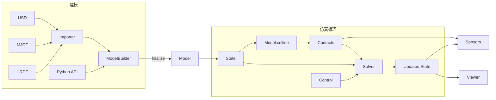

# Newton Physics（物理引擎）

**Newton** 是面向机器人学与仿真研究的 **GPU 加速、可扩展、可微** 物理引擎：在 [NVIDIA Warp](https://developer.nvidia.com/warp-python) 上实现核心计算，集成 [MuJoCo Warp](https://github.com/google-deepmind/mujoco_warp) 作为**主要物理后端**，并强调 [OpenUSD](https://openusd.org/) 场景组合与现代 Python API。项目由 **Disney Research、Google DeepMind、NVIDIA** 发起，现由 **Linux Foundation** 社区维护（代码 Apache-2.0）。

## 英文缩写速查

| 缩写 | 英文全称 | 简要说明 |
|------|----------|----------|
| Sim2Real | Simulation to Real | 把仿真中学到的策略迁移落地真机的工程主线 |
| GPU | Graphics Processing Unit | 图形处理器，大规模并行仿真训练的算力基础 |
| MuJoCo | Multi-Joint dynamics with Contact | 接触丰富的刚体物理仿真引擎 |
| URDF | Unified Robot Description Format | 统一机器人描述格式 |
| MJCF | MuJoCo XML Format | MuJoCo 的模型与场景描述格式 |
| Isaac Lab | NVIDIA Isaac Lab | 基于 Omniverse 的机器人学习训练框架 |
| API | Application Programming Interface | 应用程序编程接口 |
| CPU | Central Processing Unit | 中央处理器 |
| RL | Reinforcement Learning | 通过与环境交互最大化长期回报来学习策略的范式 |
| MJX | MuJoCo JAX | MuJoCo 的 JAX/XLA 后端，支持可微与批量仿真 |
| JAX | JAX | 支持自动微分与 XLA 编译的数值计算库 |
| Isaac Gym | NVIDIA Isaac Gym | GPU 并行刚体仿真训练环境 |

## 为什么重要？

- **机器人学习的主干正在 GPU 化**：大规模并行 rollout、可微仿真与系统辨识越来越依赖「Python 友好 + GPU 吞吐 + 可插拔求解器」的引擎，而不仅是单机 CPU 步进。
- **MuJoCo 生态的 GPU 延伸**：Newton 把 **MuJoCo Warp** 纳入统一框架，同时保留 XPBD/VBD/Featherstone 等多后端，便于在同一套 `Model` / `State` / `Solver` 抽象下做对比与扩展。
- **与 NVIDIA 机器人栈对齐**：官方叙事与 **Isaac Sim / Isaac Lab**、**MuJoCo Playground** 兼容；Isaac Lab 侧已有 `feature/newton` 集成探索，适合作为「轻量 Warp 物理 + 重型 Omniverse 仿真」之间的技术选项。

## 核心能力

| 维度 | 要点 |
|------|------|
| **计算** | Warp 驱动 GPU 仿真；目标是把日级仿真压到分钟级（厂商页叙事） |
| **可微** | 支持可微物理，服务策略训练、设计优化、系统辨识 |
| **可扩展** | 模块化求解器与组件；可插拔自定义求解器，支持多物理扩展 |
| **资产** | `ModelBuilder` 导入 **URDF、MJCF、USD**；OpenUSD 聚合机器人与环境 |
| **求解器** | **XPBD、VBD、MuJoCo（Warp）、Featherstone、SemiImplicit** 等 |
| **传感器** | 基于 `State` / `Contacts` 与 extended attributes 的观测管线 |

## 流程总览

典型步进：`ModelBuilder` 构建 → `Model` → 分配 `State` / `Control` / `Contacts` → `collide` → `Solver.step` → 传感器与可视化。

## 与相近工具的分工

| 工具 | 关系 |
|------|------|
| **[MuJoCo](./mujoco.md)** | 学术接触建模标杆；Newton 通过 **MuJoCo Warp** 承接 MJCF 资产与 GPU 批量路径 |
| **[mjlab](./mjlab.md)** | **RL 训练框架**（Isaac Lab 风格 API + MuJoCo Warp）；Newton 是更底层的**通用物理引擎**，不限于 manager-based RL |
| **[Isaac Lab](./isaac-gym-isaac-lab.md)** | Omniverse/PhysX 主线；Newton 作为可选/并行物理后端探索（官方教程与 `feature/newton` 分支） |
| **[MuJoCo MJX](./mujoco-mjx.md)** | JAX 上 MJCF 对齐实现；Newton 侧强调 Warp + 多求解器 + USD，选型时需核对任务所需的 **feature parity** |

## 优势与局限

**优势：**

- 开源（LF 治理）+ GPU 吞吐 + 可微 + 多求解器，适合研究型快速迭代。
- 与 USD、Isaac、Playground 的对接降低「资产只存在于某一仿真器」的锁定风险。

**局限：**

- 生态仍新：相对 MuJoCo 经典 CPU 栈与 Isaac Lab 工业管线，第三方任务库、基准与 Sim2Real 案例积累更少。
- **硬件**：有意义的 GPU 路径依赖 NVIDIA GPU（macOS 仅 CPU）。
- 与 [mjlab](./mjlab.md) 等「已包装好的 RL 环境」相比，Newton 更偏**引擎层**，上手需理解 `ModelBuilder` / `Solver` 抽象。

## 关联页面

- [MuJoCo（物理引擎）](./mujoco.md)
- [mjlab](./mjlab.md) — Isaac Lab API + MuJoCo Warp 的 RL 框架
- [MuJoCo MJX](./mujoco-mjx.md)
- [Isaac Gym / Isaac Lab](./isaac-gym-isaac-lab.md)
- [NVIDIA Omniverse](./nvidia-omniverse.md)
- [MuJoCo vs Isaac Sim](../comparisons/mujoco-vs-isaac-sim.md)
- [仿真器选型指南（Query）](../queries/simulator-selection-guide.md)
- [Reinforcement Learning](../methods/reinforcement-learning.md)
- [Sim2Real](../concepts/sim2real.md)

## 参考来源

- [newton-physics 仓库归档](../../sources/repos/newton-physics.md)
- [NVIDIA Developer：Newton Physics](../../sources/sites/nvidia-newton-physics.md)
- [Newton 官方文档 Overview](../../sources/sites/newton-physics-docs-overview.md)

## 推荐继续阅读

- [Newton 官方文档 Overview](https://newton-physics.github.io/newton/stable/guide/overview.html)
- [Newton GitHub](https://github.com/newton-physics/newton)
- [NVIDIA：Newton Physics 产品页](https://developer.nvidia.com/newton-physics)
- [Introduction tutorial](https://newton-physics.github.io/newton/stable/tutorials/00_introduction.html)
- [MuJoCo Warp](https://github.com/google-deepmind/mujoco_warp)
