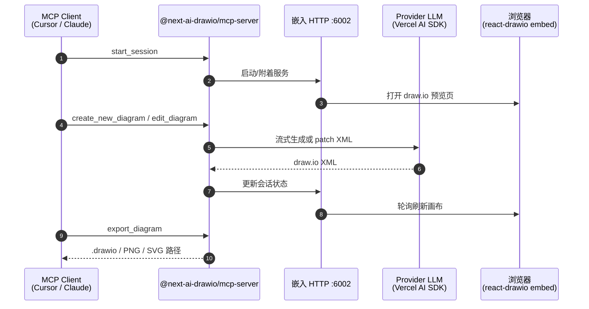

# Next AI Draw.io

**Next AI Draw.io**（[DayuanJiang/next-ai-draw-io](https://github.com/DayuanJiang/next-ai-draw-io)，Apache-2.0，~36k★）把 **自然语言聊天** 与 **draw.io 画布** 合成一条 Web 闭环：用户描述意图（或上传图片/PDF/文本），**Vercel AI SDK** 经所选 LLM **流式写出 draw.io XML**，**react-drawio** 在浏览器即时渲染；支持版本历史、云架构图元与动画连接器。官方演示：[next-ai-drawio.jiang.jp](https://next-ai-drawio.jiang.jp/)。另发布 **`@next-ai-drawio/mcp-server`**，让 Cursor、Claude Desktop、VS Code 等 MCP 客户端在 **浏览器实时预览** 中建图/改图。

## 一句话定义

用 **Next.js Web UI 或 MCP** 把自然语言编译成 **可编辑 draw.io XML**，在浏览器画布上实时预览、迭代与导出——面向 **聊天式制图** 与 **代理驱动框图**，不是桌面 OS 自动化，也不是纯静态 Mermaid。

## 英文缩写速查

| 缩写 | 英文全称 | 简要说明 |
|------|----------|----------|
| MCP | Model Context Protocol | 代理与工具互操作协议；本仓 MCP 包经 stdio 调嵌入 HTTP 服务 |
| XML | eXtensible Markup Language | draw.io 图的序列化格式；LLM 主输出载体 |
| LLM | Large Language Model | 生成/修改 XML 与聊天 refine 的核心模型 |
| BYOK | Bring Your Own API Key | 演示站可在浏览器本地配置 provider 密钥，不经服务端持久化 |
| SDK | Software Development Kit | 本页指 Vercel **AI SDK**（`ai` + `@ai-sdk/*`）多 provider 抽象 |
| PNG | Portable Network Graphics | MCP `export_diagram` 与 Web 导出格式之一 |

## 为什么重要

1. **把「框图」变成可对话、可导出的 `.drawio` 交付物：** 本站知识页常用 Mermaid 表达结构；组会架构、论文管线、专利流程图常需 **draw.io 原生图元与云图标**。本工具提供 **聊天迭代 + 历史回滚 + 多格式导出**，比一次性贴图更可维护。
2. **MCP 与 Web 同源：** `@next-ai-drawio/mcp-server` 自带嵌入 HTTP（默认 `:6002`），代理 `create_new_diagram` / `edit_diagram` 后 **浏览器轮询预览**——与 [Draw.io Scientific Illustrator](./drawio-scientific-illustrator.md)（Codex 操控**桌面** draw.io live API、拒绝 XML-first）形成 **Web 嵌入 vs 桌面 live** 对照。
3. **多 provider + 自托管：** Bedrock、OpenAI、Anthropic、Google、Ollama、DeepSeek 等；`AI_MODELS_CONFIG` 与 `/admin` 面板可配服务端模型与配额；Docker / Vercel / Cloudflare 文档完整，适合团队内网部署。
4. **与邻近方案分工：** [Archify](./archify.md) → **校验 JSON→HTML 系统图**；[Diagram Design](./diagram-design.md) → **editorial HTML/SVG Skill**；[Manim](./manim.md) → **讲解动画**；本页 → **draw.io 生态 XML**。

## 流程总览

```mermaid
flowchart LR
  A[用户 / MCP 客户端] -->|自然语言或 XML 工具调用| B[Vercel AI SDK<br/>多 provider 流式]
  B --> C[draw.io XML]
  C --> D[react-drawio<br/>浏览器画布]
  D --> E[版本历史 / 导出<br/>.drawio PNG SVG]
  A -->|MCP stdio| F[@next-ai-drawio/mcp-server]
  F --> G[嵌入 HTTP :6002]
  G --> D
```

## 核心架构

| 组件 | 角色 |
|------|------|
| **Next.js Web App** | 聊天 UI、文件上传、Settings/BYOK、Admin（`/admin`） |
| **Vercel AI SDK** | 流式 LLM 响应；统一 Bedrock / OpenAI / Anthropic / Google 等 |
| **react-drawio** | 在浏览器加载 embed，绑定 XML 增删改 |
| **`@next-ai-drawio/mcp-server`** | MCP Tools + 嵌入 HTTP；stdio ↔ 浏览器预览 |
| **桌面 Release** | Win/macOS/Linux 原生壳（GitHub Releases） |

## MCP 工具一览

| 工具 | 作用 |
|------|------|
| `start_session` | 打开浏览器实时预览会话 |
| `create_new_diagram` | 从 XML 创建新图 |
| `load_diagram` | 从磁盘加载 `.drawio`（含压缩格式） |
| `edit_diagram` | 按 cell id 增删改 |
| `get_diagram` | 读取当前 XML |
| `export_diagram` | 导出 `.drawio` / `.png` / `.svg` |
| `list_pages` / `add_page` / `rename_page` / `delete_page` | 多 page（tab）管理 |

## 源码运行时序图



关键复现路径：`npx @next-ai-drawio/mcp-server@latest` 写入 MCP 配置 → 重启客户端 → `start_session` → 自然语言描述图 → 浏览器预览 → `export_diagram`；或 `git clone` + `npm run dev` 自托管 Web UI。

## 工程实践

| 项 | 要点 |
|----|------|
| **MCP 一行安装** | Cursor `~/.cursor/mcp.json` 或 Claude Code：`claude mcp add drawio -- npx @next-ai-drawio/mcp-server@latest` |
| **Web 自托管** | `npm install` → `cp env.example .env.local` → 配 provider → `npm run dev` → `http://localhost:6002` |
| **模型选型** | 长 XML + 严格格式：Claude Sonnet 4.5、GPT-5.1、Gemini 3 Pro、DeepSeek V3.2/R1；**云架构**优先 Claude（AWS/Azure/GCP 图标训练） |
| **私有 draw.io** | MCP 环境变量 `DRAWIO_BASE_URL` 指向自建 `jgraph/drawio` Docker |
| **Admin** | 设 `ADMIN_PASSWORD` 访问 `/admin` 管理模型、访问码、配额与可观测性 |
| **开源状态** | **已开源**（截至 2026-09-21）：Apache-2.0；演示站、源码、MCP npm 包、桌面 Release 均可获取 |

## 局限与风险

- **误区：与 [Draw.io Scientific Illustrator](./drawio-scientific-illustrator.md) 等价。** 本仓主路径是 **LLM 生成 XML** 再在 embed 渲染；Scientific Illustrator 强调 **可见步进 live graph API** 且 **禁止 XML-first**。选型：要 **Web/MCP 快速聊天出图** 走本页；要 **Codex 逐步可见重绘科研 PDF 插图** 走 Scientific Illustrator。
- **XML 质量依赖模型：** 复杂布局可能需多轮 refine 或更强模型；README 明确不推荐弱模型硬扛长 XML。
- **演示站 API 额度：** 公共 demo 有限流；生产应 BYOK 或自托管。
- **embed 外联：** 默认加载 `embed.diagrams.net`；气隙环境需 `DRAWIO_BASE_URL` 自建。
- **隐私：** BYOK 密钥存浏览器 localStorage；自托管时仍须审计 provider 数据政策。

## 与相近方案的对照

| 方案 | 产物 | 代理接口 | 强项 |
|------|------|----------|------|
| **本工具** | `.drawio` XML + 导出 | Web 聊天 / MCP npm | 高星生态、多 provider、浏览器预览 |
| [Draw.io Scientific Illustrator](./drawio-scientific-illustrator.md) | 可编辑 `.drawio` | Codex Skill + 桌面 live MCP | 可见步进、拒绝 XML-first |
| [Archify](./archify.md) | 校验 HTML/SVG | Agent Skill + Node CLI | 架构/时序/数据流 IR |
| [Diagram Design](./diagram-design.md) | editorial HTML/SVG | Agent Skill | 品牌 onboarding、import draw.io |
| [Manim](./manim.md) | 讲解视频 | Python | 动画叙事 |
| 本库 Mermaid | Markdown 内图 | 静态 | 知识页结构、git 友好 |

## 关联页面

- [Draw.io Scientific Illustrator](./drawio-scientific-illustrator.md) — **桌面 live MCP** 科研插图；XML-first 哲学相反
- [Archify](./archify.md) — **JSON→HTML 系统图** 校验交付
- [Diagram Design](./diagram-design.md) — **editorial HTML/SVG** Skill
- [Manim](./manim.md) — **程序化讲解动画**
- [FreeCAD MCP](./freecad-mcp.md) — **桌面 CAD MCP** 桥（3D 机械，非 2D 框图）
- [Model Context Protocol（MCP）](../concepts/model-context-protocol.md) — 协议层与传输
- [LLM Wiki（Karpathy 模式）](../references/llm-wiki-karpathy.md) — 知识编译 vs 代理制图工具
- [ingest 工作流](../../schema/ingest-workflow.md) — 本站资料入库规范

## 参考来源

- [next-ai-draw-io 仓库源归档（本站）](../../sources/repos/next-ai-draw-io.md)
- [Next AI Draw.io 演示站归档（本站）](../../sources/sites/next-ai-drawio-jiang-jp.md)
- [DayuanJiang/next-ai-draw-io（GitHub README）](https://github.com/DayuanJiang/next-ai-draw-io)
- [MCP Server README（packages/mcp-server）](https://github.com/DayuanJiang/next-ai-draw-io/blob/main/packages/mcp-server/README.md)

## 推荐继续阅读

- [next-ai-drawio.jiang.jp 在线演示](https://next-ai-drawio.jiang.jp/) — 零安装体验与 BYOK
- [Provider Configuration Guide](https://github.com/DayuanJiang/next-ai-draw-io/blob/main/docs/en/ai-providers.md) — 各 LLM 接入细节
- [draw.io / diagrams.net](https://www.drawio.com/) — 图编辑器与 embed 宿主
- [Model Context Protocol](https://modelcontextprotocol.io) — MCP 规范
