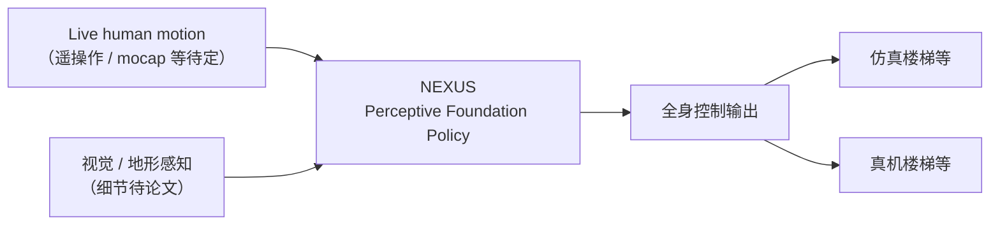

# NEXUS（感知型基础策略 · 跨域全身遥操作）

**NEXUS**（*A Perceptive Foundation Policy for Cross-Domain Whole-Body Teleoperation*，[项目页](https://nexus-humanoid.github.io/)）由 **上海交通大学** 缪翔宇（Xiangyu Miao，Weinan Zhang 组）等发布为 **Research Preview**：主张用 **感知型基础策略** 把 **实时人体运动** 转为 **跨场景/跨域、地形感知的人形全身行为**。官方口号：**「Live human motion in. Terrain-aware humanoid behavior out.」**

## 一句话定义

**一个待发布的感知基础策略：用统一视觉–全身控制接口，让人形在楼梯等地形上跟随人体遥操作，并声称可跨域泛化。**

## 英文缩写速查

| 缩写 | 英文全称 | 简要说明 |
|------|----------|----------|
| NEXUS | （项目页未展开全称） | 本文人形遥操作基础策略项目名 |
| FP | Foundation Policy | 大规模预训练/统一接口的通用策略抽象 |
| WBC | Whole-Body Control | 全身关节协调控制 |
| Teleop | Teleoperation | 人远程实时操控机器人 |
| Sim2Real | Simulation to Real | 仿真策略部署真机（预览海报含 sim+real 楼梯） |
| MoCap | Motion Capture | 与 live human motion 相关的参考来源之一 |

## 为什么重要

- **Foundation policy × 遥操作：** 与 [VLA](../methods/vla.md) 操作向 foundation 不同，NEXUS 把卖点放在 **全身跟踪 + 感知 + 跨域**，贴近 [BFM](./paper-behavior-foundation-model-humanoid.md) / [SONIC](../methods/sonic-motion-tracking.md) / [HoloMotion](./holomotion.md) 的「低层通才策略」叙事，但强调 **operator-in-the-loop** 与 **terrain-aware** 落地。
- **与 Perceptive BFM 同命题轴：** [Perceptive BFM](./paper-perceptive-bfm.md) 用机器人中心地形把 **raw 人体参考** 变为可踩点行为；NEXUS 预告页同样突出 **楼梯地形** 与 **sim/real** 预览——入库日尚无论文细节，**不可混为同一工作**，但选型时应并列关注。
- **跨域（cross-domain）：** 项目标题明示 operator / robot / scene 可能 **不同域**（见 Perceptive BFM 问题设定）；若论文成立，对 [Teleoperation](../tasks/teleoperation.md) 数据飞轮与部署接口设计有参考价值。
- **开源边界清醒：** 截至 **2026-09-06**，Paper / arXiv / Code / Video 均为 **Coming Soon**；GitHub 仅 [nexus-humanoid.github.io](https://github.com/nexus-humanoid/nexus-humanoid.github.io) 静态站——**不能**用于复现。

## 核心信息（预告级）

| 字段 | 内容 |
|------|------|
| 机构 | 上海交通大学（SJTU）；作者主页：[xiangyumiao.pages.dev](https://xiangyumiao.pages.dev/) |
| 导师 | Weinan Zhang（张伟楠） |
| 状态 | **Research Preview** |
| 论文 | **待发布** |
| arXiv | **待发布** |
| 代码 | **待发布**（无训练仓） |
| 宣传 | [X 帖](https://x.com/xiangyu_miao/status/2095706449028710582) |
| 预览线索 | 海报 alt：simulated and real **stair** terrain teleoperation |

## 流程总览（基于项目页叙事，待论文核实）

## 核心机制（预告级归纳）

1. **统一接口：** 「Foundation policy」暗示 **单一策略** 覆盖多种遥操作/跟踪接口，而非 per-task 重训（细节待论文）。
2. **感知耦合：** 标题 **Perceptive** + 地形口号，预示策略 **显式消费视觉或地形观测**，而非纯 kinematic 跟踪。
3. **跨域：** **Cross-Domain** 可能指人机不同环境、不同 embodiment 或 sim→real；入库日 **无公式/架构图**，本页不下技术结论。
4. **工程交付：** 作者研究方向写明追求 **可扩展经验 + 算法结构** 以跨行为/环境/本体泛化——与 foundation policy 社区方向一致。

## 实验与评测

- **本页为 Research Preview 编译；无量化 benchmark、消融或实机指标。**
- 项目页仅提供 **静态 preview poster**（sim + real stairs），无可播放视频。
- 论文/arXiv 发布后应在本页补：平台、观测模态、跨域设定、与 SONIC / Teleopit / Perceptive BFM 等同表对比。

## 与其他工作对比（预告级）

| 路线 | 代表 | 与 NEXUS 预告的差异（截至入库日） |
|------|------|-----------------------------------|
| 大规模 motion tracking GMT | [SONIC](../methods/sonic-motion-tracking.md) | SONIC 已开源 + 论文；强调 **scaling**；NEXUS 预告强调 **感知 + 跨域 teleop** |
| VR 全身体遥操作栈 | [Teleopit](./paper-teleopit.md) | Teleopit **五仓开源** + arXiv；分层 tracker + 手重定向；NEXUS 自称 **单一 foundation policy** |
| 地形感知 + raw 参考 | [Perceptive BFM](./paper-perceptive-bfm.md) | 已有 arXiv 与 TCRS 管线细节；NEXUS **尚未发布** 技术稿 |
| 生成式多接口 WBC | [BFM](./paper-behavior-foundation-model-humanoid.md) | BFM 用 CVAE + 掩码蒸馏；NEXUS 感知叙事更接近 **teleop 闭环** |

## 源码运行时序图

**不适用** — 截至 2026-09-06 无训练/推理/部署代码发布；[nexus-humanoid/nexus-humanoid.github.io](https://github.com/nexus-humanoid/nexus-humanoid.github.io) 仅为静态着陆页（HTML/JS），不含策略运行时模块。

## 工程实践

| 项 | 内容 |
|----|------|
| **开源状态** | **待发布** — Paper / Code / arXiv 均 Coming Soon |
| **可用资产** | 项目页、作者主页、X 宣传帖 |
| **勿误判** | Pages 仓 ≠ 算法实现 |
| **跟进** | 发布 arXiv 后补 `sources/papers/` 并升格本页 `status` |

## 结论

**NEXUS 目前只是 SJTU 方向上一则可链接的 Research Preview：它把「感知型基础策略 + 跨域全身遥操作 + 地形感知」三条线索钉在知识图上，但截至 2026-09-06 没有任何可核验的论文、指标或训练代码。**

1. **价值在选题坐标** — 把 teleop、foundation policy、terrain perception 三条线显式交叉，便于与 Perceptive BFM / SONIC / Teleopit 对照。
2. **适用边界** — 不能用于实验复现或性能声称；海报仅暗示楼梯 sim+real。
3. **开源风险** — 仅静态站公开；lint 后续应跟踪 Code 按钮是否链出真实仓库。
4. **发布后动作** — 补 arXiv 专档、评测表、源码时序图（若有）或保持「不适用」说明。

## 局限与风险

- **信息极度不完整：** 无 PDF、无架构图、无机构合著者列表（以论文为准）。
- **与 Perceptive BFM 可能重叠：** 标题与预览地形高度相近，发布后需做 **canonical 消歧**（是否同一团队、不同版本或独立工作）。
- **Foundation policy 声称易过度解读：** 在缺少数据规模与评测前，应视为 **研究预告** 而非已验证基础模型。

## 关联页面

- [Foundation Policy](../concepts/foundation-policy.md)
- [Teleoperation](../tasks/teleoperation.md)
- [Perceptive BFM](./paper-perceptive-bfm.md)
- [SONIC](../methods/sonic-motion-tracking.md)
- [Teleopit](./paper-teleopit.md)
- [机器人视觉感知栈选型闭环知识链](../queries/robot-perception-stack-selection-loop.md) — NEXUS 的「地形感知」落在感知栈的「2D→3D 提升与语义建图 → 下游策略消费」两层；项目页未披露具体感知实现，待论文/代码公开后再对号入座

## 参考来源

- [sources/sites/nexus-humanoid-github-io.md](../../sources/sites/nexus-humanoid-github-io.md)
- [sources/repos/nexus-humanoid-github-io.md](../../sources/repos/nexus-humanoid-github-io.md)

## 推荐继续阅读

- 项目页：<https://nexus-humanoid.github.io/>
- 作者主页：<https://xiangyumiao.pages.dev/>
- [Perceptive BFM（已发布技术稿对照）](./paper-perceptive-bfm.md)
