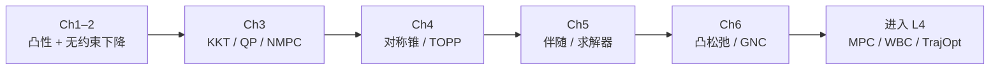

---

type: entity
tags: [course, numerical-optimization, convex-optimization, mpc, trajectory-optimization, foundational, stanford]
status: complete
updated: 2026-06-23
related:
  - ../formalizations/convex-functions.md
  - ../formalizations/kkt-conditions.md
  - ../formalizations/quadratic-programming.md
  - ../methods/line-search-steepest-descent.md
  - ../methods/quasi-newton-bfgs.md
  - ../methods/nonlinear-model-predictive-control.md
  - ../methods/convex-relaxation-robotics.md
  - ./linear-algebra-curriculum.md
  - ../../roadmap/motion-control.md
sources:
  - ../../sources/courses/numerical_optimization_foundations_robotics.md
summary: "机器人数值优化 L0 策展：具身智能研究室《数值优化基础》六章大纲，映射无约束/约束/锥规划/凸松弛与 MPC、TrajOpt、WBC 工程应用。"
---

# 数值优化学习策展（机器人 L0+）

**一句话：** 机器人控制栈里反复出现的 **QP、NMPC、TrajOpt、碰撞距离、控制分配** 共用同一套数值优化语言；本页把 [《数值优化基础》](../../sources/courses/numerical_optimization_foundations_robotics.md) 六章大纲整理成可执行路线，并接到 [运动控制成长路线](../../roadmap/motion-control.md) L3–L4。

## 英文缩写速查

| 缩写 | 英文全称 | 简要说明 |
|------|----------|----------|
| OCP | Optimal Control Problem | 最优控制问题；MPC / TrajOpt 的数学外壳 |
| QP | Quadratic Programming | 二次规划；WBC / 凸 MPC 的核心形式 |
| NMPC | Nonlinear Model Predictive Control | 非线性滚动时域优化控制 |
| KKT | Karush–Kuhn–Tucker | 约束优化一阶最优性条件 |
| BFGS | Broyden–Fletcher–Goldfarb–Shanno | 拟牛顿法，近似 Hessian 逆 |
| L-BFGS | Limited-memory BFGS | 低内存 BFGS，适合大规模 NLP |
| CG | Conjugate Gradient | 共轭梯度，大型稀疏线性/二次子问题 |
| TOPP | Time-Optimal Path Parameterization | 沿给定几何路径求时间最优速度曲线 |
| GNC | Graduated Non-Convexity | 逐步凸化逼近非凸问题的启发式框架 |
| PHR | Powell–Hestenes–Rockafellar | 增广拉格朗日乘子法的一种形式 |

## 为什么重要

1. **L3 的「数值优化直觉」需要落地**：仅有 [Optimal Control](../concepts/optimal-control.md) 概念不够，必须能选算法、写 KKT、调求解器。
2. **与 [线性代数策展](./linear-algebra-curriculum.md) 互补**：线代给矩阵语言；本页给 **如何在这些矩阵上下降、满足约束、做锥规划与松弛**。
3. **直接服务 L4 主干**：Convex MPC → WBC QP → NMPC / TrajOpt 都依赖本章地图中的节点。

## 推荐学习路径

| 阶段 | 课程章节 | 机器人相关产出 | 本库页面 |
|------|---------|---------------|---------|
| 基础 | Ch1 凸函数 + 最速下降/阻尼牛顿 | 理解 iLQR 线搜索、非凸 NLP 初值敏感 | [convex-functions](../formalizations/convex-functions.md)、[line-search-steepest-descent](../methods/line-search-steepest-descent.md) |
| 大规模无约束 | Ch2 BFGS / CG | cuRobo 类 TrajOpt 后端、大规模 IK | [quasi-newton-bfgs](../methods/quasi-newton-bfgs.md)、[conjugate-gradient-method](../methods/conjugate-gradient-method.md) |
| 路径应用 | Ch2.4 平滑导航 | 移动机器人 / 无人机平滑路径 | [smooth-navigation-path-generation](../methods/smooth-navigation-path-generation.md) |
| 约束核心 | Ch3 KKT / QP / 增广拉格朗日 | WBC QP、控制分配、NMPC | [kkt-conditions](../formalizations/kkt-conditions.md)、[quadratic-programming](../formalizations/quadratic-programming.md)、[penalty-barrier-augmented-lagrangian](../methods/penalty-barrier-augmented-lagrangian.md) |
| 机器人应用 | Ch3.6–3.8 | 冗余驱动分配、SDF 碰撞、NMPC | [control-allocation](../concepts/control-allocation.md)、[collision-distance-optimization](../concepts/collision-distance-optimization.md)、[nonlinear-model-predictive-control](../methods/nonlinear-model-predictive-control.md) |
| 锥规划 | Ch4 TOPP | 机械臂/足式沿路径时间最优 | [symmetric-cone-programming](../formalizations/symmetric-cone-programming.md)、[time-optimal-path-parameterization](../methods/time-optimal-path-parameterization.md) |
| 工程技巧 | Ch5 伴随 / 求解器 | TrajOpt 梯度、选型 OSQP/Acados | [adjoint-sensitivity-analysis](../formalizations/adjoint-sensitivity-analysis.md)、[optimization-software-selection](../queries/optimization-software-selection.md) |
| 非凸出口 | Ch6 凸松弛 | 姿态估计、抓取、多机器人 | [convex-relaxation-robotics](../methods/convex-relaxation-robotics.md) |

## 章节 ↔ 本库节点完整映射

### 第 1 章 数值优化基础

- 1.1 数学规划与机器人 → [Optimal Control](../concepts/optimal-control.md)
- 1.2–1.3 凸集/凸函数 → [Convex Functions](../formalizations/convex-functions.md)
- 1.4–1.5 最速下降 / 阻尼牛顿 → [Line Search Steepest Descent](../methods/line-search-steepest-descent.md)（牛顿步见 [LQR/iLQR](../methods/lqr-ilqr.md) 的 Gauss-Newton 视角）
- 1.6 实践 → 同上方法页「推荐做什么」

### 第 2 章 无约束优化

- 2.2 拟牛顿 → [Quasi-Newton BFGS](../methods/quasi-newton-bfgs.md)
- 2.3 共轭梯度 → [Conjugate Gradient](../methods/conjugate-gradient-method.md)
- 2.4–2.5 平滑导航 → [Smooth Navigation Path Generation](../methods/smooth-navigation-path-generation.md)

### 第 3 章 约束优化

- 3.1 形式分类 → [Constrained Optimization](../concepts/constrained-optimization.md)
- 3.2 Seidel LP → 见 [Constrained Optimization](../concepts/constrained-optimization.md)（低维 LP 特例）
- 3.3 严格凸 QP → [Quadratic Programming](../formalizations/quadratic-programming.md)
- 3.4–3.5 序列无约束化 / PHR → [Penalty / Barrier / Augmented Lagrangian](../methods/penalty-barrier-augmented-lagrangian.md)
- 3.6 控制分配 → [Control Allocation](../concepts/control-allocation.md)
- 3.7 碰撞距离 → [Collision Distance Optimization](../concepts/collision-distance-optimization.md)
- 3.8 NMPC → [Nonlinear MPC](../methods/nonlinear-model-predictive-control.md)
- 3.9 实践 → [MPC Solver Selection](../queries/mpc-solver-selection.md)

### 第 4 章 对称锥规划

- 4.1–4.2 锥 / 对称锥 ALM → [Symmetric Cone Programming](../formalizations/symmetric-cone-programming.md)
- 4.3 TOPP → [Time-Optimal Path Parameterization](../methods/time-optimal-path-parameterization.md)

### 第 5 章 构建与求解技巧

- 5.1 函数光滑化 → [Convex Relaxation in Robotics](../methods/convex-relaxation-robotics.md)（Huber / 软化约束）
- 5.2 伴随 → [Adjoint Sensitivity Analysis](../formalizations/adjoint-sensitivity-analysis.md)
- 5.3–5.4 求解器 / 软件 → [Optimization Software Selection](../queries/optimization-software-selection.md)、[MPC Solver Selection](../queries/mpc-solver-selection.md)

### 第 6 章 凸松弛

- 6.2–6.5 QCQP 松弛 / Riemannian / 分布式 / GNC → [Convex Relaxation in Robotics](../methods/convex-relaxation-robotics.md)

## 常见误区

- **只会调 OSQP，不懂 KKT**：QP 无解时无法判断是建模冲突还是数值问题。
- **把 NMPC 当黑盒**：非凸 NLP 对初值、约束光滑性、实时预算极敏感。
- **跳过无约束章节**：TrajOpt 里 L-BFGS + 线搜索仍是工业默认组合（见 [cuRobo](./curobo.md)）。

## 与其他页面的关系

- 上游数学：[Linear Algebra Curriculum](./linear-algebra-curriculum.md)
- 控制应用：[MPC](../methods/model-predictive-control.md)、[Trajectory Optimization](../methods/trajectory-optimization.md)、[HQP](../concepts/hqp.md)
- 选型：[MPC vs RL](../comparisons/mpc-vs-rl.md)、[TrajOpt vs RL](../comparisons/trajectory-opt-vs-rl.md)

## 推荐继续阅读

- Boyd & Vandenberghe, *Convex Optimization*
- Nocedal & Wright, *Numerical Optimization*
- [Underactuated Robotics](https://underactuated.mit.edu/) — 机器人 OCP 视角
- [Motion Control Roadmap](../../roadmap/motion-control.md) L3–L4

## 参考来源

- [sources/courses/numerical_optimization_foundations_robotics.md](../../sources/courses/numerical_optimization_foundations_robotics.md) — 具身智能研究室《数值优化基础》课程大纲整理
