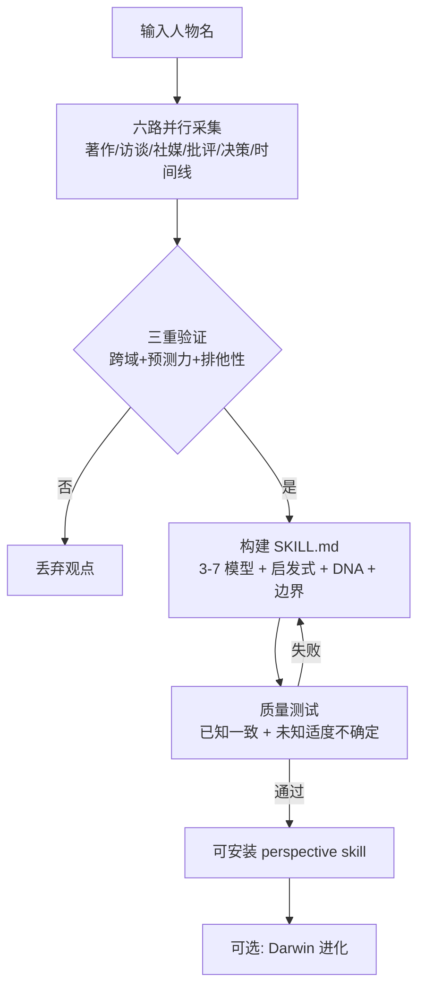

# Nuwa Skill（女娲.skill）

**Nuwa Skill** 是 [alchaincyf/nuwa-skill](https://github.com/alchaincyf/nuwa-skill) 仓库分发的 **元 skill**：输入一个名字，自动完成调研、提炼与验证，把公开著作/访谈/社交媒体等 **编译成可装载的 perspective skill** — 用该人物的 **认知框架** 分析新问题，而非复读语录。

## 一句话定义

用 **六路并行采集 + 三重验证心智模型 + 保真度评分卡**，把「各领域最强大脑」的 **认知操作系统** 蒸馏成 agent 可调用的 `SKILL.md`，并诚实标注做不到什么。

## 英文缩写速查

| 缩写 | 英文全称 | 简要说明 |
|------|----------|----------|
| LLM | Large Language Model | 执行调研、提炼与 skill 对话的推理核心 |
| Agent Skills | Agent Skills Standard | [agentskills.io](https://agentskills.io) 约定的可装载技能格式 |
| DNA | Expression DNA | 女娲术语：语气、节奏、用词偏好等表达层特征 |
| MCP | Model Context Protocol | 部分 runtime 通过 MCP 扩展工具；女娲本体为 markdown skill |

## 为什么重要（对本知识库读者）

- **人物 skill 蒸馏标杆：** 上游 README 强调与 [colleague-skill](https://github.com/titanwings/colleague-skill)（蒸馏同事）对照 — **何必只蒸馏同事**；对本站读者，可把 **领域专家（如 Karpathy、Peng）** 的公开论述与 wiki 实体页 **分层**：wiki 编译 **事实与交叉引用**，Nuwa 编译 **决策启发式与表达风格**（上游另有 [karpathy-skill](https://github.com/alchaincyf/karpathy-skill) 独立仓）。
- **与 LLM Wiki 互补：** [Karpathy LLM Wiki](../references/llm-wiki-karpathy.md) 维护 **持久结构化知识**；女娲维护 **可对话的认知透镜** — 适合「用芒格视角审这笔投资」类问题，但不替代 ingest 溯源与 `make ci-preflight`。
- **生态三角：** **女娲** 造 skill → [Cangjie Skill](cangjie-skill.md) 从书/长视频造方法论 skill → [Darwin Skill](darwin-skill.md) 棘轮进化；女娲 Phase 5 双 agent 精炼内置达尔文评估思路。

## 核心结构

| 层次 | 内容 |
|------|------|
| **五层提取** | 表达 DNA → 心智模型 → 决策启发式 → 反模式/价值观 → 诚实边界 |
| **四步流水线** | 六路并行采集 → 三重验证提炼 → 构建 SKILL.md → 质量验证（已知+未知问题） |
| **三重验证** | 跨 2+ 领域出现、对新问题有预测力、有排他性（非常识） |
| **分发** | `npx skills add alchaincyf/nuwa-skill`；Claude Code / Codex / Cursor / OpenClaw / Hermes 等 50+ runtime |
| **官方人物 skill** | 14 人 + 1 主题（X 导师）；独立仓如 steve-jobs-skill、munger-skill、karpathy-skill |
| **保真度** | 双 agent 盲测五维（立场/风格/诚实/来源/结构）；官方 skill 全员 A 级（≥85） |

### 蒸馏流水线（概念级）

## 常见误区或局限

- **误区：女娲 = 角色扮演。** 目标是 **认知架构提取** — 用框架推断立场，不是模仿口癖凑热闹。
- **误区：可替代 wiki 实体页。** 人物 wiki 页记录 **作品、机构、与本库主题关系**；女娲 skill 记录 **启发式与表达 DNA** — 宜交叉引用，不宜混为一页。
- **误区：蒸馏等于复制真实想法。** README 明确 **公开表达 ≠ 内心**；每个 skill 须写 **诚实边界**（直觉、突变、隐私不可得）。
- **局限：** `SKILL.md` 核心不接受外部 PR（issue 驱动）；基于调研截止时间快照；英文为主文档、部分人物偏中文语境。

## 关联页面

- [Cangjie Skill](cangjie-skill.md) — **蒸馏书/长视频方法论**
- [Darwin Skill](darwin-skill.md) — **skill 棘轮进化**
- [Andrej Karpathy](andrej-karpathy.md) — 本站 Karpathy 实体；对照上游 karpathy-skill
- [autoresearch（karpathy）](karpathy-autoresearch.md) — Darwin 的灵感链上游
- [Superpowers（obra）](superpowers-obra.md) — 编码交付流程 skill
- [LLM Wiki（Karpathy 模式）](../references/llm-wiki-karpathy.md) — 知识编译范式
- [Ingest Workflow](../../schema/ingest-workflow.md) — 本仓库维护规范

## 参考来源

- [Nuwa Skill 仓库源归档（本站）](../../sources/repos/nuwa-skill.md)
- [alchaincyf/nuwa-skill（GitHub）](https://github.com/alchaincyf/nuwa-skill)
- [Agent Skills 规范](https://agentskills.io/)
- [colleague-skill](https://github.com/titanwings/colleague-skill) — 蒸馏同事的先行对照

## 推荐继续阅读

- [steve-jobs-skill 示例对话（上游 examples）](https://github.com/alchaincyf/nuwa-skill/tree/main/examples/steve-jobs-perspective) — 多轮深度对话保真度展示
- [references/fidelity-scorecard.md（上游）](https://github.com/alchaincyf/nuwa-skill/blob/main/references/fidelity-scorecard.md) — 保真度评分方法论
- [darwin-skill](https://github.com/alchaincyf/darwin-skill) — 造完之后的进化环
