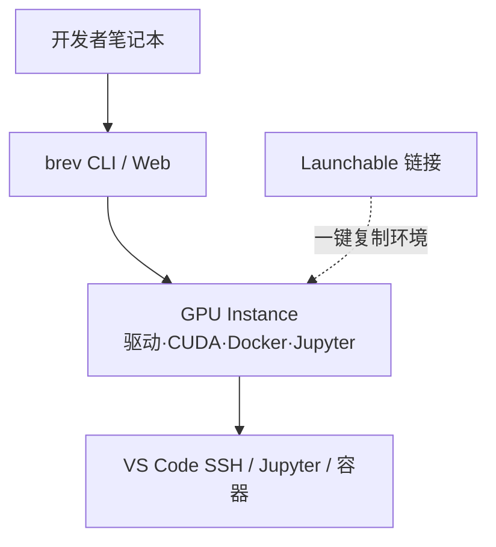

# NVIDIA Brev

**NVIDIA Brev** 提供 **即时 GPU 实例** 与 **可分享 Launchable 环境**，在 AWS/GCP/Azure 等云商上预装 NVIDIA 驱动、CUDA、Python、Docker 与 Jupyter，让开发者无需自建镜像即可跑 Isaac、COMPASS、Jupyter 或自定义容器工作负载。

## 一句话定义

**选 GPU、点启动、写代码——Brev 把云 GPU 机器做成和本地工作站一样可 SSH/VS Code 接入的开发环境。**

## 英文缩写速查

| 缩写 | 英文全称 | 简要说明 |
|------|----------|----------|
| Brev | NVIDIA Brev | 本页云 GPU 开发与部署平台 |
| CLI | Command-Line Interface | `brev` 终端工具（[brev-cli](https://github.com/brevdev/brev-cli)） |
| GPU | Graphics Processing Unit | 实例核心资源 |
| CUDA | Compute Unified Device Architecture | 预装 GPU 计算栈 |
| SSH | Secure Shell | VS Code Remote / 终端接入 |
| NIM | NVIDIA Inference Microservice | 文档高级指南：在实例上部署 NIM |
| Launchable | Brev Launchable | 硬件+软件+代码的一键可分享部署链接 |

## 为什么重要

- **Physical AI 课程默认云入口：** [Physical AI Learning](./nvidia-physical-ai-learning.md)、[Isaac Lab 入门课](./nvidia-getting-started-isaac-lab.md) 在无本地 GPU 时指向 **[Isaac Launchable](./isaac-launchable.md)**（官方 Brev Launchable 模板）或自建 Brev 实例。
- **COMPASS 等重栈友好：** [COMPASS](./compass.md) Docker + Isaac Lab 3.0 beta 可在 Brev 大显存实例上跑 smoke test 与残差 RL，避免本机驱动/容器摩擦。
- **Agent 可编程：** [brev-cli](https://github.com/brevdev/brev-cli) 提供 **`brev agent-skill`**，让编码 agent 用自然语言创建/搜索 GPU 实例。

## 核心结构

| 能力 | 说明 |
|------|------|
| **GPU Instance** | 选规格启动 VM；多云商后端 |
| **Launchable** | 把硬件+软件栈+代码打包为可分享 URL（教程/团队协作） |
| **Environment** | 预装 AI/ML 工具链的镜像层 |
| **Brev CLI** | `brev login` / `create` / `ls`；MIT 开源 |
| **NIM 部署** | 高级文档：在实例上跑推理微服务 |

## 工程实践

| 目标 | 做法 |
|------|------|
| 安装 CLI | macOS：`brew install brevdev/homebrew-brev/brev`；Linux：官方 `install-latest.sh` |
| 首次使用 | `brev login` → `brev create <name>` → `brev ls` |
| VS Code | 按文档配置 **Remote SSH** 直连实例 |
| Jupyter | 端口转发访问实例上 JupyterLab |
| 自定义栈 | Docker / Docker Compose 在实例内跑 COMPASS、Isaac 等 |
| Agent | `brev agent-skill` 安装后可在 Claude Code 中说「create A100 for training」 |
| 与 Jetson 分工 | Brev = **训练/仿真云 GPU**；[Jetson](./nvidia-jetson.md) = **机载边缘推理** |

## 局限与风险

- **云费用与配额：** 大显存实例按小时计费；长时间 COMPASS RL 需设 checkpoint 与停机策略。
- **Launchable 版本钉扎：** [Isaac Launchable](./isaac-launchable.md) 当前钉 **Lab 3.0.0-beta2-post1 + Sim 6.0.1**；与课程录制版本不一致时需核对 README。
- **数据合规：** 机器人数据与 HF token 勿提交到可分享 Launchable 除非明确脱敏。
- **CLI 与平台分离：** `brev-cli` MIT 开源；Brev 云服务本身为 NVIDIA 商业产品。

## 关联页面

- [NVIDIA Physical AI Learning](./nvidia-physical-ai-learning.md)
- [Getting Started With Isaac Lab](./nvidia-getting-started-isaac-lab.md)
- [Isaac Launchable](./isaac-launchable.md) — 官方 Isaac Lab+Sim 浏览器 Launchable
- [COMPASS](./compass.md)
- [Isaac Sim](./isaac-sim.md)
- [Isaac Lab](./isaac-lab.md)
- [边缘–云机器人](../concepts/edge-cloud-robotics.md)

## 参考来源

- [Brev 文档 Overview 归档](../../sources/sites/nvidia-brev-overview.md)
- [brev-cli 仓库归档](../../sources/repos/brev_cli.md)
- [isaac-launchable 仓库归档](../../sources/repos/isaac_launchable.md)

## 推荐继续阅读

- [NVIDIA Brev 文档](https://docs.nvidia.com/brev/getting-started/overview)
- [brev.nvidia.com](https://brev.nvidia.com)
- [brevdev/brev-cli](https://github.com/brevdev/brev-cli)
