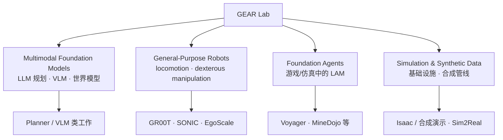

# NVIDIA GEAR Lab（Generalist Embodied Agent Research）

**GEAR** 是 NVIDIA Research 下的 **具身智能基础研究组**（门户：<https://research.nvidia.com/labs/gear/>），由 **Linxi "Jim" Fan** 与 **Yuke Zhu** 领导。公开 slogan 为 *Building Generally Capable Agents in Many Worlds, Virtual and Real*——强调在 **仿真与真机** 两侧同时推进 **通才（generalist）** 具身能力，而非孤立优化单任务 specialist。

## 英文缩写速查

| 缩写 | 英文全称 | 简要说明 |
|------|----------|----------|
| GEAR | Generalist Embodied Agent Research | NVIDIA 具身通才智能体研究组 |
| VLA | Vision-Language-Action | 视觉-语言-动作多模态基础策略方向 |
| VLM | Vision-Language Model | 视觉-语言多模态理解模型，常作 planner 或 VLA 骨干 |
| WBC | Whole-Body Control | 协调全身关节满足多任务/约束的控制基础设施 |
| LLM | Large Language Model | 大语言模型，常作高层任务/语言接口 |
| Sim2Real | Simulation to Real | 把仿真中学到的策略迁移落地真机的工程主线 |

## 为什么重要

- **工业界具身基础模型枢纽：** GEAR 连续发布 **人形 VLA（GR00T 系）**、**规模化 WBT（SONIC）**、**人视频 scaling（EgoScale）**、**真机 autoresearch（ENPIRE）** 等可被本库多条学习路线直接引用的 **系统级锚点**。
- **「通才」叙事一致：** 主页四议程把 **规划/世界模型、机器人本体、游戏/仿真 agent、合成数据** 放在同一研究组——便于理解为何 GR00T、SONIC、EgoScale 等看似异质的工作 **共享工程栈与作者网络**（如 [Zhengyi Luo](./zhengyi-luo.md)、[Tairan He](./tairan-he.md)）。
- **与本库分层对齐：** GEAR 产出常对应知识库 **方法页（methods）+ 实体页（entities）+ 任务页（tasks）** 的交叉区：例如 SONIC → 低层 WBC；GR00T → VLA；EgoScale → manipulation 数据 scaling；ENPIRE → 真机策略开发 harness。

## 研究议程（主页四支柱）

| 支柱 | 公开定义（归纳） | 本库已沉淀代表 |
|------|------------------|----------------|
| **Multimodal Foundation Models** | 互联网规模数据上的 LLM 规划、VLM、世界模型 | [VLA](../methods/vla.md) 生态中的 GR00T / planner 叙事 |
| **General-Purpose Robots** | 复杂环境人形 locomotion + 灵巧操作 | [SONIC](../methods/sonic-motion-tracking.md)、[EgoScale](../methods/egoscale.md)、[GR00T-WholeBodyControl](./gr00t-wholebodycontrol.md) |
| **Foundation Agents** | 游戏/仿真中自探索、自举能力的大 action model | 主页 Featured：**Voyager**、**MineDojo**（待单独 ingest） |
| **Simulation & Synthetic Data** | 大规模学习的仿真 infra 与合成数据 | [GR00T Visual Sim2Real](./gr00t-visual-sim2real.md)、Isaac 系教程交叉 |

## 主页 Featured 项目（2026-06）

| 项目 | 一句话 | 本库状态 |
|------|--------|----------|
| **GR00T** | 人形机器人基础模型 | [GR00T N1 实体](./paper-hrl-stack-34-gr00t_n1.md)、[WBC 仓库](./gr00t-wholebodycontrol.md) |
| **Eureka** | Coding LLM 自动设计奖励 | 外链待深读 |
| **Voyager** | LLM 开放式具身 agent（Minecraft） | 外链待深读 |
| **VIMA** | 多模态 prompt 操作 | 外链待深读 |
| **MineDojo** | 互联网知识开放式 agent | 外链待深读 |
| **EgoScale** | 人视频 scaling 解锁灵巧操作 | [EgoScale 方法页](../methods/egoscale.md) |

**项目索引页另列：** MimicPlay（长时程模仿学习）—— 尚未单独 ingest。

## 本库已索引的 GEAR 系工作（扩展）

主页 Featured **不等于完整目录**。以下工作亦常标注 NVIDIA GEAR 署名或挂在 `research.nvidia.com/labs/gear/` 子路径：

| 工作 | 角色 | 本库入口 |
|------|------|----------|
| **SONIC** | 规模化人形 motion tracking / 统一低层接口 | [sonic-motion-tracking.md](../methods/sonic-motion-tracking.md) |
| **ENPIRE** | 真机 coding-agent 策略自改进 harness | [enpire.md](../methods/enpire.md) |
| **GR00T Visual Sim2Real** | VIRAL / DoorMan 等像素→动作迁移 | [gr00t-visual-sim2real.md](./gr00t-visual-sim2real.md) |
| **Real-robot autoresearch** | ENPIRE 与机队 scaling 讨论 | [real-robot-policy-autoresearch-harness.md](../queries/real-robot-policy-autoresearch-harness.md) |

## 常见误区或局限

- **GEAR ≠ 全部 NVIDIA 机器人产品：** Isaac Sim/Lab、Omniverse、Physical AI Learning 等属 **更广 NVIDIA 生态**；GEAR 聚焦 **研究组论文与开源模型**（见 [NVIDIA Physical AI Learning](./nvidia-physical-ai-learning.md) 对照）。
- **首页项目列表会变：** 新论文可能先以 arXiv + 独立项目页发布，**滞后**出现在 `/gear/` 首页；策展应以 **论文/仓库** 为准。
- **「Foundation Agent」与「VLA」边界：** GEAR 同时推进 **游戏 agent（Voyager）** 与 **真机 VLA（GR00T）**；读论文时需分清 **动作空间、观测与部署约束**。

## 与其他页面的关系

- [GR00T-WholeBodyControl](./gr00t-wholebodycontrol.md) — GEAR 人形 **低层控制单仓**（WBC + SONIC + MotionBricks）
- [EgoScale](../methods/egoscale.md) — GEAR **人视频 → 灵巧 VLA** scaling 叙事
- [ENPIRE](../methods/enpire.md) — GEAR **真机 autoresearch** 闭环
- [Zhengyi Luo](./zhengyi-luo.md) / [Tairan He](./tairan-he.md) — GEAR–CMU 合作作者网络节点
- [Foundation Policy](../concepts/foundation-policy.md) — 通才策略抽象层

## 推荐继续阅读

- GEAR 门户：<https://research.nvidia.com/labs/gear/>
- 项目索引：<https://research.nvidia.com/labs/gear/projects/>
- SONIC 演示：<https://nvlabs.github.io/GEAR-SONIC/>
- Isaac-GR00T：<https://github.com/NVIDIA/Isaac-GR00T>

## 参考来源

- [nvidia-research-gear-lab.md](../../sources/sites/nvidia-research-gear-lab.md) — GEAR 主页与项目索引策展
- [nvidia-research-egoscale.md](../../sources/sites/nvidia-research-egoscale.md) — EgoScale 子站
- [nvidia-research-enpire.md](../../sources/sites/nvidia-research-enpire.md) — ENPIRE 子站

## 关联页面

- [SONIC（规模化运动跟踪）](../methods/sonic-motion-tracking.md)
- [EgoScale](../methods/egoscale.md)
- [ENPIRE](../methods/enpire.md)
- [GR00T-WholeBodyControl](./gr00t-wholebodycontrol.md)
