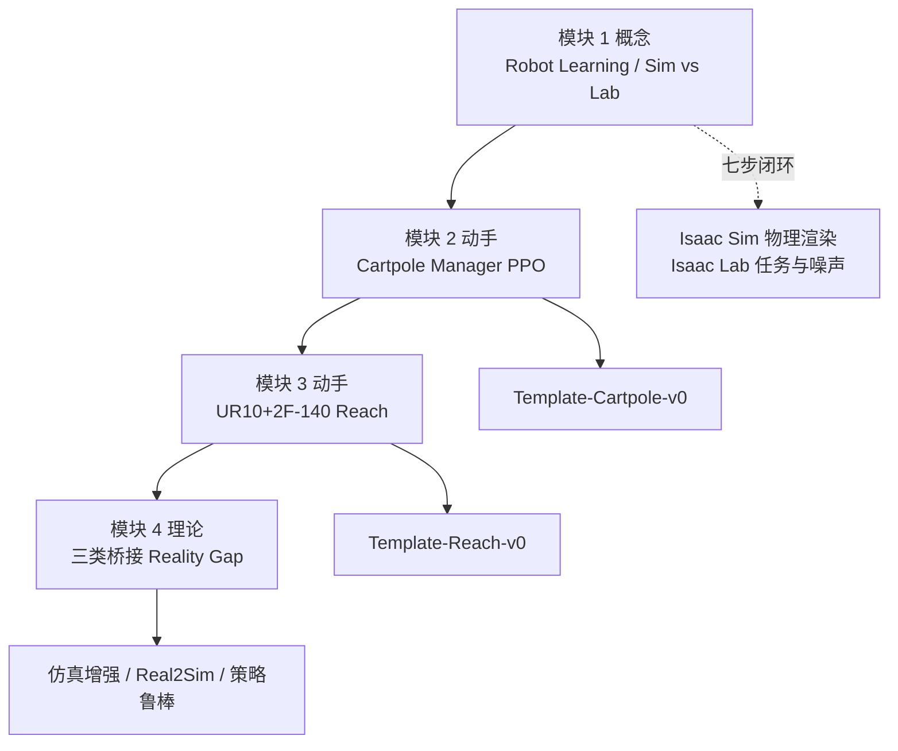
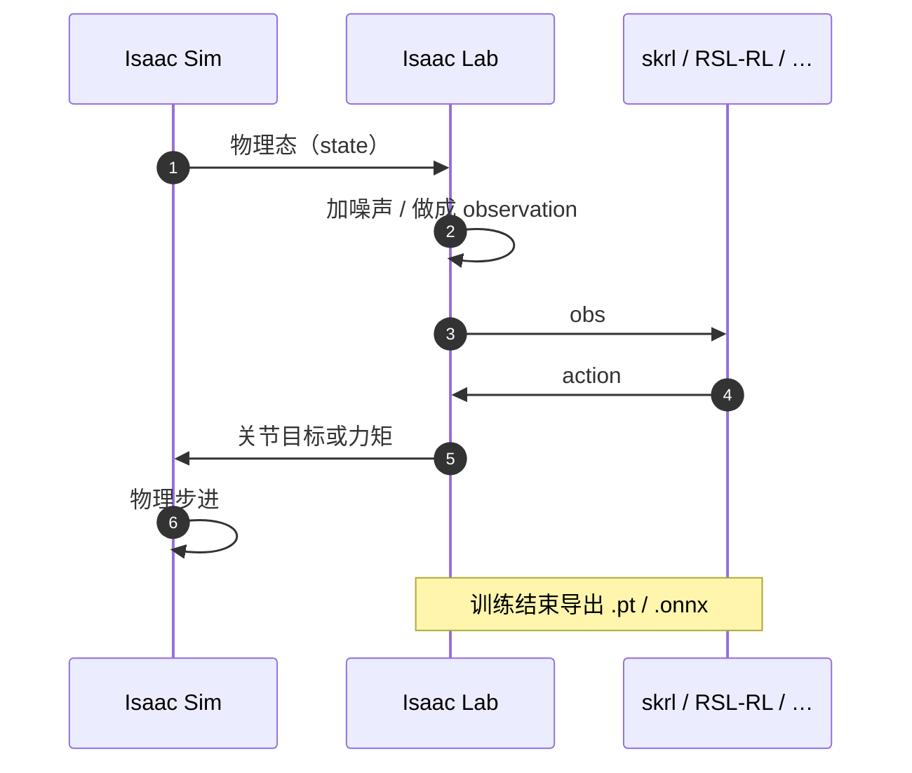

# NVIDIA Getting Started With Isaac Lab

**Getting Started With Isaac Lab** 是 [Physical AI Learning](./nvidia-physical-ai-learning.md) 门户下的 **中级自学课**（官方标注约 3–4 小时）。四模块把读者从「Isaac Sim 与 Isaac Lab 各干什么」带到 **Cartpole 并行 PPO**、**UR10 + Robotiq 2F-140 自定义 reach**，最后用理论模块把 **reality gap** 拆成仿真增强、Real2Sim 与策略鲁棒三类桥接。

## 一句话定义

官方 Isaac Lab 入门主线：先在 GPU 并行 MDP 里训通第一台（倒立摆）和第二台（六轴 reach），再带着三类 sim-to-real 工具箱去读部署，而不是把 Lab 当 Gym 换皮。

## 英文缩写速查

| 缩写 | 英文全称 | 简要说明 |
|------|----------|----------|
| Isaac Lab | NVIDIA Isaac Lab | 建立在 Isaac Sim 上的 robot learning 框架 |
| MDP | Markov Decision Process | Manager 把观测/动作/奖励/终止拆成可组合配置 |
| PPO | Proximal Policy Optimization | 课内 skrl 默认算法 |
| SKRL | Modular Reinforcement Learning Library | 本课训练后端；模板 YAML 需对齐观测接口 |
| DR | Domain Randomization | 扩大仿真分布以覆盖真机；过宽会变成弱通才 |
| USD | Universal Scene Description | Sim 侧资产格式；Lab 用 `ArticulationCfg` 引用 |
| IL | Imitation Learning | 模块 1 对照路线：演示 → BC/IRL，不是本课动手主线 |
| SysID | System Identification | Real2Sim：用真机轨迹把仿真参数拧到实物 |
| ONNX | Open Neural Network Exchange | 课内部署产物格式之一（另有 `.pt` / JIT） |

## 为什么重要

- **补上「怎么写一个 Lab 任务」这一环。** 本库已有 [Isaac Lab](./isaac-lab.md) 实体与 [默认环境清单](./isaac-lab-default-environments.md)；本课给出 **external template + manager 配置** 的可跟做路径，避免只会跑官方 `Isaac-*-v0`。
- **与 SO-101 课分工。** [SO-101 Sim2Real](./nvidia-so101-sim2real-lab-workflow.md) 是 **VLA + 真机四策略对照**；本课是 **RL + manager-based 任务设计**。两条都在同一门户，不要混成一门课。
- **第四模块把 gap 分类钉死。** 近似 / 模型 / 未建模动力学 → 三类对策，可直接对照 [Sim2Real](../concepts/sim2real.md)、[Domain Randomization](../concepts/domain-randomization.md)、[Privileged Training](../concepts/privileged-training.md)。

## 开源与运行入口（步骤 2.5）

| 项 | 状态（入库日 2026-08-28） |
|----|---------------------------|
| 课程正文 | 免费文档，无独立课程 GitHub |
| 可运行代码 | **已开源** — [isaac-sim/IsaacLab](https://github.com/isaac-sim/IsaacLab)；任务由 `./isaaclab.sh --new` 生成 external 工程 |
| 云 GPU | [Isaac Launchable](./isaac-launchable.md)（Brev 官方模板，钉 **Lab 3.0.0-beta2-post1 + Sim 6.0.1**）或 [NVIDIA Brev](./nvidia-brev.md) 自建实例；版本可能与课测 revision 不完全一致 |
| 数据/权重 | 无单独发布；Cartpole / Reach 从零训 |

## 四模块地图

## 核心原理

### Sim 与 Lab 的数据流

课内把栈写成：OpenUSD → Omniverse → Isaac Sim → Isaac Lab。Sim 管 **资产、物理、渲染**；Lab 管 **任务设计**：读状态、加噪声、做成观测、包一层 RL/IL 库、把动作写回 Sim。

关键区分：**state** 是仿真里的真值（如精确位姿）；**observation** 是部署侧能测到的量（图像、编码器、IMU）。仿真里还能拿 **privileged information**（摩擦、物体真值位姿），真机没有。

### Manager-based vs Direct

| | Manager-based（本课推荐） | Direct |
|--|---------------------------|--------|
| 代码形态 | 观测/动作/奖励/事件拆成 `@configclass` | 单类写完环境 |
| 适合 | 复用、协作、新用户 | 难拆分逻辑、JIT、旧 Isaac Gym 心智 |
| 课内用法 | Cartpole 与 Reach 全部走这条 | 结论里指向官方 Direct 导览，不当课内作业 |

`Actions` 是关节怎么动；`Commands` 是任务目标（如末端位姿命令）。二者不要写成一个 manager。

### 模块 2：Cartpole 奖励与并行

外部工程注册 `Template-Cartpole-v0`。课内默认 **4096** 环境、`dt = 1/120`、`decimation = 2`、回合 5 s。动作是滑轨 **力矩**（`JointEffortActionCfg`，scale 100）；观测是相对关节位置/速度。

奖励项（权重是课内示例，不是普适常数）：

| 项 | 直觉 |
|----|------|
| `alive` +1 | 连续平衡任务给「还活着」 |
| `is_terminated` −2 | 飞出滑轨要重罚 |
| 杆角相对 0 的 L2 | 主任务：杆直立 |
| 车速 / 杆速 L1 | shaping：别靠猛甩 |

奖励函数对 **整批环境的 tensor 一次算完**——这是并行训练能加速的原因，不是「写一个 Python for 循环」。与 [Cartpole 问题](../concepts/cartpole.md) 中 `Isaac-Cartpole-v0` 同族，但本课任务 id 是模板生成的 `Template-Cartpole-v0`，超参不要和 Gymnasium `CartPole-v1` 混用。

### 模块 3：自定义机器人 + reach

资产在 Sim 里用 USD **reference** 把 UR10 与 2F-140 接到 `ee_link`，去掉夹爪多余 Articulation Root，再 `Fixed Joint`。Lab 侧 `ArticulationCfg` 用 **`ImplicitActuatorCfg`**（臂 Kp/Kd 800/40）——执行器参数放配置文件，不写进核心 USD。概念见 [Implicit / Explicit 执行器建模](../concepts/implicit-explicit-actuator-modeling.md)。

Reach 的命令是末端位姿均匀采样（约每 4 s）；观测加 `Unoise` 模拟编码器噪声。位置奖励用 **L2 惩罚 + tanh 细粒度奖励**：靠近目标时 tanh 梯度更大。课内第一次 `play` **位置对了、姿态不对**，再补四元数最短路径误差——这是「漏写奖励项」的标准教学事故，不是算法坏了。

调试顺序：`zero_agent`（能动但不该乱动）→ `random_agent`（关节确实在动）→ `train.py` → `play.py`（`Template-Reach-Play-v0`）。

### 模块 4：三类桥接 Reality Gap

Gap 来源课内写成三条：离散化等 **近似误差**、质量/摩擦不准的 **模型误差**、SEA/延迟/噪声等 **未建模动力学**。对策分三类，不是互斥：

1. **仿真增强（扩大仿真圆）** — 物理/地形/物体/任务 DR；视觉 DR **不追求照片级**，而让网络抓住对比与结构；深度相机加孔洞与非均匀噪声；点云做位移与缺损。见 [Domain Randomization](../concepts/domain-randomization.md)。
2. **Real2Sim（平移仿真圆）** — [SysID](../concepts/system-identification.md)；[Actuator Network](../methods/actuator-network.md) 用指令+关节历史预测力矩并 **冻结** 替换仿真 PID；扫描网格数字孪生；NeRF 作训练期渲染；世界模型在 sim/real 上训共享 latent。
3. **策略鲁棒** — action rate / 关节速度 / 接触力正则，避免仿真里「能完成但会砸硬件」；特权信息走 **非对称 actor-critic**（critic 吃真值，actor 吃可部署观测）或 **teacher–student**（课内 DextrAH-G 三阶段）。见 [Privileged Training](../concepts/privileged-training.md)。

权衡：DR 太宽 → 通才、专项变弱；只做 Real2Sim → 要采数、更 specialist。课内建议 **最小必要 DR + 有针对的 Real2Sim**。课内速度叙事：G1 粗糙地形 locomotion，RTX 4090 上约 **1 s 仿真 ≈ 27 min 真机经验**——用来理解「为何必须仿真」，不是承诺你的任务也能达到这个比。

## 工程实践

1. **装栈：** 本地按 Isaac Lab 文档；无合适 GPU 走 [Isaac Launchable](./isaac-launchable.md) 或 Brev。先确认 Launchable 钉扎版本是否就是课测版本。
2. **新建任务：** `./isaaclab.sh --new` 选 **External + Manager-based + skrl/PPO**，再 `pip install -e source/<Name>`，用 `list_envs.py` 确认注册。
3. **训练：** `python scripts/skrl/train.py --task <id> --headless`；看过程去掉 `--headless`；云端流式加 `--livestream 2`。并行数默认 4096，机器吃不住就 `--num_envs`。
4. **自定义臂：** Sim 里保证 **单一 Articulation Root**；Lab 里 USD 路径、关节名、`ee_link` 与命令 `body_name` 一致。
5. **奖励迭代：** 先位置再姿态；用 curriculum 把平滑项权逐步加重，而不是一开始就把 action-rate 罚死。
6. **导出：** 课内产物 `.pt` / `.onnx`；真机还要状态估计、观测抽取、低层控制器——Lab **不提供** 现成 sim-to-real 脚本，只给策略与 env cfg。

## 局限与风险

- **Launchable 版本可能对不齐课测版本。** [Isaac Launchable](./isaac-launchable.md) 当前为 Lab 3.0.0-beta2-post1；先跑 `zero_agent`，不要一上来 4096 环境 debug。
- **skrl YAML `input: STATES`：** 课内示例与部分模板在 skrl 2.x 会 `NoneType.shape`；社区修复是改成 `OBSERVATIONS`（[IsaacLab#5416](https://github.com/isaac-sim/IsaacLab/issues/5416)）。
- **模块 4 没有动手。** 读完三类桥接不等于会部署；真机课走 [SO-101](./nvidia-so101-sim2real-lab-workflow.md) 或官方 Spot/装配博客。
- **Implicit 执行器好训，不等于真机。** Reach 课用 implicit PD；上真机还要对齐 explicit / 执行器网络。
- **DR 不是越大越好。** 课内明确：覆盖变宽，策略变成弱通才。
- **课内「26+ 环境」过时。** 当前默认任务规模以 [isaac-lab-default-environments](./isaac-lab-default-environments.md) 为准（v3.0 量级是上百个 Gym ID）。

## 关联页面

- [NVIDIA Physical AI Learning](./nvidia-physical-ai-learning.md) — 门户与路径选型
- [Isaac Launchable](./isaac-launchable.md) — 无本地 GPU 时的官方浏览器环境
- [NVIDIA SO-101 Sim2Real 实验 workflow](./nvidia-so101-sim2real-lab-workflow.md) — 同门户的 VLA/真机课
- [Isaac Lab](./isaac-lab.md)
- [Isaac Sim](./isaac-sim.md)
- [Isaac Gym / Isaac Sim / Isaac Lab 总览](./isaac-gym-isaac-lab.md)
- [Isaac Lab 默认环境](./isaac-lab-default-environments.md)
- [skrl](./skrl.md)
- [Cartpole 问题](../concepts/cartpole.md)
- [MDP](../formalizations/mdp.md)
- [Reinforcement Learning](../methods/reinforcement-learning.md)
- [Sim2Real](../concepts/sim2real.md)
- [Domain Randomization](../concepts/domain-randomization.md)
- [Privileged Training](../concepts/privileged-training.md)
- [Implicit / Explicit 执行器建模](../concepts/implicit-explicit-actuator-modeling.md)
- [Actuator Network](../methods/actuator-network.md)
- [Sim2Real Gap 缩减指南](../queries/sim2real-gap-reduction.md)

## 参考来源

- [Getting Started With Isaac Lab 课程归档](../../sources/courses/nvidia_getting_started_isaac_lab.md)
- [Physical AI Learning 门户](../../sources/sites/nvidia-physical-ai-learning.md)
- [Isaac Lab 仓库归档](../../sources/repos/isaac_lab.md)
- [官方课程](https://docs.nvidia.com/learning/physical-ai/getting-started-with-isaac-lab/latest/index.html)

## 推荐继续阅读

- Isaac Lab 文档：<https://isaac-sim.github.io/IsaacLab/>
- Task Design Workflows：<https://isaac-sim.github.io/IsaacLab/main/source/overview/core-concepts/task_workflows.html>
- [Query：如何缩小 sim2real gap](../queries/sim2real-gap-reduction.md)
- 同门户下一课：[SO-101 Sim2Real](https://docs.nvidia.com/learning/physical-ai/sim-to-real-so-101/latest/index.html)
