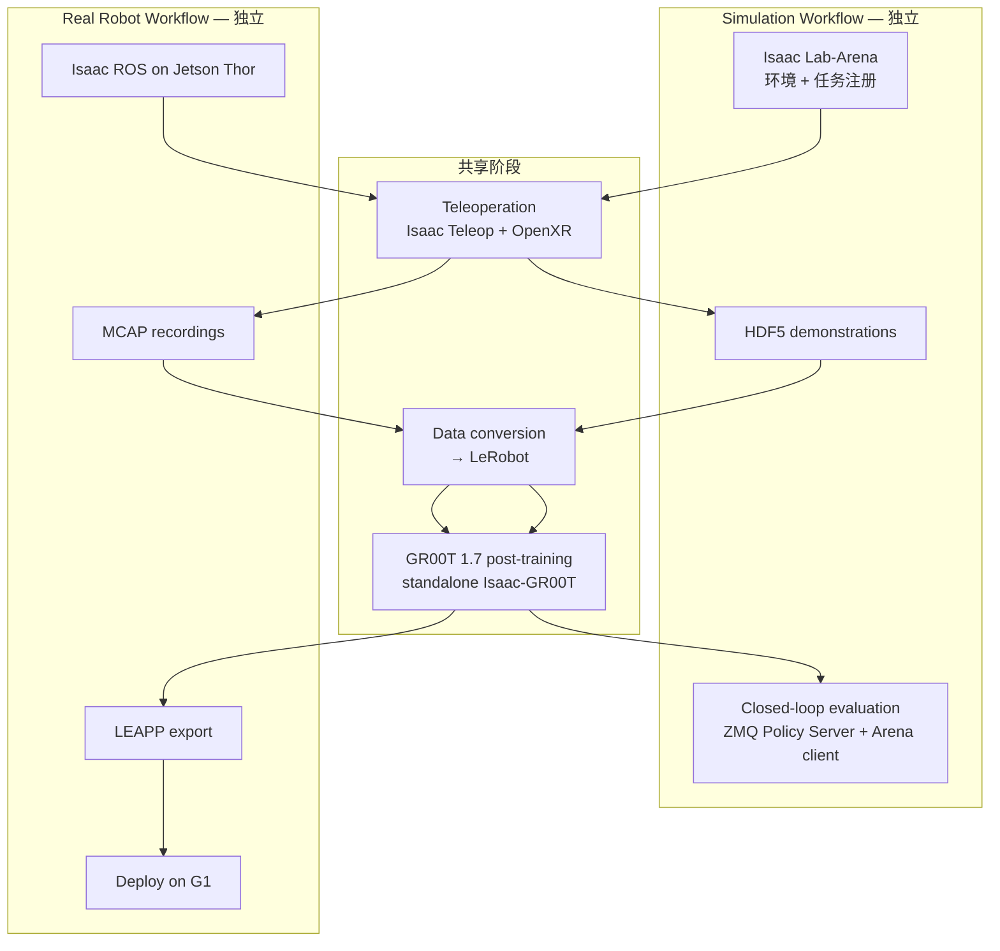

# NVIDIA GR00T G1 端到端参考 workflow

**How to Develop and Deploy Humanoid Robots End-to-End with NVIDIA Isaac GR00T and Unitree G1** 是 [Physical AI Learning](./nvidia-physical-ai-learning.md) 下的 **官方动手课**。它以 **Unitree G1** 在货架前完成 **apple → plate** 静态桌面 pick-and-place 为基准任务，把 NVIDIA 已验证的 **GR00T 1.7 reference workflow** 拆成可逐步跟做的章节，并明确提供 **仿真-only** 与 **真机-only** 两条 **完全解耦** 的路径。

## 一句话定义

跟做 NVIDIA 官方 G1 人形 manipulation 参考链：OpenXR 遥操采 demonstration → LeRobot → GR00T 1.7 后训练 → Isaac Lab-Arena 闭环评测或 Jetson Thor 真机部署。

## 英文缩写速查

| 缩写 | 英文全称 | 简要说明 |
|------|----------|----------|
| VLA | Vision-Language-Action | 视觉-语言-动作多模态策略 |
| WBC | Whole-Body Control | 全身控制；本课默认 AGILE 仅保站立平衡 |
| E2E | End-to-End | 从环境搭建到真机部署的完整管线 |
| LEAPP | — | Isaac ROS 侧策略导出 bundle，供 Thor 端侧推理 |
| HDF5 | Hierarchical Data Format 5 | 仿真 teleop 录制格式 |
| MCAP | — | 真机 ROS 2 bag 常用容器格式 |
| ZMQ | ZeroMQ | Arena 与 GR00T Policy Server 远程推理传输 |
| IL | Imitation Learning | 从 demonstration 学习策略 |
| VR | Virtual Reality | Quest 3 / PICO 4 Ultra 等 OpenXR 头显遥操 |

## 为什么重要

- **Reference workflow 而非 demo：** 课程强调这是 **已验证、开源、可复现** 的人形 enablement 蓝图，不是一次性 showcase；团队可整链采用或只嵌入其中模块。
- **与 SO-101 课形成互补：** [SO-101 Sim2Real 实验课](./nvidia-so101-sim2real-lab-workflow.md) 教 **操作臂 + 四类 sim2real gap**；本课教 **人形 G1 + GR00T 1.7 + WBC 分层 + 双路径部署**，更贴近 [Isaac GR00T](./isaac-gr00t.md) 平台主线。
- **两条独立路径降低门槛：** 无 G1 硬件可只走仿真；有 Thor + G1 可跳过仿真专做真机 MCAP 链——比「仿真真机强绑定」的教程更易选型。
- **预置 HF 跳过路径：** 官方提供仿真/真机 **数据集与 checkpoint**，支持「先复现 reference 结果再自采自训」的三档深度（最快 / 标准 / 自定义任务）。

## 流程总览

## 基准任务规格

| 字段 | 内容 |
|------|------|
| Task name | `galileo_g1_static_pick_and_place` |
| 技能 | Pick + place；**无** walk / squat / turn |
| Embodiment | Unitree G1，29 DOF；**AGILE WBC 仅站立平衡** |
| 场景 | Galileo Lab，单货架；apple 刚体 → 同架 clay plate |
| 策略 | GR00T **1.7**，模仿学习 |
| 仿真数据 | Teleop **HDF5** → LeRobot |
| 真机数据 | **MCAP** → LeRobot |
| 评测 | Success rate；仿真 **50 Hz** 闭环控制 |

**工程提示：** 静态任务刻意 **去掉 locomotion 通道**，但 WBC 仍 actively balance；遥操/训练标签来自 **AGILE** 下的 joint-space 分布——换 WBC 即换训练分布（与 [Isaac GR00T](./isaac-gr00t.md) G1 教程节一致）。

## 仿真路径要点

| 步骤 | 关键决策 |
|------|----------|
| Arena 搭建 | Docker 内 Isaac Lab-Arena；任务/embodiment/成功逻辑见 Environment Code Review |
| Teleop | CloudXR + Quest 3 / PICO 4 Ultra；无头显可用 **IWER** 桌面 Chrome 冒烟 |
| 后训练 | **Arena 容器外** 独立 `Isaac-GR00T` checkout，避免依赖冲突 |
| 评测 | GR00T server（独立 venv）+ Arena client **ZeroMQ** 远程 policy |
| 算力 | 官方单卡测试：**RTX 6000 Ada 48GB**，20k steps 约 **2–3 h** |

## 真机路径要点

| 步骤 | 关键决策 |
|------|----------|
| 硬件 | G1 + Dex3-1 + 头载 RealSense + **Jetson AGX Thor** |
| 软件栈 | Thor 上 **Isaac ROS**；AGILE 管下肢，GR00T/操作员管上半身 |
| 训练/导出 | Fine-tune 与 **LEAPP** 可在 x86 完成；部署回 Thor |
| 安全 | 必须完整阅读 G1 Safety 章节；**建议双人**（遥操 + 监护） |

## 预置 Hugging Face 资产

| 场景 | 数据集 | 模型（可跳过训练） |
|------|--------|-------------------|
| 仿真 | [`nvidia/Arena-G1-Static-PickNPlace-Task`](https://huggingface.co/datasets/nvidia/Arena-G1-Static-PickNPlace-Task) | [`nvidia/GN1x-Tuned-Arena-G1-Static-PickNPlace`](https://huggingface.co/nvidia/GN1x-Tuned-Arena-G1-Static-PickNPlace) |
| 真机 | [`nvidia/GR00T-N1.7-AppleToPlate`](https://huggingface.co/datasets/nvidia/GR00T-N1.7-AppleToPlate) | [`nvidia/GR00T-N1.7-ApplePnP-V1`](https://huggingface.co/nvidia/GR00T-N1.7-ApplePnP-V1) |

使用前须对齐 **embodiment、WBC modality 与部署配置**——预置 checkpoint 是起点，不是万能策略。

## 工程实践

### 三档跟做深度（课程官方）

1. **最快：** 用预置模型复现 reference success rate，少量 teleop 熟悉流程  
2. **标准：** 自采 demonstration + 自训 GR00T 1.7  
3. **自定义：** 在同一 workflow 上换任务/物体/场景（需自行改 Arena 注册与 LeRobot 映射）

### 先决条件摘要

- **共享：** Linux + Docker；中级 Python；Isaac Teleop 支持 XR 设备；训练 GPU **≥48 GB VRAM**  
- **仿真 Sim：** Ubuntu 22.04/24.04；Isaac Sim 6.0 口径工作站（**需 RT Core GPU**，A100/H100 **不能**跑 Isaac Sim 容器）  
- **真机：** Jetson AGX Thor + G1；大规模 post-train 推荐 8× GPU

单路径官方时长约 **3–6 h**（不含自选采数量与调参迭代）。

## 局限与风险

- **不是通用人形平台 kit：** 任务 bounded（静态桌面 manipulation）；loco-manip 需换 WBC/任务注册，见 [GR00T-WholeBodyControl](./gr00t-wholebodycontrol.md) 与 [loco-manipulation](../tasks/loco-manipulation.md) 专页。  
- **弱数据/错误 action mapping 仍会击穿管线：** 工具连通 ≠ 策略可用；workspace 可重复性、控制器稳定性需阶段验证。  
- **IWER 仅适合链路冒烟：** 训练级 demonstration 仍推荐真 XR 头显。  
- **与 [GR00T-VisualSim2Real](./gr00t-visual-sim2real.md) 不同：** 后者是 **PPO Teacher + RGB Student** 研究 repo；本课是 **IL + GR00T 1.7 + LeRobot** 教程链。

## 开源状态（项目页核查，2026-09-23）

| 组件 | 状态 | 入口 |
|------|------|------|
| Isaac-GR00T | **已开源** | https://github.com/NVIDIA/Isaac-GR00T |
| Isaac Lab-Arena | **已开源** | https://github.com/isaac-sim/IsaacLab-Arena |
| Isaac Teleop | **已开源** | https://github.com/NVIDIA/IsaacTeleop |
| Isaac ROS | **已开源** | https://github.com/NVIDIA-ISAAC-ROS |
| 预置权重/数据 | **已发布** | 见上表 HF 链接 |

## 参考来源

- [GR00T G1 E2E 课程归档](../../sources/courses/nvidia_gr00t_e2e_g1_workflow.md)
- [Isaac-GR00T 仓库归档](../../sources/repos/isaac_gr00t.md)
- [NVIDIA Developer Blog：人形端到端 GR00T 平台](../../sources/blogs/nvidia_develop_humanoid_robot_policies_isaac_gr00t.md)
- [官方课程](https://docs.nvidia.com/learning/physical-ai/gr00t-e2e-workflow/latest/index.html)

## 关联页面

- [NVIDIA Physical AI Learning](./nvidia-physical-ai-learning.md)
- [Isaac GR00T（开发平台）](./isaac-gr00t.md)
- [Isaac Lab-Arena](./isaac-lab-arena.md)
- [Isaac Teleop](./isaac-teleop.md)
- [LeRobot](./lerobot.md)
- [GR00T-WholeBodyControl](./gr00t-wholebodycontrol.md)
- [Manipulation](../tasks/manipulation.md)
- [NVIDIA Physical AI 工具链技术地图](../overview/nvidia-physical-ai-toolchain-technology-map.md)

## 推荐继续阅读

- [NVIDIA Learning：课程首页](https://docs.nvidia.com/learning/physical-ai/gr00t-e2e-workflow/latest/index.html)
- [GR00T Reference Workflow for Unitree G1（Isaac ROS）](https://nvidia-isaac-ros.github.io/reference_workflows/isaac_for_physical_ai/tutorials/tutorials.html)
- [Develop Humanoid Robot Policies End-to-End with NVIDIA Isaac GR00T](https://developer.nvidia.com/blog/develop-humanoid-robot-policies-end-to-end-with-nvidia-isaac-gr00t/)
- [Isaac Teleop + GR00T 1.7 LeRobot 集成（HF Blog）](https://huggingface.co/blog/nvidia/nvidia-isaac-teleop-and-gr00t17-in-lerobot)
