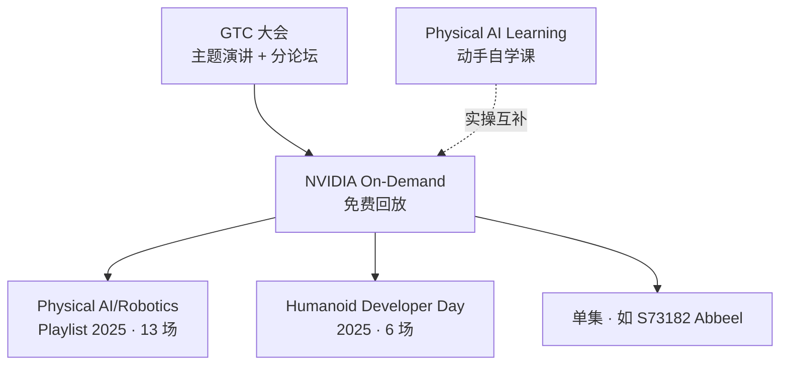

# NVIDIA GTC（机器人 / Physical AI 一手资料）

**NVIDIA GTC**（GPU Technology Conference，现定位为 **AI Conference**）是 NVIDIA 年度/global 大会：主题演讲、技术分论坛与 Hands-on Lab 会后通过 **[NVIDIA On-Demand](https://www.nvidia.com/en-us/on-demand/)** 免费回放。对本知识库而言，GTC 是 **Physical AI 产品路线与生态案例的一手视频索引**——与 [Physical AI Learning](./nvidia-physical-ai-learning.md) 动手课互补，而非替代。

## 一句话定义

**看 GTC 把握 NVIDIA 机器人栈「发布什么、谁在用」；跟 Physical AI Learning 学「怎么跑起来」。**

## 英文缩写速查

| 缩写 | 英文全称 | 简要说明 |
|------|----------|----------|
| GTC | GPU Technology Conference | 本页 NVIDIA 官方 AI 大会（现品牌为 AI Conference） |
| On-Demand | NVIDIA On-Demand | 会后演讲视频回放门户 |
| Physical AI | Physical Artificial Intelligence | 感知–推理–行动于真实物理世界的 AI 系统 |
| WFM | World Foundation Model | Cosmos 等视频级世界模型 |
| GR00T | Generalist Robot 00 Technology | NVIDIA 人形 VLA 开发平台 |
| USD | Universal Scene Description | OpenUSD 场景组合与数字孪生数据层 |

## 为什么重要

- **一手发布与路线：** GTC 2025 **Humanoid Developer Day** 集中发布 **Isaac GR00T 四部分架构**、**MuJoCo-Warp + Newton** 合作叙事；Physical AI/Robotics 播放列表由 **Ming-Yu Liu** 主讲 **Cosmos WFM**（[S72431](https://www.nvidia.com/en-us/on-demand/session/gtc25-s72431/)）。
- **生态案例密度高：** 工业数字孪生圆桌含 Agility、Intrinsic、Foxconn；通才人形圆桌含 1X、Boston Dynamics、Skild AI——适合选型时对照 [Isaac GR00T](./isaac-gr00t.md)、[Newton](./newton-physics.md)、[Cosmos](./nvidia-cosmos.md)。
- **与 resources 播放列表衔接：** [Robotics Fundamentals 播放列表](../../sources/sites/nvidia-robotics-fundamentals-playlist.md) 中多条 GTC 片段（如 *Physical AI for the Real World* → [S81479](https://www.nvidia.com/en-us/on-demand/session/gtc26-s81479/)）可回溯到本页索引。

## 核心结构

## 官方播放列表（机器人主线）

### Physical AI / Robotics — GTC 2025（13 场）

完整场次见 [`sources/courses/nvidia_gtc_2025_physical_ai_robotics_playlist.md`](../../sources/courses/nvidia_gtc_2025_physical_ai_robotics_playlist.md)。

| 优先观看 | 标题 | 关联实体 |
|----------|------|----------|
| ★ | An Introduction to NVIDIA Cosmos World Foundation Models | [Cosmos](./nvidia-cosmos.md) |
| ★ | Physical AI for the Next Frontier of Industrial Digitalization | [Omniverse](./nvidia-omniverse.md) |
| ★ | AI-Powered Robotics: Forging the Future of Intelligent Automation | 智能制造案例 |
| | An Introduction to OpenUSD | [Learn OpenUSD](./nvidia-learn-openusd.md) |
| | Agentic AI for Physical Operations | 仓储 Spatial AI |
| | Build your next Vision AI application for Physical AI on a Digital Twin | Metropolis |

播放列表：[On-Demand playList-44408ff1](https://www.nvidia.com/en-us/on-demand/playlist/playList-44408ff1-cbb9-4280-96eb-945d6451afa5/)

### Humanoid Developer Day — GTC 2025（6 场）

完整场次见 [`sources/courses/nvidia_gtc_2025_humanoid_developer_day.md`](../../sources/courses/nvidia_gtc_2025_humanoid_developer_day.md)。

| 优先观看 | 标题 | 关联实体 |
|----------|------|----------|
| ★ | An Introduction to Building Humanoid Robots | [Isaac GR00T](./isaac-gr00t.md) |
| ★ | Announcing Mujoco-Warp and Newton | [Newton](./newton-physics.md) |
| ★ | A New Era of Generalist Robotics: The Rise of Humanoids | 人形生态圆桌 |
| | Insights Into Disney's Robotic Character Platform | 娱乐机器人 / BDX |
| | The Promise of Humanoid Robots: Research vs. the Real World | 研究 vs 部署差距 |
| | A New Path to Embodied AI | Skild AI 具身路线 |

播放列表：[On-Demand playList-65d9c18b](https://www.nvidia.com/en-us/on-demand/playlist/playList-65d9c18b-207e-4cc3-8a16-81dc3ead10f4/)

### 单集速查（resources 播放列表 ↔ On-Demand）

| 标题 | 会话 | 大会 |
|------|------|------|
| An Introduction to NVIDIA Cosmos World Foundation Models | [gtc25-s72431](https://www.nvidia.com/en-us/on-demand/session/gtc25-s72431/) | GTC 2025 |
| Introduction to Autonomous Vehicles | [gtc25-s72857](https://www.nvidia.com/en-us/on-demand/session/gtc25-s72857/) | GTC 2025 |
| Physical AI for the Real World: A Vision From NVIDIA Robotics Research | [gtc26-s81479](https://www.nvidia.com/en-us/on-demand/session/gtc26-s81479/) | GTC 2026 |
| An Introduction to Robot Simulation | [gtc26-s81488](https://www.nvidia.com/en-us/on-demand/session/gtc26-s81488/) | GTC 2026 |
| AI for Humanoid Robots（Pieter Abbeel） | [gtc25-s73182](https://www.nvidia.com/en-us/on-demand/session/gtc25-s73182/) | GTC 2025 |
| MuJoCo-Warp and Newton（Google × NVIDIA） | [gtc25-s72709](https://www.nvidia.com/en-us/on-demand/session/gtc25-s72709/) | GTC 2025 |

## 工程实践

| 目标 | 做法 |
|------|------|
| 找机器人回放 | On-Demand 搜 **Robotics** / **Physical AI** / **Humanoid**；或从上表播放列表进入 |
| 发布会后跟进 | 先看 Humanoid Day **GR00T** 与 **Newton** 场，再读对应实体页 README |
| Cosmos 入门 | 播放列表第 4 场 + [Cosmos 实体](./nvidia-cosmos.md) + Cookbook |
| 与课程配合 | 愿景/案例看 GTC；命令与 lab 走 [Physical AI Learning](./nvidia-physical-ai-learning.md) / [Isaac Launchable](./isaac-launchable.md) |
| 中文资源 | GTC 主站与 On-Demand 以英文为主；中国区可能有本地化活动页 |

## 局限与风险

- **视频 ≠ 可复现：** GTC 演讲展示的是路线与 demo，不含完整训练脚本；复现须跟产品文档与开源仓。
- **版本快速过时：** 2025 场中 Isaac/Sim/Lab 版本可能与当前 main 不一致；以实体页与 GitHub 为准。
- **营销与案例偏差：** 工业圆桌、人形圆桌含合作伙伴叙事，需与独立论文/开源实现交叉验证。
- **On-Demand 需登录：** 部分页面 cookie/地区限制；无法抓取全文时以官方播放列表元数据归档（见 sources）。

## 关联页面

- [NVIDIA Physical AI Learning](./nvidia-physical-ai-learning.md) — 动手课门户
- [Robotics Fundamentals 播放列表](../../sources/sites/nvidia-robotics-fundamentals-playlist.md) — 营销漏斗
- [NVIDIA Cosmos](./nvidia-cosmos.md)
- [Isaac GR00T](./isaac-gr00t.md)
- [Newton Physics](./newton-physics.md)
- [NVIDIA Omniverse](./nvidia-omniverse.md)
- [Isaac Lab](./isaac-lab.md) / [Isaac Sim](./isaac-sim.md)

## 参考来源

- [NVIDIA GTC 门户归档](../../sources/sites/nvidia-gtc.md)
- [GTC 2025 Physical AI/Robotics 播放列表](../../sources/courses/nvidia_gtc_2025_physical_ai_robotics_playlist.md)
- [GTC 2025 Humanoid Developer Day](../../sources/courses/nvidia_gtc_2025_humanoid_developer_day.md)
- [NVIDIA GTC](https://www.nvidia.com/gtc/)
- [NVIDIA On-Demand](https://www.nvidia.com/en-us/on-demand/)

## 推荐继续阅读

- [Physical AI / Robotics GTC 2025 播放列表](https://www.nvidia.com/en-us/on-demand/playlist/playList-44408ff1-cbb9-4280-96eb-945d6451afa5/)
- [Humanoid Developer Day 播放列表](https://www.nvidia.com/en-us/on-demand/playlist/playList-65d9c18b-207e-4cc3-8a16-81dc3ead10f4/)
- [Physical AI Learning — Robotics](https://docs.nvidia.com/learning/physical-ai/robotics.html)
