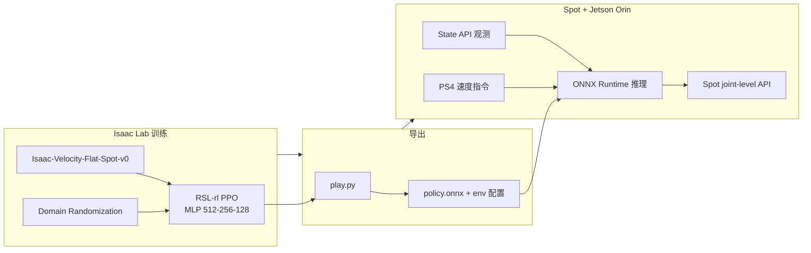
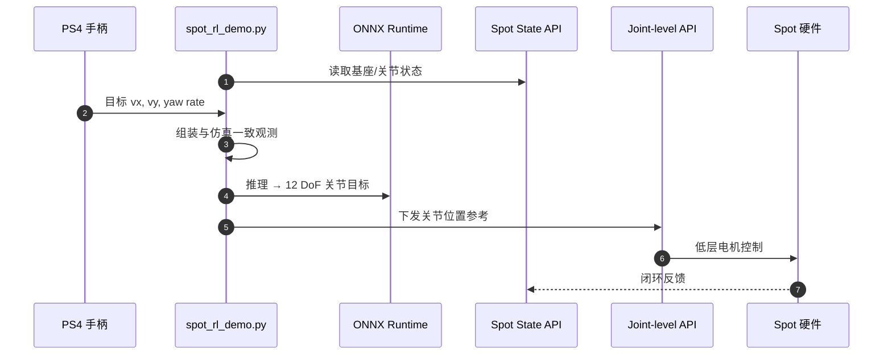

# NVIDIA Isaac Lab Spot locomotion Sim2Real

**Closing the Sim-to-Real Gap: Training Spot Quadruped Locomotion with NVIDIA Isaac Lab** 是 NVIDIA Developer Blog 上的 **Spot 四足平地 locomotion** 教程：用 **Reinforcement Learning Researcher Kit**（Boston Dynamics × NVIDIA × The AI Institute）在 Isaac Lab 训练 **`Isaac-Velocity-Flat-Spot-v0`**，再经 **Jetson AGX Orin** 与 **`spot-rl-example`** 在真机 **零样本** 部署。

## 一句话定义

4096 并行 env + RSL-rl PPO 在 Isaac Lab 里学会 Spot 平地速度跟踪，导出 ONNX 到 Orin payload，用与仿真一致的观测和 PS4 速度指令闭环跑真机——Researcher Kit 的 **标准 sim2real 入门路径**。

## 英文缩写速查

| 缩写 | 英文全称 | 简要说明 |
|------|----------|----------|
| Sim2Real | Simulation to Real | 仿真策略迁移真机 |
| RL | Reinforcement Learning | 学习关节位置参考的低层 locomotion 策略 |
| PPO | Proximal Policy Optimization | RSL-rl 默认 on-policy 算法 |
| DR | Domain Randomization | 训练阶段随机化物理与控制参数 |
| Isaac Lab | NVIDIA Isaac Lab | Omniverse 机器人学习框架 |
| ONNX | Open Neural Network Exchange | 边缘部署常用策略导出格式 |
| SDK | Software Development Kit | Spot Python SDK 与 joint-level API |

## 为什么重要

- **可跟做部署链：** 相对 [Spot 分布距离 Sim2Real 论文](./paper-spot-rl-distributional-sim2real.md) 的研究向 CMA-ES 标定，本篇给出 **从 train.py 到 spot_rl_demo.py** 的逐步命令。
- **Kit 生态锚点：** 统一 **Isaac Lab 任务 ID、RSL-rl、Orin 载荷、BD State API** 命名，避免与「仅高层 Spot 接口」混淆。
- **四足 sim2real 对照：** 与本库 [Locomotion](../tasks/locomotion.md) 中 Go2 / ANYmal 等 Isaac Lab 路线并列，Spot 为 **商业四足 + 低层 API** 代表。

## 流程总览

## 源码运行时序图

- **复现路径：** Isaac Lab 训练 → `play.py` 导出 → Orin 安装 [spot-rl-example](https://github.com/boston-dynamics/spot-rl-example) + joint SDK → Release Control → `spot_rl_demo.py`。
- **训练规模（博客）：** 4096 env × 15000 iter ≈ 4 h @ RTX 4090；85k–95k FPS。

## 工程实践

| 步骤 | 要点 |
|------|------|
| **训练** | `./isaaclab.sh -p .../rsl_rl/train.py --task Isaac-Velocity-Flat-Spot-v0 --num_envs 4096 --headless` |
| **导出** | `play.py` 同 task → `exported/` 下 `.onnx` + 配置 |
| **Orin 网络** | 有线连接 Spot；示例 Jetson 192.168.50.5，Spot 192.168.50.3；SSH **端口 20022** |
| **Spot 前置** | 平板 App **Release Control**；电机 lockout 释放 |
| **手柄** | PS4 蓝牙配对 Orin；左摇杆 xy、右摇杆 yaw |

## 开源状态（步骤 2.5，截至 2026-08-30）

| 项 | 状态 |
|----|------|
| Isaac Lab Spot velocity 任务 | **已开源** |
| [spot-rl-example](https://github.com/boston-dynamics/spot-rl-example) | **已开源** — 见 [sources/repos/spot_rl_example.md](../../sources/repos/spot_rl_example.md) |
| Spot joint-level Python SDK | **需 Researcher Kit / BD 渠道** |
| RL Researcher Kit 硬件 | **商业采购**（Spot + 支架；Orin 另购） |

## 局限与风险

- **仅平地 velocity：** `Isaac-Velocity-Flat-Spot-v0` **无 Rough 变体**（见 [默认环境表](./isaac-lab-default-environments.md)）；楼梯/野外需另训或改任务。
- **零样本假设：** 未做本篇以外的 SysID；复杂域 gap 见论文实体的 **MMD/CMA-ES** 管线。
- **安全：** 低层 RL 部署须渐进 SOP；Release Control 后策略直接驱动物理关节。

## 关联页面

- [Spot 分布距离 Sim2Real（论文）](./paper-spot-rl-distributional-sim2real.md) — 同 Kit 的高性能 / 标定向研究
- [Isaac Lab 默认环境](./isaac-lab-default-environments.md) — Spot velocity ID
- [Boston Dynamics](./boston-dynamics.md) — Spot 平台
- [Locomotion](../tasks/locomotion.md) — 四足速度跟踪任务
- [Sim2Real](../concepts/sim2real.md) — 迁移总概念

## 参考来源

- [NVIDIA 博客：Spot locomotion Sim2Real](../../sources/blogs/nvidia_isaac_lab_spot_locomotion_sim2real.md)
- [spot-rl-example 仓库档案](../../sources/repos/spot_rl_example.md)

## 推荐继续阅读

- [Isaac Lab Spot 环境文档](https://isaac-sim.github.io/IsaacLab/) — 官方 velocity 任务说明
- [Spot RL Researcher Kit 产品页](https://www.bostondynamics.com/solutions/spot/research) — 硬件与 SDK 入口
