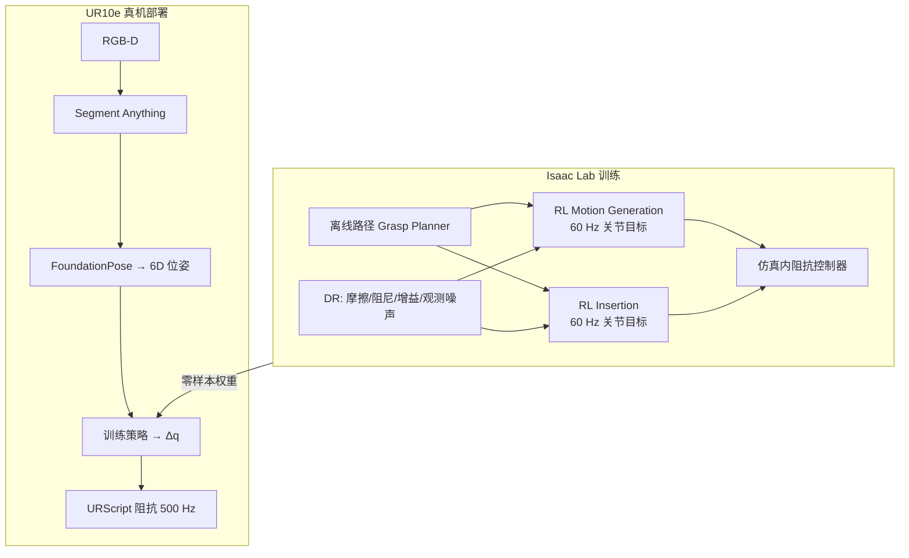

# NVIDIA Isaac Lab UR10e 工业装配 Sim2Real

**Bridging the Sim-to-Real Gap for Industrial Robotic Assembly Applications Using NVIDIA Isaac Lab** 是 NVIDIA Developer Blog 上的 **接触密集工业装配** 落地案例：在 Isaac Lab 中训练 **UR10e 齿轮装配**（抓取规划 + RL 运动生成 + RL 插入），经 **Isaac ROS 感知栈** 与 **Universal Robots Direct Torque 阻抗接口** 实现 **零样本 sim-to-real**。

## 一句话定义

用 IndustReal 类 RL + DR 在 Isaac Lab 里学会 UR10e 装配子技能，再用 Segment Anything / FoundationPose 估 6D 位姿、500 Hz URScript 阻抗控真机——展示 Factory 族环境之外的 **六轴 + 力矩级合规** 工业 sim2real 闭环。

## 英文缩写速查

| 缩写 | 英文全称 | 简要说明 |
|------|----------|----------|
| Sim2Real | Simulation to Real | 仿真策略迁移真机部署 |
| RL | Reinforcement Learning | 通过试错学习 motion / insertion 策略 |
| DR | Domain Randomization | 随机化摩擦、阻尼、增益与观测噪声 |
| PPO | Proximal Policy Optimization | 博客使用的 on-policy 算法（rl-games） |
| EE | End-Effector | 机械臂末端执行器 |
| Isaac Lab | NVIDIA Isaac Lab | Omniverse 机器人学习训练框架 |
| Isaac ROS | NVIDIA Isaac ROS | GPU 加速 ROS 2 感知与部署包集合 |
| UR10e | Universal Robots UR10e | 六轴协作臂真机平台 |

## 为什么重要

- **接触密集 + 工业六轴：** 补全本库以 Franka Factory 任务为主、较少覆盖 **UR + 力矩阻抗** 的装配叙事。
- **感知—控制分层清晰：** 6D 位姿来自 Isaac ROS；策略只输出关节目标，合规由 **阻抗 / 力矩环** 承担——与 stiff 位置控工业臂的常见失败模式对照鲜明。
- **与 Factory 环境对齐：** Lab 已有 `Isaac-Factory-GearMesh-Direct-v0` 等基线；本篇给出 **IndustReal 算法 + UR 早期力矩 API + ROS 部署** 的可跟读工程故事。

## 流程总览

## 工程实践

| 模块 | 要点 |
|------|------|
| **Motion generation** | 随机初始关节角 → 目标 EE 位姿；奖励：EE–目标距离 + 动作平滑惩罚 |
| **Insertion** | 齿轮在夹爪、近轴随机位姿 → 插入轴底；奖励：齿轮–目标距离 + 平滑惩罚 |
| **策略结构** | LSTM 256 + MLP [256,128,64]；PPO（rl-games） |
| **训练环境** | Isaac Sim 4.5 + Isaac Lab 2.1；RTX 4090；并行 env + 多齿轮尺寸/装配进度随机 |
| **真机感知** | RGB → SAM 分割 → 深度 + mask → FoundationPose |
| **真机控制** | 策略 60 Hz 输出 Δ 关节角 → **500 Hz URScript 阻抗** 算力矩 |
| **任务编排** | 对三颗随机齿轮循环：move → grasp → insert |

## 开源状态（步骤 2.5，截至 2026-08-30）

| 项 | 状态 |
|----|------|
| Isaac Lab + Factory 环境 | **已开源** — [isaac-sim/IsaacLab](https://github.com/isaac-sim/IsaacLab) |
| Isaac ROS（SAM / FoundationPose） | **已开源** — [NVIDIA-ISAAC-ROS](https://github.com/NVIDIA-ISAAC-ROS) |
| UR Direct Torque Command | **早期访问** — 须向 UR 申请；非默认 UR 栈 |
| 本篇齿轮装配完整训练/部署包 | **待发布** — 博客称 environments and training code coming soon |

## 局限与风险

- **复现门槛：** 缺 UR 力矩 early access 则无法复现阻抗环；缺官方训练包时需自建 IndustReal 风格任务。
- **感知误差 → 接触力：** 阻抗可缓冲小偏差，但 6D 位姿漂移仍可能导致卡死或过大侧向力——需 SOP 与力限。
- **与默认 Factory 任务差异：** 官方 Factory 为 Franka + rl_games Direct env；本篇 UR10e 管线 **不等价复制**。

## 关联页面

- [Isaac Lab](./isaac-lab.md) — 训练框架总览
- [Isaac Lab 默认环境](./isaac-lab-default-environments.md) — Factory / FORGE / AutoMate 装配 ID
- [Sim2Real](../concepts/sim2real.md) — 接触密集 manipulation 迁移
- [Manipulation](../tasks/manipulation.md) — 操作任务总览
- [NVIDIA Getting Started With Isaac Lab](./nvidia-getting-started-isaac-lab.md) — UR10 reach 入门课（非装配）

## 参考来源

- [NVIDIA 博客：UR10e 工业装配 Sim2Real](../../sources/blogs/nvidia_isaac_lab_ur10e_industrial_assembly_sim2real.md)
- [Isaac Lab 仓库档案](../../sources/repos/isaac_lab.md)

## 推荐继续阅读

- [IndustReal 论文（arXiv）](https://arxiv.org/abs/2308.13459) — 博客引用的 contact-rich 装配 sim2real 算法
- [Isaac Lab Factory 环境文档](https://isaac-sim.github.io/IsaacLab/main/source/overview/environments.html) — 官方装配任务族
