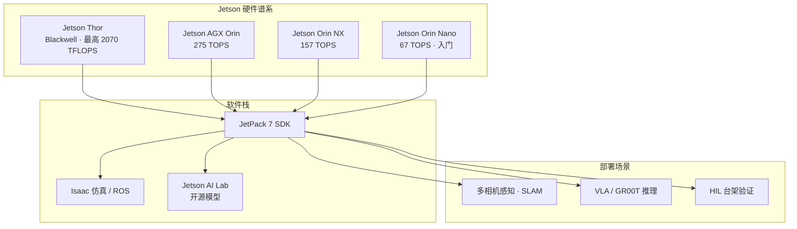

# NVIDIA Jetson

**NVIDIA Jetson** 是面向 **机器人与边缘 AI** 的嵌入式计算平台：以 **Jetson 模组**（SoM）+ **JetPack SDK** 提供机载 CUDA/TensorRT 推理、多路相机与网络 I/O，并与 **Isaac**、**GR00T**、**Cosmos** 等 Physical AI 软件栈对齐。官方将 Jetson 定位为 *physical AI hardware*——把开放模型与仿真训练产物部署到真机边缘。

## 一句话定义

**装在机器人身上的 NVIDIA GPU 计算机家族——从 Orin Nano 到 Jetson Thor，用统一 JetPack 把感知、VLA 与 HIL 验证跑在边缘。**

## 英文缩写速查

| 缩写 | 英文全称 | 简要说明 |
|------|----------|----------|
| Jetson | NVIDIA Jetson | 本页嵌入式边缘 AI 平台品牌 |
| JetPack | NVIDIA JetPack SDK | 驱动、CUDA、TensorRT、Ubuntu 根文件系统捆绑 |
| SoM | System on Module | 可插拔计算模组（如 Orin NX SO-DIMM） |
| TOPS | Tera Operations Per Second | INT8 等边缘 AI 算力常用标称 |
| HIL | Hardware-in-the-Loop | 真实 Jetson 接入仿真环境的软硬件集成测试 |
| VLA | Vision-Language-Action | 多模态策略；Thor/Orin 为常见机载推理目标 |
| ROS 2 | Robot Operating System 2 | Jetson 上最常见的机器人中间件栈 |

## 为什么重要

- **机载算力默认答案：** 四足/人形课程与论文反复出现 **Orin NX / AGX Orin / Jetson Thor** 作为机载节点，与桌面 RTX 形成「边缘推理 vs 离板训练」分工（见 [边缘–云机器人](../concepts/edge-cloud-robotics.md)）。
- **Physical AI 落地层：** 官方将 **Nemotron、Cosmos、Isaac GR00T** 与社区开源模型的 **边缘运行时** 绑定在 Jetson 上，而非仅作通用嵌入式板。
- **HIL 管线硬件：** Isaac Sim 课程路径在 SIL 之后，将 **Jetson + Isaac ROS** 作为 [Hardware-in-the-Loop](../concepts/hardware-in-the-loop.md) 的典型目标平台。
- **跨代选型复杂：** 从 **$199 Orin Nano** 到 **2070 TFLOPS Thor**，功耗、CSI 路数、PCIe 代际差异直接影响能否跑满帧 VLA 或多相机 SLAM。

## 核心结构

### 产品线选型（2026 官方门户摘要）

| 系列 | 典型 AI 标称 | 功耗 | 适用场景 |
|------|-------------|------|----------|
| **Jetson Thor** | 最高 2070 FP4 TFLOPS | 40–130 W | 人形 VLA、多模态大模型机载、高帧率分割 |
| **Jetson AGX Orin** | 最高 275 TOPS | 15–60 W | 多传感器融合、中大型机器人主脑 |
| **Jetson Orin NX** | 最高 157 TOPS | 10–25 W | 四足/小型 AMR 机载（本库有 [专页](./jetson-orin-nx.md)） |
| **Jetson Orin Nano** | 最高 67 TOPS | 7–15 W | 入门教育、轻量视觉、成本敏感 |
| Xavier / TX2 / Nano | legacy | 更低 | 存量平台维护，新设计优先 Orin+ |

相对 **AGX Orin**，官方称 **Jetson Thor** 最高约 **7.5×** AI 算力、**3.5×** 能效（同门户数据）。

### 软件与生态

| 组件 | 作用 |
|------|------|
| **JetPack** | 统一 BSP + CUDA + TensorRT + 容器/OTA 工具链 |
| **Isaac ROS / Sim** | 感知、SLAM、SIL/HIL 与仿真对齐 |
| **Jetson AI Lab** | 开源模型与示例聚合 |
| **合作伙伴生态** | 工业 PC、边缘 appliance、整机方案 |
| **NVIDIA IGX** | 工业级、功能安全导向的并行平台（门户另链） |

## 工程实践

| 目标 | 做法 |
|------|------|
| 选型 | 先定 **功耗预算 + 相机路数 + 模型算力**，再查官方 [Compare Specifications](https://www.nvidia.com/en-us/autonomous-machines/embedded-systems/) 表 |
| 软件基线 | 模组与 **JetPack 版本** 一一对应；升级前核对 Isaac ROS / GR00T 支持矩阵 |
| 推理优化 | 机载优先 **TensorRT**（见 [ORT vs MNN vs TensorRT](../comparisons/onnxruntime-vs-mnn-vs-tensorrt.md)） |
| HIL | SIL 通过后，将 ROS 2 节点部署到 Jetson，Sim 侧仍提供虚拟环境与传感器（见 [HIL 概念页](../concepts/hardware-in-the-loop.md)） |
| 热与供电 | Thor/AGX 持续推理需核对散热与峰值功耗；传感器与控制电源宜独立保护 |

## 局限与风险

- **硬件闭源商业模组：** 无整机 CAD/电气开源；定制载板需自行设计或走合作伙伴方案。
- **标称 TOPS ≠ 端到端帧率：** VLA、扩散、多路解码会争抢内存带宽与 CPU；须实测全链路延迟。
- **跨代迁移成本：** CSI/PCIe/USB 代际与 JetPack 大版本升级可能迫使载板与驱动栈重做集成。
- **与数据中心 GPU 分工：** 训练、大规模仿真仍应在 RTX/数据中心；Jetson 专注边缘推理与 HIL。

## 关联页面

- [Jetson Orin NX](./jetson-orin-nx.md) — 四足/轻量机器人常用模组深读
- [Isaac GR00T](./isaac-gr00t.md) — Thor 部署叙事与开源 VLA 平台
- [Hardware-in-the-Loop](../concepts/hardware-in-the-loop.md)
- [Software-in-the-Loop](../concepts/software-in-the-loop.md)
- [边缘–云机器人](../concepts/edge-cloud-robotics.md)
- [四足机器人](./quadruped-robot.md)
- [NVIDIA Physical AI Learning](./nvidia-physical-ai-learning.md)

## 参考来源

- [NVIDIA Jetson Embedded Systems 门户归档](../../sources/sites/nvidia-jetson-embedded-systems.md)
- [NVIDIA Jetson Orin 产品页归档](../../sources/sites/nvidia-jetson-orin-nx.md)

## 推荐继续阅读

- [NVIDIA Jetson Embedded Systems（官方）](https://www.nvidia.com/en-us/autonomous-machines/embedded-systems/)
- [NVIDIA Embedded Computing Developer](https://developer.nvidia.com/embedded-computing)
- [Hardware-in-the-Loop Fundamentals（Isaac Sim 课程）](https://docs.nvidia.com/learning/physical-ai/getting-started-with-isaac-sim/latest/leveraging-ros-2-and-hil-in-isaac-sim/01-hardware-in-the-loop-hil-fundamentals.html)
