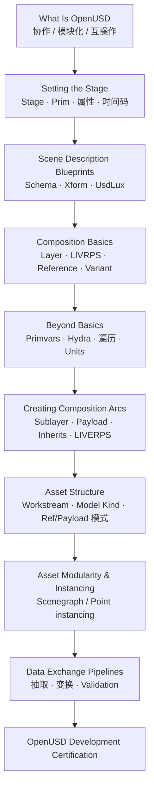

# NVIDIA Learn OpenUSD

**Learn OpenUSD** 是 NVIDIA 维护的 **免费、开源** USD 自学路径（[在线课纲](https://docs.nvidia.com/learn-openusd/latest/index.html) + [GitHub 源码](https://github.com/NVIDIA-Omniverse/LearnOpenUSD)）。它从 OpenUSD 的 stage/prim 语法讲到 composition arcs、资产组织、instancing 与 data exchange，并 **直接对接 OpenUSD Development Professional Certification**。

## 一句话定义

官方 USD 技能树：用 Python + usdview 把「会写 Prim」练到「能设计可协作、可复用、可验证的 OpenUSD 资产与交换管线」——机器人侧是读懂 Isaac Sim stage 与 URDF→USD 的前置课，不是 RL 训练课。

## 英文缩写速查

| 缩写 | 英文全称 | 简要说明 |
|------|----------|----------|
| USD | Universal Scene Description | 皮克斯开源场景描述框架；Omniverse/Isaac 共享 stage 格式 |
| OpenUSD | Open Universal Scene Description | USD 开源生态与社区命名 |
| Prim | Primitive | USD 场景图基本节点（mesh、xform、light 等） |
| LIVRPS / LIVERPS | Local/Inherits/Variant/Relocates/Reference/Payload/Specializes | Composition 强度排序助记；relocates 为新加入的 E |
| Hydra | USD Hydra Imaging Framework | USD 渲染/视口委托框架（Beyond Basics 模块） |
| DCC | Digital Content Creation | Blender/Maya 等内容创作工具 |
| API | Application Programming Interface | 课内主要用 Usd Python API |

## 为什么重要

- **机器人仿真缺的一环：** 本库已有 [Isaac Sim](./isaac-sim.md) / [Isaac Lab](./isaac-lab.md) 训练栈，但 **USD stage、reference/payload、variant** 决定资产能否复用与协作；本课补上官方系统教程。
- **与 Physical AI 门户并列：** [NVIDIA Physical AI Learning](./nvidia-physical-ai-learning.md) 把 Learn OpenUSD 与 Isaac Lab、SO-101 等路径并列；本页是 **USD 专线的 canonical 入口**。
- **认证与工程可信度：** 课纲明确服务 **OpenUSD Development Certification**；组织可用同一套开源内容做内训与技能验收。

## 学习路径总览

## 模块要点（与机器人栈的接点）

| 模块 | 学完应会 | 机器人 / Isaac 侧读法 |
|------|----------|------------------------|
| Setting the Stage | 创建 stage、prim 层级、time samples | 读懂 Sim stage 路径与 articulation 挂载点 |
| Composition Basics | layer、reference、variant、强度序 | 理解 Lab 环境如何 **引用** 机器人 USD 而不破坏性覆盖 |
| Asset Structure | workstream、model hierarchy、资产接口 | 多艺术家并行改同一机器人/场景时的 layer 分工 |
| Instancing | scenegraph / point instancing | 大规模并行仿真里 **重复 props / 阵列** 的性能与组织 |
| Data Exchange | 抽取几何/材质、validation | URDF/MJCF/CAD→USD 管线质量门禁（见 [StackForce](./stackforce.md) 等工具） |

## 工程实践

| 项 | 说明 |
|----|------|
| **前置** | Python 3（函数、循环、dict/list）；3D 基础概念 |
| **工具** | OpenUSD 发行版、`usdview`、Usd Python API |
| **源码** | [NVIDIA-Omniverse/LearnOpenUSD](https://github.com/NVIDIA-Omniverse/LearnOpenUSD) — 可 fork 做企业内训 |
| **在线阅读** | https://docs.nvidia.com/learn-openusd/latest/index.html |
| **认证** | [OpenUSD Development Professional Certification](https://www.nvidia.com/en-us/learn/certification/openusd-development-professional/) |
| **延伸** | [OpenUSD.org](https://openusd.org/) · [NVIDIA OpenUSD Docs](https://docs.omniverse.nvidia.com/usd/latest/index.html) |

## 开源状态（步骤 2.5，截至 2026-08-30）

| 项 | 状态 |
|----|------|
| 课纲 GitHub | **已开源** |
| 在线文档 | **免费** |
| OpenUSD 库 | **已开源**（Pixar） |
| 认证考试 | **付费**；非本仓库内容 |

## 局限与风险

- **不是 Isaac Lab API 课：** 不会教 PPO / manager-based env；仿真训练仍看 [Getting Started With Isaac Lab](./nvidia-getting-started-isaac-lab.md)。
- **LIVERPS 迁移中：** relocates 弧较新，站点部分章节仍写 LIVRPS——以 Creating Composition Arcs 模块声明为准。
- **认证与课纲版本：** 考试大纲可能领先/滞后于 GitHub main；发版前核对 NVIDIA 认证页。

## 关联页面

- [NVIDIA Physical AI Learning](./nvidia-physical-ai-learning.md) — 门户路径索引
- [NVIDIA Omniverse](./nvidia-omniverse.md) — USD 协作仿真底座
- [Isaac Sim](./isaac-sim.md) — 机器人 USD stage 与资产导入
- [Isaac Lab](./isaac-lab.md) — 在 USD stage 上的学习框架
- [Blender](./blender.md) — 常见 DCC→USD 来源
- [StackForce](./stackforce.md) — CAD/URDF→SimReady USD 工程向导

## 参考来源

- [Learn OpenUSD 课程归档](../../sources/courses/nvidia_learn_openusd.md)
- [LearnOpenUSD 仓库档案](../../sources/repos/learn_openusd.md)

## 推荐继续阅读

- [Learn OpenUSD 在线课纲](https://docs.nvidia.com/learn-openusd/latest/index.html)
- [Assembling Digital Twins With Omniverse and OpenUSD](https://docs.nvidia.com/learning/physical-ai/) — Physical AI 门户中的数字孪生动手路径（与 Omniverse 场景组合衔接）
