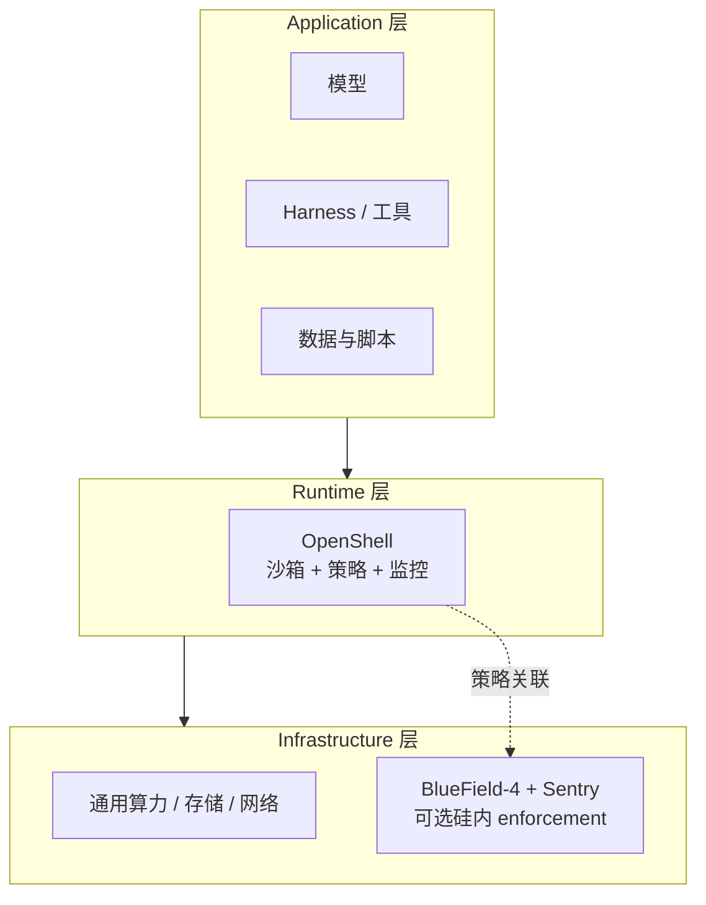
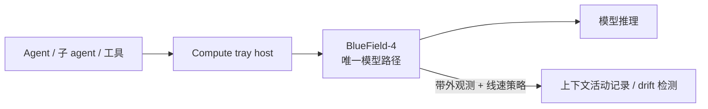

# NVIDIA Open Agent Safety Platform（OASP）

**NVIDIA Open Agent Safety Platform**（OASP）是 NVIDIA 2026-09 公开的 **agent 安全参考架构**（[Developer Blog](https://developer.nvidia.com/blog/nvidia-open-agent-safety-platform-a-reference-for-continuous-in-silicon-agent-monitoring/)）：把 **软件运行时** [OpenShell](./nvidia-openshell.md) 与 **DPU 硅内监控/执行**（**NVIDIA Sentry**，BlueField-4 + DOCA）组合成 **分层、带外、可验证** 的信任层，类比互联网时代的 **浏览器沙箱 + TLS 锁标**。

## 一句话定义

**用「可证明的策略 +  agent 不可触及的 enforcement 平面 + 通往模型的唯一控制点」把自主 agent 舰队锁在 operator 意图内，并在 Vera Rubin POD 上把同一策略延伸到线速硬件路径。**

## 英文缩写速查

| 缩写 | 英文全称 | 简要说明 |
|------|----------|----------|
| OASP | Open Agent Safety Platform | 本页 NVIDIA agent 安全参考平台 |
| DPU | Data Processing Unit | BlueField 数据面处理器，承担带外安全 |
| DOCA | Data Center Infrastructure on a Chip Architecture | NVIDIA DPU 可编程框架，Sentry 与 OpenShell 策略联动 |
| CPU | Central Processing Unit | Vera CPU 上运行 OpenShell 运行时编排 |
| AI | Artificial Intelligence | 本架构防护对象：自主 agent 工作负载 |
| OCSF | Open Cybersecurity Schema Framework | OpenShell 侧审计事件格式（软件层） |

## 为什么重要

- **突破评测沙箱的公开案例** 促使社区讨论 agent 发布节奏；OASP 主张 **加速安全工程** 而非单纯减速产品（博客立场）。
- **Drift 不可训练消除：** 长时、多工具、歧义任务下 agent 会偏离约束；架构假设 agent **不能** 自我治理全部行为，需要 **独立 watchdog**。
- **AI factory 规模：** 子 agent、工具链、应用同时运行时，需要 ** lineage + 行为画像偏差检测**；BlueField 位于 **节点到模型的唯一路径** 时，可在 host 不可信时仍保留基础设施级防护（博客表述）。
- **开放运行时：** 策略语言与 [OpenShell](./nvidia-openshell.md) 开源，便于 lab / 云 / 企业按 **共享责任** 各守一层。

## 核心原理

### 五条原则（官方）

1. Policy **可验证**（prover）
2. Enforcement **带外**（agent 不可达）
3. **模型路径** 为控制点（观测 + kill switch）
4. **权限 ∝ 推理可见性**（开放权重更易 audit thinking）
5. **共享责任** — lab / enterprise / hardware vendor 分层，接口开放

### 三层栈

### Vera Rubin POD 上的控制点（博客）

- **OpenShell** 在 Vera CPU 侧：沙箱编排、operator 指令 → **可验证 policy**、运行中强制。
- **Sentry**（可选）：经 **DOCA** 关联 agent 交互、策略决策、工具/数据访问；**身份治理** gateway 持续验证 agent 身份与委派 scope。
- **启用方式（博客）：** 已在 Vera + BlueField-4 上的部署可通过 **软件更新** 叠加 Sentry 层。

## 开源与产品边界

| 组件 | 状态 | 入口 |
|------|------|------|
| OpenShell | **已开源** Apache 2.0 | [GitHub](https://github.com/NVIDIA/OpenShell) |
| Sentry + BlueField 栈 | **产品/硬件路径** | 依赖 NVIDIA 系统软件与 DPU 平台；非 OpenShell 单仓 |
| 生态伙伴 | 博客列举多类厂商 | 参考设计，非本库维护清单 |

详见 [开发者门户归档](../../sources/sites/nvidia-open-agent-safety-platform-developer.md) 步骤 2.5 表。

## 局限与风险

- **Sentry 复现门槛：** 完整「in-silicon」叙事需要 BlueField-4/Vera 环境；多数开发者可先仅部署 OpenShell 软件层。
- **策略与组织流程：** 形式化 prover 不能替代 **业务侧权限建模**；fleet 级 lineage 仍要 SIEM/运营集成。
- **与具身机器人栈距离：** 本架构针对 **自主 software agent**（coding、工具调用、模型 API）；真机策略安全需另叠 OT/机器人安全框架，但 **带外 kill switch** 思想可类比 [ENPIRE](../methods/enpire.md) 的 reset/verify 接口。

## 与其他页面的关系

- [NVIDIA OpenShell](./nvidia-openshell.md) — OASP 软件运行时与 CLI/Gateway 细节
- [Agentic Coding 软件工程基础](../concepts/agentic-coding-software-fundamentals.md) — 人的「安全可靠」判断 + 运行时强制
- [Agent Reach](./agent-reach.md) — 信息接入脚手架，不替代 sandbox

## 推荐继续阅读

- [Add Runtime Controls to AI Agents with NVIDIA OpenShell](https://developer.nvidia.com/blog/add-runtime-controls-to-ai-agents-with-nvidia-openshell/)
- [Run Autonomous, Self-Evolving Agents More Safely with NVIDIA OpenShell](https://developer.nvidia.com/blog/run-autonomous-self-evolving-agents-more-safely-with-nvidia-openshell/)

## 参考来源

- [OASP 博客归档](../../sources/blogs/nvidia_open_agent_safety_platform_2026-09-28.md)
- [Developer 门户核查](../../sources/sites/nvidia-open-agent-safety-platform-developer.md)
- [OpenShell 仓库](../../sources/repos/nvidia_openshell.md)
