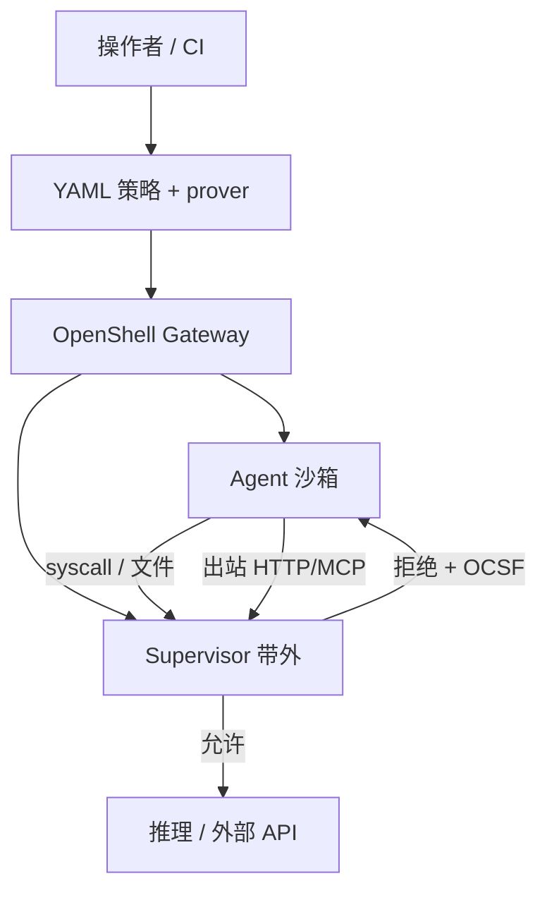
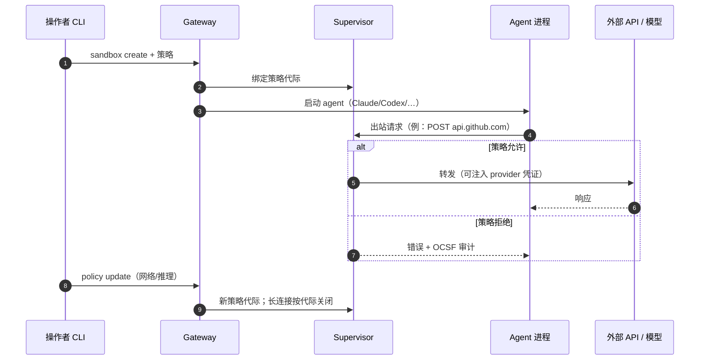

# NVIDIA OpenShell

**NVIDIA OpenShell**（[GitHub](https://github.com/NVIDIA/OpenShell)，[文档](https://docs.nvidia.com/openshell/latest/)）是面向 **自主、长时运行 AI agent** 的 **开源运行时**：在 **agent 进程外** 用操作系统内核控制与策略引擎限制文件、syscall、出站网络与模型 API 路由。官方将其类比为 **浏览器标签沙箱**——agent 仍可装包、调 API、用凭证，但边界由 **可版本化的 YAML 策略** 定义并由运行时强制，而非 prompt 自律。

## 一句话定义

**在 agent 与基础设施之间插入带外控制平面：声明策略 → 沙箱隔离执行 → Supervisor 线速拦截 + 变更前 formal 证明，使 coding agent 的能力与零信任边界可并存。**

## 英文缩写速查

| 缩写 | 英文全称 | 简要说明 |
|------|----------|----------|
| OCSF | Open Cybersecurity Schema Framework | OpenShell 记录 allow/deny 等审计事件的 schema |
| MCP | Model Context Protocol | Supervisor 可 inspect 的 L7 流量类型之一 |
| L7 | Layer 7 (Application) | HTTP/GraphQL/MCP 级方法、路径级策略 |
| YAML | YAML Ain't Markup Language | 沙箱策略声明格式 |
| API | Application Programming Interface | 出站与推理 endpoint 策略对象 |
| DPU | Data Processing Unit | 与 [OASP](./nvidia-open-agent-safety-platform.md) 中 BlueField 带外层互补 |

## 为什么重要

- **Prompt guardrail 的硬上限：**  compromised 或 drift 的 agent 可忽略系统提示；OpenShell 把约束放在 **环境层**（Landlock/网络代理/进程身份），与 [Agentic Coding 软件工程基础](../concepts/agentic-coding-software-fundamentals.md) 中「安全可靠」项同向，但是 **基础设施级** 实现。
- **与「能力脚手架」正交：** [Agent Reach](./agent-reach.md) 解决 **读搜渠道安装**；OpenShell 解决 **跑 agent 时的 exfiltration / 越权写 / 凭证泄露**——二者可同时使用。
- **长时自治 agent：** 博客与 [OASP](./nvidia-open-agent-safety-platform.md) 强调 **drift**（策略拦截、缺工具、歧义目标、数周试错）无法单靠训练消除；需要 **持续监控 + 可热更新网络/推理策略**。
- **可审计变更：** Policy prover 在批准策略 diff 前给出 **形式化边界** 或反例路径，agent 的自然语言解释不能推翻证明结果（官方 walkthrough 叙事）。

## 核心原理

### 组件分工

| 组件 | 角色 |
|------|------|
| **Gateway** | 多沙箱生命周期、策略分发、compute driver（Docker/K8s/Podman/MicroVM 等） |
| **Supervisor** | 与每个沙箱配对，**不在 agent workload 内**；检查网络/推理请求、写 OCSF 审计 |
| **Sandbox** | 隔离容器/VM；静态策略（文件/进程）创建时锁定；网络/推理可 `openshell policy set/update` 热更新 |
| **Providers** | 凭证注入（环境变量），避免密钥落盘到 agent 可见文件树 |
| **Policy prover** | 变更前 formal 分析新增权限（含 provider 贡献的 endpoint） |

### 策略四层（文档模型）

| 层 | 保护对象 | 变更时机 |
|----|----------|----------|
| Filesystem | 读写路径 | 创建沙箱时锁定 |
| Process | 特权提升、危险 syscall | 创建时锁定 |
| Network | 出站连接（default-deny） | 运行时可热更新 |
| Inference | 模型 API 路由到受控后端 | 运行时可热更新 |

### 流程总览（参考架构）

### 源码运行时序图

对齐 [NVIDIA/OpenShell](https://github.com/NVIDIA/OpenShell) CLI `sandbox create` 与 Supervisor 拦截路径（概念级）：

## 工程实践

| 项 | 建议 |
|----|------|
| **快速试跑** | 文档 Quickstart：`openshell sandbox create -- claude`；需 Docker 等 driver；API key 走 provider 而非写进 repo |
| **最小权限网络** | 教程 `first-network-policy`：先 default-deny，再按 host/port/binary/method 放行；生产可先 audit 再 enforce |
| **与 Brev** | README 提供 Launchable 一键环境；与 [NVIDIA Brev](./nvidia-brev.md) 租 GPU/交互环境场景相邻 |
| **硬件增强** | Vera + BlueField-4 上的 **Sentry** 带外层见 [OASP](./nvidia-open-agent-safety-platform.md)，OpenShell 策略可在硅内二次强制（软件更新启用） |

## 局限与风险

- **不是 agent 框架：** 不替代 LangGraph、Hermes 等编排；只包执行边界（cf. [Hermes Agent](./hermes-agent.md)）。
- **策略即安全资产：** YAML 需 code review / 版本控制；prover 覆盖的是 **模型化权限**，仍依赖 operator 正确建模 endpoint。
- **Sentry/硅内层非本仓：** 仅 OpenShell 开源；最高保证级部署依赖 NVIDIA 硬件栈与 Sentry 产品节奏。
- **compute driver 运维成本：** Gateway、K8s/Docker 与策略代际热更新需要平台工程，小团队可先单机 Docker 试点。

## 与其他页面的关系

- [NVIDIA Open Agent Safety Platform](./nvidia-open-agent-safety-platform.md) — OpenShell + Sentry + Vera/BlueField 完整参考设计
- [Open Code Review](./open-code-review.md) — diff 级评审工具链；与运行时 sandbox 互补
- [Agent Reach](./agent-reach.md) — 外网 ingest 脚手架

## 推荐继续阅读

- NVIDIA Technical Blog：[Add Runtime Controls to AI Agents with NVIDIA OpenShell](https://developer.nvidia.com/blog/add-runtime-controls-to-ai-agents-with-nvidia-openshell/)
- 文档：[Quickstart](https://docs.nvidia.com/openshell/get-started/quickstart)、[First network policy 教程](https://docs.nvidia.com/openshell/dev/get-started/tutorials/first-network-policy)

## 参考来源

- [NVIDIA Open Agent Safety Platform 博客](../../sources/blogs/nvidia_open_agent_safety_platform_2026-09-28.md)
- [NVIDIA/OpenShell 仓库归档](../../sources/repos/nvidia_openshell.md)
