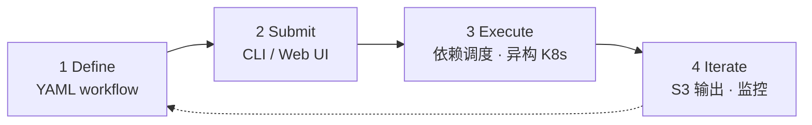
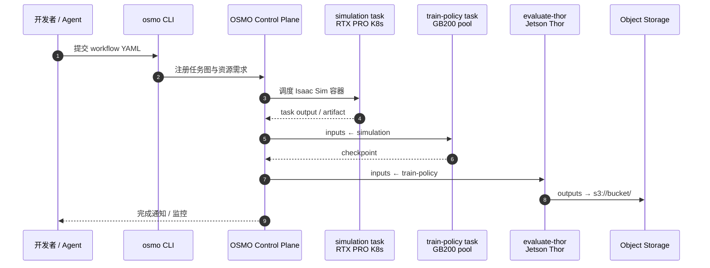

# NVIDIA OSMO（Physical AI 工作流编排）

**NVIDIA OSMO**（[GitHub](https://github.com/NVIDIA/OSMO)，[User Guide](https://nvidia.github.io/OSMO/main/user_guide/index.html)，[开发者门户](https://developer.nvidia.com/osmo)）是面向 **Physical AI / 机器人** 的 **开源工作流编排平台**：用 **声明式 YAML** 描述从 **合成数据 → 训练/RL → SIL/HIL → 边缘 benchmark** 的多阶段任务，在 **异构 Kubernetes** 上自动调度依赖与算力。官方将其定位为解决 [**Three Computer Problem**](https://blogs.nvidia.com/blog/three-computers-robotics/) — 同时编排 **云训练 GPU**、**仿真 GPU** 与 **Jetson 边缘 HIL** — 而 **不是** 替代 [Isaac Sim](./isaac-sim.md)、PyTorch 或 SLURM 本身。

## 一句话定义

**Physical AI 的「Makefile + 集群调度器」——一条 YAML 串起 Isaac Sim SDG、GB200 训练与 Thor 评测，笔记本写好、云上跑通。**

## 英文缩写速查

| 缩写 | 英文全称 | 简要说明 |
|------|----------|----------|
| OSMO | （产品名 NVIDIA OSMO） | 本页开源 Physical AI 编排器 |
| YAML | YAML Ain't Markup Language | workflow 声明格式 |
| K8s | Kubernetes | 底层算力抽象；用户无需手写 manifest |
| HIL | Hardware-in-the-Loop | workflow 可调度 Jetson 等边缘真机任务 |
| SIL | Software-in-the-Loop | 与 Isaac Sim/ROS 栈联动的仿真验证任务 |
| OIDC | OpenID Connect | 产品页强调的企业认证方式之一 |
| SDG | Synthetic Data Generation | User Guide 中 Isaac Sim 规模化数据生成教程 |

## 为什么重要

- **横切 NVIDIA 工具链的「胶水层」：** [技术地图](../overview/nvidia-physical-ai-toolchain-technology-map.md) 各段已有 Sim/Lab/GR00T/Jetson 实体；OSMO 负责 **跨段编排** — README 称已在 NVIDIA 内部支撑 **GR00T、Isaac Lab、Isaac Sim、Isaac ROS** 等日常 GPU-hour 级 workload。
- **Three Computer 一次声明：** 训练（GB200/H100）、仿真（RTX PRO 6000）、边缘（Jetson AGX Thor）可在 **同一 workflow** 里用 `inputs`/`outputs` 传 artifact，避免三套 shell 脚本与手工拷 S3。
- **Agentic 开发入口：** [developer.nvidia.com/osmo](https://developer.nvidia.com/osmo) 强调 **CLI + agent context file** — 编码 Agent 可查询运行中 workflow、GPU 容量与平台活动，从 prompt 推到可执行管线。
- **与「租 GPU 上课」互补：** [NVIDIA Brev](./nvidia-brev.md) / [Isaac Launchable](./isaac-launchable.md) 解决 **单次交互环境**；OSMO 解决 **可重复、可 CI、跨集群的多阶段生产管线**。

## 核心原理

### 四步生命周期



### Three Computer 编排（官方模型）

| 计算机角色 | 典型硬件 | workflow 中做什么 |
|------------|----------|-------------------|
| **Training** | GB200、H100 | PyTorch / RL 分布式训练 |
| **Simulation** | RTX PRO 6000、L40 | [Isaac Sim](./isaac-sim.md) SDG、物理/传感器渲染 |
| **Edge** | Jetson AGX Thor | [HIL](../concepts/hardware-in-the-loop.md) 评测、机载 benchmark |

### 示例 workflow（README 摘录）

```yaml
workflow:
  tasks:
  - name: simulation
    image: nvcr.io/nvidia/isaac-sim
    platform: rtx-pro-6000
  - name: train-policy
    image: nvcr.io/nvidia/pytorch
    platform: gb200
    resources:
      gpu: 8
    inputs:
    - task: simulation
  - name: evaluate-thor
    image: my-ros-app
    platform: jetson-agx-thor
    inputs:
    - task: train-policy
    outputs:
    - url: s3://my-bucket/thor-benchmark/
```

### 源码运行时序图

对齐 [NVIDIA/OSMO](https://github.com/NVIDIA/OSMO) CLI 提交与 K8s backend 执行：



## 工程实践

| 步骤 | 做法 |
|------|------|
| **本地试跑** | User Guide [Local Deployment](https://nvidia.github.io/OSMO/main/deployment_guide/appendix/deploy_local.html) — Docker/KIND，约 10 分钟 |
| **云上生产** | [Cloud Deployment](https://nvidia.github.io/OSMO/main/deployment_guide/) — EKS/AKS/GKE；Azure 可参考 [Microsoft Physical AI Toolchain](https://github.com/microsoft/physical-ai-toolchain) |
| **第一条管线** | 从 [Getting Started / Install CLI](https://nvidia.github.io/OSMO/main/user_guide/getting_started/install/index.html) → [Isaac Sim SDG](https://nvidia.github.io/OSMO/main/user_guide/how_to/isaac_sim_sdg.html) 或 [HIL 教程](https://nvidia.github.io/OSMO/main/user_guide/tutorials/hardware_in_the_loop/index.html) |
| **Agent 集成** | 配置 developer 页所述 **agent context**；让 Agent 查 workflow 状态而非手写 kubectl |
| **存储** | task `outputs` 写 S3/Azure Blob；下游 task 用 `inputs: - task:` 链接 |
| **交互调试** | [Interactive Workflows](https://nvidia.github.io/OSMO/main/user_guide/workflows/interactive/index.html) — 远程 VSCode/Jupyter/SSH |

开源结论（2026-09-06）：**编排器本体已开源**（GitHub `NVIDIA/OSMO`，Apache-2.0）；底层 **Isaac Sim 镜像、云 GPU、Jetson 硬件** 仍按各自许可与采购。

## 局限与风险

- **不是 MLOps：** FAQ 明确无 experiment dashboard / artifact registry 替代；实验追踪需另接 W&B 等。
- **不部署量产机器人：** 产出 checkpoint 与 benchmark；真机量产 runtime 需用户集成 [Isaac ROS](./isaac-ros-visual-slam.md) / [Jetson](./nvidia-jetson.md) 栈。
- **K8s 仍存在于底层：** YAML 抽象了 manifest，但 **平台团队** 仍需维护 cluster/backend 注册与 OIDC。
- **与 SLURM 集群共存：** 大型 HPC 站点可能仍用 SLURM 跑单段训练；OSMO 价值在 **跨仿真+边缘的多阶段 Physical AI 图**，非替换所有 batch 调度。
- **版本线：** 文档分支含 release/6.0–6.4；升级 OSMO 时核对 [Isaac Lab](./isaac-lab.md) / Sim 镜像 tag 兼容性。

## 关联页面

- [NVIDIA Physical AI 工具链技术地图](../overview/nvidia-physical-ai-toolchain-technology-map.md)
- [Isaac Lab](./isaac-lab.md) — OSMO 编排的常见训练/RL 任务镜像
- [Isaac Sim](./isaac-sim.md) — SDG 与 SIL 仿真任务
- [Isaac GR00T](./isaac-gr00t.md) — README 列出的内部生产 workload 之一
- [NVIDIA Jetson](./nvidia-jetson.md) — `jetson-agx-thor` 等平台 target
- [Software-in-the-Loop](../concepts/software-in-the-loop.md) / [Hardware-in-the-Loop](../concepts/hardware-in-the-loop.md)
- [NVIDIA Brev](./nvidia-brev.md) / [Isaac Launchable](./isaac-launchable.md) — 单次云环境 vs OSMO 多阶段 workflow

## 参考来源

- [NVIDIA/OSMO 仓库归档](../../sources/repos/nvidia_osmo.md)
- [NVIDIA OSMO 开发者门户摘录](../../sources/sites/nvidia-osmo-developer.md)
- [OSMO User Guide 索引摘录](../../sources/sites/osmo-user-guide.md)

## 推荐继续阅读

- [GitHub — NVIDIA/OSMO](https://github.com/NVIDIA/OSMO)
- [OSMO User Guide](https://nvidia.github.io/OSMO/main/user_guide/index.html)
- [NVIDIA OSMO 产品页](https://developer.nvidia.com/osmo)
- [Three Computers for Robotics（NVIDIA Blog）](https://blogs.nvidia.com/blog/three-computers-robotics/)
- [Hardware In The Loop 教程](https://nvidia.github.io/OSMO/main/user_guide/tutorials/hardware_in_the_loop/index.html)
