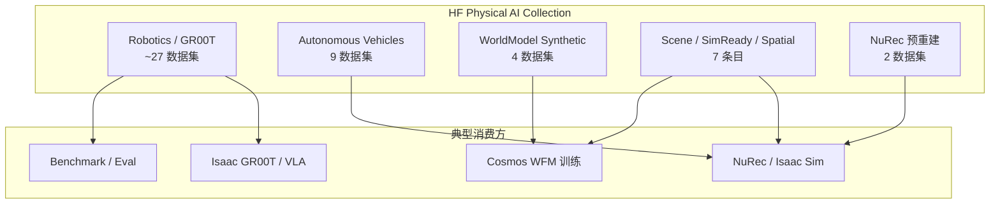

# NVIDIA Physical AI 数据集（Hugging Face 集合）

**NVIDIA Physical AI**（[Hugging Face Collection](https://huggingface.co/collections/nvidia/physical-ai)）是 NVIDIA 为 Physical AI 开发者维护的 **官方数据与资产索引**：把机器人操纵、人形遥操作、自动驾驶神经重建、世界模型合成场景、SimReady 工业场景等 **49** 个 HF 仓收进同一集合，与 [Isaac GR00T](./isaac-gr00t.md)、[NuRec](./nvidia-nurec.md)、[Cosmos](./nvidia-cosmos.md) 产品栈互指。

## 一句话定义

**NVIDIA Physical AI 在 Hugging Face 上的「数据超市」：按任务域浏览可下载数据集与预重建场景，训练 VLA/GR00T、跑 NuRec Real2Sim 或喂 Cosmos 世界模型时从这里选子集，而不是零散搜 `nvidia/PhysicalAI-*`。**

## 英文缩写速查

| 缩写 | 英文全称 | 简要说明 |
|------|----------|----------|
| Physical AI | Physical Artificial Intelligence | 需在物理世界中感知、推理与行动的 AI 系统 |
| HF | Hugging Face | 权重与数据集托管平台 |
| NuRec | NVIDIA Neural Reconstruction | 神经重建 USDZ 体积；AV/机器人各有预重建集 |
| NCore | NVIDIA Core clip format | AV 重建输入的 clip 清单格式 |
| GR00T | Generalist Robot 00 Technology | NVIDIA 人形/通用操纵基础模型族 |
| WFM | World Foundation Model | 视频级世界模型；合成场景子集服务其训练 |
| SimReady | Simulation Ready | Omniverse 可直接仿真的 USD 场景资产 |
| VLA | Vision-Language-Action | 视觉–语言–动作策略 |

## 为什么重要

- **单一入口替代碎片搜索：** 官方描述为 *open, commercial-grade datasets for physical AI developers*；集合把 `PhysicalAI-Robotics-*`、`PhysicalAI-Autonomous-*`、`PhysicalAI-WorldModel-Synthetic-*` 等同前缀仓编目，降低漏集风险。
- **与 NVIDIA 栈对齐：** GR00T 论文与 [Isaac GR00T](./isaac-gr00t.md) 教程默认引用 `GR00T-X-Embodiment-Sim` 等子集；[Instant NuRec](./paper-instant-nurec.md) / [NuRec](./nvidia-nurec.md) 文档指向 `PhysicalAI-Autonomous-Vehicles-NCore` 与 `PhysicalAI-Robotics-NuRec`。
- **合成 + 真实混布：** 除遥操作与 LeRobot 移植集外，还有 Cosmos Drive Dreams、WorldModel Synthetic 系列——与 [Cosmos 3](./cosmos-3.md) 数据增广叙事一致。
- **门控要预期：** AV 主集、部分 NuRec / Spatial 集为 **`gated: auto`**；下载前需 HF 账号接受各数据卡条款，不能假设匿名 wget。

## 核心结构（任务域）

### 高流量子集（选型起点）

| 域 | 推荐入口 | 典型用途 |
|----|----------|----------|
| **GR00T / 操纵** | [PhysicalAI-Robotics-GR00T-X-Embodiment-Sim](https://huggingface.co/datasets/nvidia/PhysicalAI-Robotics-GR00T-X-Embodiment-Sim) | 跨 embodiment 仿真演示；GR00T 基线数据 |
| **遥操作** | `GR00T-Teleop-Sim` / `Teleop-G1` / `Teleop-GR1` | 仿真或 G1/GR-1 真机风格轨迹 |
| **人形 loco-manip** | [PhysicalAI-Robotics-Locomanipulation-GRAIL](https://huggingface.co/datasets/nvidia/PhysicalAI-Robotics-Locomanipulation-GRAIL) | 见 [GRAIL 数据集](./grail-locomanipulation-dataset.md) |
| **LeRobot 生态** | `LIBERO_LeRobot_v3`、`BridgeData2_LeRobot_v3` | 标准 LeRobot v3 schema 移植 |
| **AV Real2Sim** | `PhysicalAI-Autonomous-Vehicles-NCore` + `NuRec` | Instant / Docker NuRec 重建 |
| **机器人 Real2Sim** | `PhysicalAI-Robotics-NuRec` | Isaac 加载预重建 USDZ |
| **WFM 合成** | `PhysicalAI-WorldModel-Synthetic-*` | Cosmos / 视频 WM 场景增广 |
| **评测** | `PhysicalAI-VANTAGE-Bench`、`GR00T-Eval` | 空间智能 / GR00T 对标 |

完整 49 项清单见 [来源归档](../../sources/sites/hf-nvidia-physical-ai-collection.md)。

## 工程实践

| 目标 | 做法 |
|------|------|
| 浏览全集 | 打开 [HF collection](https://huggingface.co/collections/nvidia/physical-ai) 或 `huggingface-cli` 按 `nvidia/PhysicalAI-` 前缀搜索 |
| 门控集 | 登录 HF → 数据集页 **Access repository** → 读 LICENSE → `datasets.load_dataset(...)` |
| GR00T 训练 | 官方教程 + `GR00T-X-Embodiment-Sim`；评测用 `GR00T-Eval` |
| NuRec | AV：`NCore` clip → Instant/NuRec 容器；机器人：直接下 `Robotics-NuRec` USDZ |
| 与 Cosmos 权重配合 | 数据从此集合；模型权重见 [Cosmos3 HF 集合](../../sources/sites/hf-nvidia-cosmos3-collection.md) |

**开源状态（2026-09-05）：** 集合内条目 **已开放获取**；**不是**单一许可证——逐卡核对。代码入口分散在各产品 GitHub（GR00T、NuRec、Isaac 等），本集合仅索引数据/资产。

## 局限与风险

- **集合 ≠ 完整 NVIDIA 数据宇宙：** 部分 checkpoint（如 Cosmos Policy-DROID）在独立 HF 仓，不在本 collection。
- **门控与地域：** `gated: auto` 子集无法 CI 匿名拉取；企业合规需单独审数据卡。
- **格式异构：** 有 parquet+video、USDZ、imagefolder、LeRobot v3 等；不要假设统一 schema。
- **第三方条目：** 如 `bones-studio/seed`、`NianticSpatial/real2sim-sample-usdz-scenes` 许可与 NVIDIA 主集不同。

## 关联页面

- [Isaac GR00T](./isaac-gr00t.md) — 主要数据消费模型
- [NVIDIA Omniverse NuRec](./nvidia-nurec.md) — 预重建场景消费
- [NVIDIA Cosmos](./nvidia-cosmos.md) — 世界模型平台
- [Cosmos 3](./cosmos-3.md) — WFM 权重（另集合）
- [GRAIL Loco-Manipulation Dataset](./grail-locomanipulation-dataset.md) — 集合内大型 G1 子集
- [NVIDIA Physical AI Learning](./nvidia-physical-ai-learning.md) — 官方课程门户
- [Sim2Real](../concepts/sim2real.md) — 合成/仿真数据上真机语境

## 参考来源

- [HF Physical AI 集合归档](../../sources/sites/hf-nvidia-physical-ai-collection.md)

## 推荐继续阅读

- [Hugging Face：Physical AI Collection](https://huggingface.co/collections/nvidia/physical-ai)
- [NVIDIA Physical AI Learning](https://docs.nvidia.com/learning/physical-ai/)
- [Isaac GR00T 文档](https://developer.nvidia.com/isaac/gr00t)
- [NuRec 文档](https://docs.nvidia.com/nurec/)
