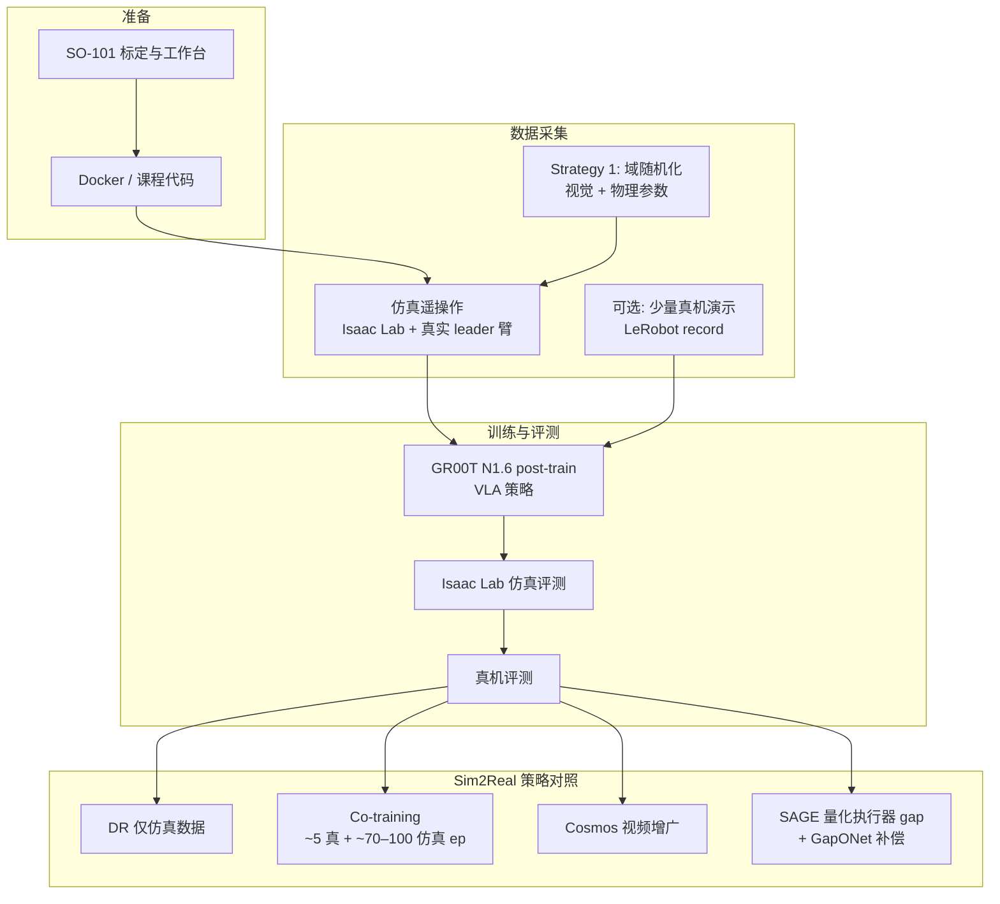

# NVIDIA SO-101 Sim2Real 实验 workflow

**Train an SO-101 Robot From Sim-to-Real With NVIDIA Isaac** 是 [Physical AI Learning](./nvidia-physical-ai-learning.md) 门户下的 **中级动手课**（官方标注约 6–10 小时）。学员在 **SO-101 操作臂** 上完成 **离心管瓶非结构化 pick-and-place**：先在仿真中快速迭代，再把 **视觉–语言–动作（VLA）** 策略部署到真机，并 **亲手观察** sim2real gap 及四种缓解手段的效果。

## 一句话定义

用低成本 SO-101 走完「仿真遥操作采数 → GR00T 后训练 VLA → 真机评测 → 四种 gap 策略对比」的标准 manipulation sim2real 实验课。

## 为什么重要

- **Workflow 优先于单点算法：** 课程明确 SO-101 非产线平台，价值在于可迁移到更复杂任务/机器人的 **流程**（标定、采数、训练、评测、迭代策略）。
- **四类策略对照实验：** 在同一任务上并排 **域随机化、Co-training、Cosmos 增广、SAGE+GapONet**，比只读 [Sim2Real](../concepts/sim2real.md) 概念页更易建立工程直觉。
- **与本库 GR00T 研究页分工：** [GR00T-VisualSim2Real](./gr00t-visual-sim2real.md) 聚焦 Unitree G1 上的 **PPO Teacher + DAgger RGB** 研究代码；本页聚焦 **GR00T N1.6 + LeRobot + Isaac Lab** 的 **教程级 IL/VLA 管线**。

## 任务与难点（课程设定）

- **任务：** 桌面散落离心管瓶 → 抓取 → 重新定向 → 精确放入 rack（简化 lightbox 与部分约束以降低上手难度）。
- **感知：** 主要依赖 **2D 相机**；抓取后 **腕部相机遮挡** 是刻意设计的难点，迫使策略在缺失视觉下仍能完成放置。
- **仿真动机：** 真机采数慢、有风险；仿真可并行重置，适合模仿学习批量采 demonstration。

## 流程总览

## Sim2Real 理论锚点（课程第 03 章）

官方将 gap 归纳为四类，并强调 **「高仿真成功率不会自动迁移」**：

| 类别 | 典型来源 |
|------|----------|
| Sensing | 相机噪声/畸变、深度伪影、光照差异 |
| Actuation | 摩擦、回差、热效应、控制周期差异 |
| Physics | 接触模型、可变形体、流体/颗粒 |
| Modeling | CAD 与实物偏差、质量惯量估计误差 |

迁移困难还来自 **分布偏移、感知误差累积、未建模动力学、实时约束**——与 [sim2real-gap-reduction](../queries/sim2real-gap-reduction.md) 中的根因分类一致。

## 四种 Sim2Real 策略（课程实验轴）

### Strategy 1：Domain Randomization（仿真遥操作）

- 在 Isaac Lab 中用真实遥操作臂驱动 **仿真 SO-101**，采集模仿学习演示。
- 随机化视觉（颜色/纹理/光照/相机外参）与物理（质量摩擦、关节阻尼、执行器延迟与噪声等）。
- **优点：** 不需真机增广即可扩大分布；**局限：** 调参偏经验，动作可能偏保守。

### Strategy 2：Co-training（仿真 + 少量真机）

- 混合 **大量仿真演示**（课程示例约 70–100 ep）与 **少量真机遥操作**（约 5 ep）。
- 缓解「仿真-only 分布偏移」与「真机-only 样本不足」的两难。

### Strategy 3：Cosmos 数据集增广

- **Cosmos** 作为 Physical AI **世界基础模型**，从演示视频 + 文本 prompt 生成光照、物体位姿、背景等多样 **逼真视频**，补足 DR 无法覆盖的「合成感」与全新场景。课程 ingest 时对应 **Cosmos 2.x / Predict 系** 工作流；后续 **全模态单栈** 见 [Cosmos 3](./cosmos-3.md)（Generator T2V/I2V 与 policy rollout）。
- 可与 depth/edge/seg 等控制信号组合（课程给出 prompt 与 control weight 示例）。

### Strategy 4：SAGE + GapONet（执行器层）

- 针对 hobby servo **回差沿运动链累积** 等 **执行器 gap**：先用 [SAGE](./sage-sim2real-actuator-gap-estimator.md) 对同一轨迹做仿真/真机成对对比与可视化，再用 **GapONet** 建模复杂执行器动力学。
- 与 Strategy 1–3 主要面向感知/视觉/数据分布形成互补。

## GR00T 与 VLA 在本课中的角色

- **Isaac GR00T：** 通用人形/机器人基础模型研究与数据管线；本课使用 **GR00T N1.6** 做 **post-training**（预训练已吸收大规模视觉–语言–机器人数据，后训练对准 SO-101 与离心管瓶任务）。
- **VLA 接口：** 多相机 RGB + 自然语言（如 “Pick up the red vial…”）→ 关节位置/速度序列。
- **课程设置：** 完整后训练需数小时 GPU；课程提供 **预训练 checkpoint** 以便学员聚焦 workflow 与策略对比（脚本与自训流程一致）。

详见 [VLA](../methods/vla.md) 方法页；人形视觉 sim2real 研究实现见 [GR00T-VisualSim2Real](./gr00t-visual-sim2real.md)。

## LeRobot 与 Isaac Lab

- **LeRobot：** 真机/仿真侧 **演示录制、数据集格式与 Hugging Face Hub**（课程示例 `lerobot-record`，机器人类型 `so101_follower` / `so101_leader`）。
- **Isaac Lab：** 仿真环境、并行 rollout、仿真评测与 DR 场景重置。

## 常见误区

- **把本课当成 SO-101 硬件评测：** 重点是 **流程与策略对照**，不是臂展/负载极限。
- **只跑预训练模型不读 Strategy 4：** 执行器 gap 在低成本舵机臂上往往显著，需 SAGE 量化后再调 DR 范围或补偿模型。
- **与 GR00T-VisualSim2Real 混为一谈：** 后者是 G1  loco-manipulation 的 **特权 Teacher + RGB Student** 研究 repo，算法栈与任务不同。

## 英文缩写速查

| 缩写 | 英文全称 | 简要说明 |
|------|----------|----------|
| Sim2Real | Simulation to Real | 把仿真中学到的策略迁移落地真机的工程主线 |
| VLA | Vision-Language-Action | 视觉-语言-动作多模态基础策略方向 |
| Isaac Lab | NVIDIA Isaac Lab | 基于 Omniverse 的机器人学习训练框架 |
| DR | Domain Randomization | 训练时随机化仿真参数以提升跨域鲁棒迁移 |
| AI | Artificial Intelligence | 人工智能 |
| G1 | Unitree G1 Humanoid | 宇树入门级教育科研人形平台 |
| PPO | Proximal Policy Optimization | 人形/足式 locomotion 中最常用的 on-policy 策略梯度算法 |
| DAgger | Dataset Aggregation | 迭代收集策略诱导状态下的专家标注以纠偏的模仿学习方法 |
| RGB | Red-Green-Blue | 彩色图像通道，常与深度 (RGB-D) 配合 |
| IL | Imitation Learning | 从专家演示学习策略，奖励难定义时的主路线 |
| CAD | Computer-Aided Design | 计算机辅助设计，硬件结构建模 |
| GPU | Graphics Processing Unit | 图形处理器，大规模并行仿真训练的算力基础 |
| Isaac Gym | NVIDIA Isaac Gym | GPU 并行刚体仿真训练环境 |
| Manipulation | Robot Manipulation | 抓取、移动、操作物体的任务总称 |

## 参考来源

- [SO-101 Sim2Real 课程归档](../../sources/courses/nvidia_sim_to_real_so101_isaac.md)
- [Physical AI Learning 门户](../../sources/sites/nvidia-physical-ai-learning.md)
- [官方课程](https://docs.nvidia.com/learning/physical-ai/sim-to-real-so-101/latest/index.html)

## 关联页面

- [NVIDIA Physical AI Learning](./nvidia-physical-ai-learning.md)
- [Sim2Real](../concepts/sim2real.md)
- [Domain Randomization](../concepts/domain-randomization.md)
- [LeRobot](./lerobot.md)
- [Isaac Gym / Isaac Lab](./isaac-gym-isaac-lab.md)
- [SAGE](./sage-sim2real-actuator-gap-estimator.md)
- [Cosmos 3](./cosmos-3.md)
- [Manipulation](../tasks/manipulation.md)

## 推荐继续阅读

- [Sim2Real Gap 缩减实战指南](../queries/sim2real-gap-reduction.md)
- [Comparison：Sim2Real 方法横向对比](../comparisons/sim2real-approaches.md)
- [SAGE 仓库](https://github.com/isaac-sim2real/sage)
