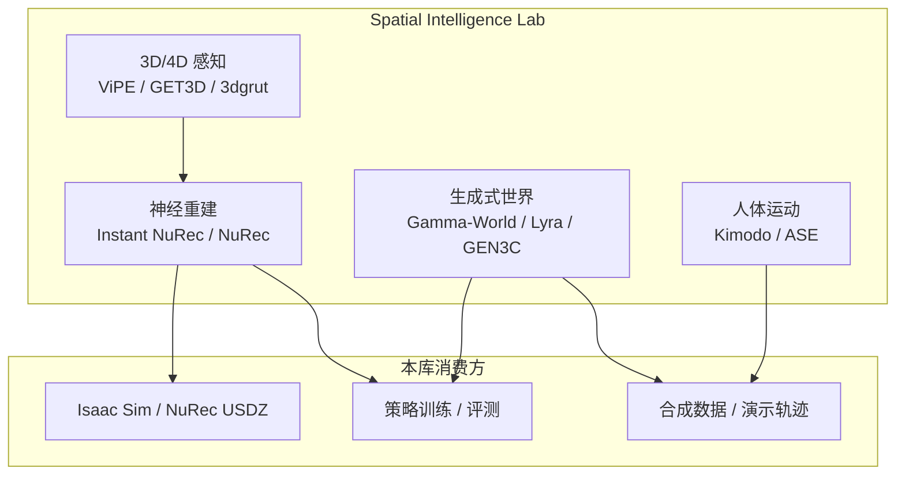

# NVIDIA Spatial Intelligence Lab（SIL）

**NVIDIA Spatial Intelligence Lab**（门户：<https://research.nvidia.com/labs/sil/>，GitHub：<https://github.com/nv-tlabs>）是 NVIDIA Research 下的 **空间智能** 研究组：目标是把 AI 的 **感知、世界建模与物理交互** 推到可部署的基础技术，而不是只做 2D 识别或纯语言推理。

## 一句话定义

**NVIDIA 的空间智能基础研究组：3D/4D 感知、神经重建与生成式世界模型多从 `nv-tlabs` 开源，项目页挂在 `research.nvidia.com/labs/sil/projects/*`——与工程术语 Software-in-the-Loop（SIL）同名不同义。**

## 英文缩写速查

| 缩写 | 英文全称 | 简要说明 |
|------|----------|----------|
| SIL | Spatial Intelligence Lab | 本页所述 NVIDIA 研究组（勿与 Software-in-the-Loop 混淆） |
| 3DGS | 3D Gaussian Splatting | 神经场景表示；Instant NuRec 等输出形态 |
| WFM | World Foundation Model | 视频/世界生成基础模型；Gamma-World 等多智能体路线 |
| NuRec | NVIDIA Neural Reconstruction | 驾驶/机器人神经重建产品栈 |
| ViT | Vision Transformer | 多视图编码骨干（Instant NuRec 等） |
| ASE | Adversarial Skill Embeddings | nv-tlabs 技能嵌入 RL 框架 |
| Real2Sim | Real to Simulation | 真实日志 → 可仿真资产；SIL 实验室与 NuRec 主线 |

## 为什么重要

- **Real2Sim / 仿真评测上游：** [Instant NuRec](./paper-instant-nurec.md) 把驾驶 clip **秒级** 打成可仿真 3DGS，并证明 AlpaSim **策略排序不变**——直接服务 [仿真评测基础设施](../concepts/simulation-evaluation-infrastructure.md) 与 [NuRec](./nvidia-nurec.md) 产品栈。
- **机器人数据上游：** [Kimodo](./kimodo.md) 从大规模动捕生成 **G1 / SOMA** 参考轨迹，衔接 [ProtoMotions](./protomotions.md) 与 [SONIC](../methods/sonic-motion-tracking.md) 跟踪。
- **生成式世界模型：** [Gamma-World](./paper-gamma-world-multi-agent.md) 等多体可控视频世界模型补 [生成式世界模型](../methods/generative-world-models.md) 的 **空间交互** 维度。
- **与 GEAR 互补：** [GEAR Lab](./nvidia-gear-lab.md) 偏通才具身 agent / GR00T / SONIC **系统栈**；SIL 更偏 **几何、重建、4D 与生成式空间先验**。

## 核心结构

### 代码与项目页怎么找

| 入口 | 用途 |
|------|------|
| [research.nvidia.com/labs/sil/](https://research.nvidia.com/labs/sil/) | 实验室门户与 `projects/*` 交互 demo |
| [github.com/nv-tlabs](https://github.com/nv-tlabs) | 多数开源实现（~121 公开仓） |
| 各论文 `sources/repos/` | 本库逐步归档的 README 与开源边界 |

## 本库已索引代表工作

| 工作 | 本库页 |
|------|--------|
| Instant NuRec | [paper-instant-nurec](./paper-instant-nurec.md) |
| Omniverse NuRec | [nvidia-nurec](./nvidia-nurec.md) |
| Kimodo | [kimodo](./kimodo.md) |
| Gamma-World | [paper-gamma-world-multi-agent](./paper-gamma-world-multi-agent.md) |
| ASE | [ASE](../methods/ase.md) |
| ChronoEdit | [paper-sa-2510-04290-chronoedit](../entities/paper-sa-2510-04290-chronoedit-towards-temporal-reasoning-for-image.md) |

完整高星仓清单见 [nv-tlabs 归档](../../sources/repos/nv_tlabs.md)。

## 工程实践

| 目标 | 建议 |
|------|------|
| 查某 SIL 论文代码 | 项目页 Footer → GitHub；同时搜 `nv-tlabs` 与 `NVIDIA/` |
| 驾驶 Real2Sim | Instant NuRec CLI → NuRec 容器精修 → Isaac / AlpaSim |
| 人形运动数据 | Kimodo 生成 → GMR / ProtoMotions |
| 别混淆 SIL | 仿真 **Software-in-the-Loop** 见 [概念页](../concepts/software-in-the-loop.md) |

**开源状态（2026-09-05）：** 实验室 **无单一代码仓**；各项目 **逐仓库** 开源程度不同（见各 `sources/repos/` 步骤 2.5 表）。

## 局限与风险

- **缩写冲突：** 站内 **SIL** 亦指 [Software-in-the-Loop](../concepts/software-in-the-loop.md)——读文献/课程时先确认语境。
- **组织分裂：** 部分项目（如 Instant NuRec）在 **`NVIDIA/`** 而非 `nv-tlabs`。
- **产品 vs 研究：** NuRec 容器、Cosmos 等与实验室论文 **发布节奏不同**，勿把 demo 页当生产 SLA。

## 关联页面

- [NVIDIA GEAR Lab](./nvidia-gear-lab.md) — 具身通才 agent 研究组
- [NVIDIA NuRec](./nvidia-nurec.md) — 产品化神经重建
- [Software-in-the-Loop（概念）](../concepts/software-in-the-loop.md) — Isaac Sim 工程 SIL
- [生成式世界模型](../methods/generative-world-models.md)
- [仿真评测基础设施](../concepts/simulation-evaluation-infrastructure.md)
- [机器人视觉感知栈选型闭环](../queries/robot-perception-stack-selection-loop.md) — SIL 的 3D/4D 感知与重建落到感知栈哪一层

## 参考来源

- [SIL 实验室门户归档](../../sources/sites/nvidia-spatial-intelligence-lab.md)
- [nv-tlabs GitHub 归档](../../sources/repos/nv_tlabs.md)

## 推荐继续阅读

- [NVIDIA Spatial Intelligence Lab](https://research.nvidia.com/labs/sil/)
- [nv-tlabs（GitHub）](https://github.com/nv-tlabs)
- [Instant NuRec 项目页](https://research.nvidia.com/labs/sil/projects/instant-nurec/)
- [Kimodo 项目页](https://research.nvidia.com/labs/sil/projects/kimodo/)
