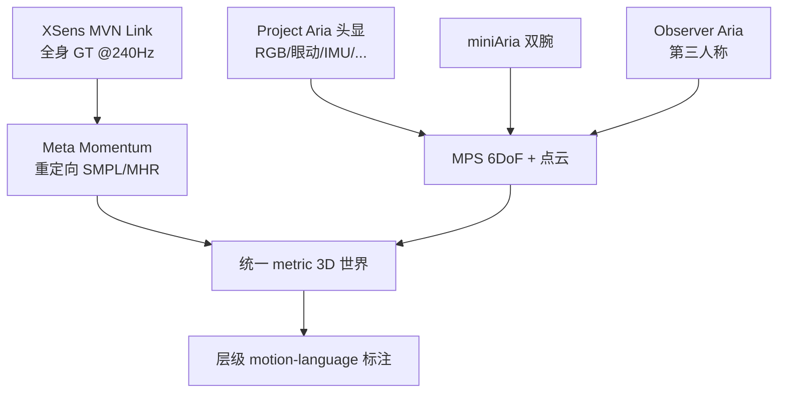

# Nymeria Dataset

**Nymeria** 是 Meta **Project Aria** 发布的 **野外最大规模多模态 egocentric 人类运动数据集**（[官方页](https://www.projectaria.com/datasets/nymeria/)，论文 [arXiv:2406.09905](https://arxiv.org/abs/2406.09905)）。它在真实家庭与校园场景中同步记录 **头显 / 双腕 / 第三人称 observer / 全身 GT 运动**，并提供 **层级 motion-language** 标注，服务 egocentric tracking、synthesis、action recognition 与 **跨本体动作先验** 研究（如 [Light-O1](./light-o1.md) Transfer Scaling Law 的 egocentric 适配轴）。

## 一句话定义

**用 Aria 生态多设备 + XSens GT 在统一 metric 3D 世界里采集的「野外人类 motion + 语言 + egocentric 视频」超大规模开放数据集。**

## 英文缩写速查

| 缩写 | 英文全称 | 简要说明 |
|------|----------|----------|
| MPS | Machine Perception Services | Aria 轨迹/点云/眼动深度后处理管线 |
| GT | Ground Truth | 本数据集指 XSens 全身 kinematics + Momentum 重定向 |
| Ego | Egocentric | 第一人称可穿戴视角 |
| SMPL | Skinned Multi-Person Linear Model | 人体参数化；NymeriaPlus 提供优化 SMPL/MHR |
| CC BY-NC | Creative Commons Attribution-NonCommercial | 数据集开放许可（非商用） |

## 为什么重要

- **规模与多样性：** **300 h** 活动、**264** 人、**50** 地点、**20** 场景脚本——覆盖日常家务/社交/户外等 long-tail。
- **多设备同步：** 世界首个 **多 egocentric 设备 + observer + GT motion** 同坐标系数据集；支持 ego-exo 融合研究（见 [EgoExoMoCap](./paper-egoexomocap.md)）。
- **Motion-language：** **310.5K** 句 / **8.64M** 词，含 narration / atomic action / activity summary 三层。
- **具身 scaling 锚点：** [Light-O1](./light-o1.md) 将其作为 **人类 egocentric** 适配 held-out 曲线之一。

## 核心信息

| 字段 | 内容 |
|------|------|
| **机构** | Meta（Project Aria） |
| **序列** | **1200**（Nymeria / NymeriaPlus 各 **1100** 可选序列，~**80 TB**/版） |
| **传感** | Aria 头显 + miniAria 腕带 + XSens + observer Aria |
| **语言** | **230 h** 标注 · **6545** 词表 |
| **许可** | **CC BY-NC 4.0** |
| **工具** | [facebookresearch/nymeria_dataset](https://github.com/facebookresearch/nymeria_dataset) + `aria_dataset_downloader` |

## 采集栈（概念）

## 工程实践

| 步骤 | 要点 |
|------|------|
| 申请 | Project Aria Dataset Explorer 筛选序列 → 下载 `*_download_urls.json` |
| 下载 | `aria_dataset_downloader`；按 **group** 选择性拉取，避免一次 80TB |
| 版本 | **NymeriaPlus** 用 `main`；原版可试 `nymeria_dataset_legacy` |
| 隐私 | 官方 **EgoBlur** 人脸/车牌；遵守 Research 伦理条款 |
| 机器人用法 | 人类 motion / 语言 / ego 视频作 **预训练或 scaling 探针**；上机需重定向 |

## 局限与风险

- **非机器人动作空间**：SMPL/MHR 轨迹 **≠** 关节角命令；迁移需 retarget + 控制栈。
- **NC 许可**：商用与再分发受限。
- **体量**：全量下载成本极高；实验应 **子集 + Explorer 过滤**。
- **Nymeria vs Plus**：Plus 改运动与 bbox/ShapeR；混用版本需固定协议。

## 关联页面

- 论文实体：[paper-nymeria.md](./paper-nymeria.md)
- 对照：[HIW-500](./hiw-500-dataset.md)（G1 野外 teleop）
- 引用方：[Light-O1](./light-o1.md)

## 参考来源

- [nymeria-dataset-projectaria.md](../../sources/sites/nymeria-dataset-projectaria.md)
- [nymeria_arxiv_2406_09905.md](../../sources/papers/nymeria_arxiv_2406_09905.md)
- [nymeria_dataset.md](../../sources/repos/nymeria_dataset.md)

## 推荐继续阅读

- [Project Aria Nymeria 页](https://www.projectaria.com/datasets/nymeria/)
- [GitHub nymeria_dataset](https://github.com/facebookresearch/nymeria_dataset)
