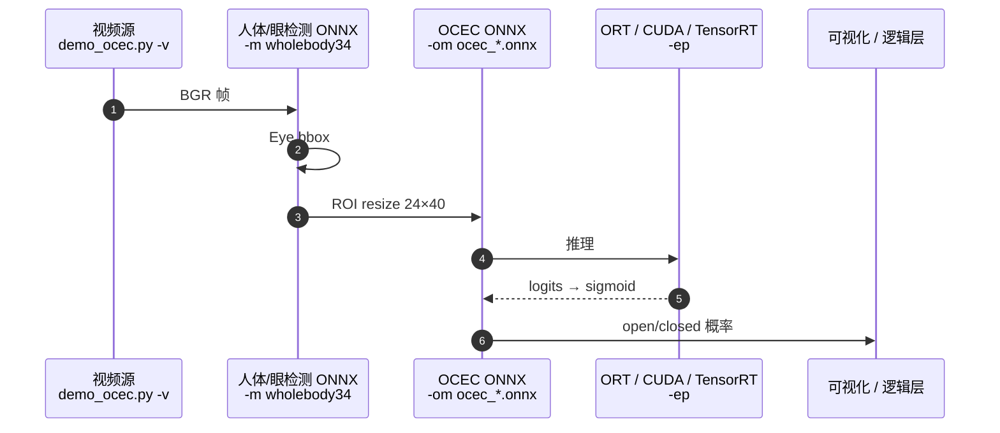

# OCEC（Open Closed Eyes Classification）

**OCEC**（[`PINTO0309/OCEC`](https://github.com/PINTO0309/OCEC)）在 **极小眼部裁剪** 上做 **open vs closed** 二分类，并导出 **P–L** 六档 ONNX，主打 **超低延迟** 的眨眼 / wink 估计；权重见 [GitHub Releases](https://github.com/PINTO0309/OCEC/releases) 与 [PINTO Model Zoo 476_OCEC](https://github.com/PINTO0309/PINTO_model_zoo/tree/main/476_OCEC)，DOI [10.5281/zenodo.17505461](https://doi.org/10.5281/zenodo.17505461)。

## 一句话定义

**把「开/闭眼」从整帧视觉里拆成「检测器给眼 ROI → 24×40 微 CNN/ConvNeXt 分类 → sigmoid 概率」的 ONNX 级联，用亚毫秒 CPU 推理换可部署的 blink 通道。**

## 英文缩写速查

| 缩写 | 英文全称 | 简要说明 |
|------|----------|----------|
| OCEC | Open Closed Eyes Classification | 本仓库：开/闭眼二分类与 ONNX 导出 |
| ONNX | Open Neural Network Exchange | 跨框架模型交换格式；OCEC 发布 P–L 六档 `.onnx` |
| ROI | Region of Interest | 眼部裁剪区域，默认约 24×40 像素 |
| F1 | F1 Score | 精确率与召回的调和平均；README 报告各 variant 约 0.992–0.995 |
| EP | Execution Provider | ORT/TensorRT 等推理后端；`demo_ocec.py -ep` 指定 |
| BCE | Binary Cross-Entropy | 训练使用 `BCEWithLogitsLoss` + `pos_weight` 应对类不平衡 |
| HF | Hugging Face | 参考数据集 [closed-open-eyes](https://huggingface.co/datasets/MichalMlodawski/closed-open-eyes) 托管处 |

## 为什么重要

- **分辨率与算力对齐：** README 指出真实场景里 **高于约 20×40 px 的眼部 bbox 再做大图分类是浪费**；OCEC 用 **24×40** 输入与 **112 KB–6.4 MB** 模型，在 CPU 上可达 **0.16–0.80 ms** 量级延迟（官方 README 表，以本机 benchmark 为准）。
- **完整可复现管线：** 从 [HF 参考集](../../sources/datasets/closed-open-eyes.md)、`real_data` 视频统计、`03_wholebody34_data_extractor.py` 裁剪，到 `04_dataset_convert_to_parquet.py` 与 `python -m ocec train`，再到 **自动 ONNX 导出**——适合作为 **微分类 + 检测级联** 的工程模板。
- **机器人/HRI 侧读法：** 非 Loco/Manip 主感知栈，但可用于 **遥操作确认**（眨眼 ACK）、**操作者疲劳/注意力辅通道**、或 **共享空间人机共存** 的轻量 cue；与 [遥操作任务](../tasks/teleoperation.md) 的数据质量/安全讨论可并列，而非替代深度策略网络。

## 核心原理

| 环节 | 要点 |
|------|------|
| **检测** | Demo 用 **DEIMv2 + DINOv3 WholeBody34** ONNX 取 **Eye** 框（需自备 detector 权重，README 示例 `deimv2_dinov3_s_wholebody34_...onnx`） |
| **分类** | 眼 ROI resize 到 **24×40**（可配置 `image_size`）；backbone 含 `baseline` / `inverted_se` / `convnext`，head 含 `avg` / `avgmax_mlp` / `transformer` / `mlp_mixer` |
| **训练** | Parquet 行含 `split/label/class_id/image_path/source`；**同一 `still_image` 增广不跨 split** 防泄漏；`WeightedRandomSampler` + `pos_weight` |
| **推理** | Sigmoid 概率；Releases 提供 **P/N/S/C/M/L** 六档 ONNX，F1 与体积/延迟 trade-off 见官方表 |
| **开源状态** | **已开源** — 代码、训练脚本、Releases ONNX、Zenodo 归档均可公开获取（[sources 核查](../../sources/repos/ocec.md)） |

### 模型档位（README 摘要）

| Variant | 体积 | F1（README） | CPU 延迟（README） |
|---------|------|--------------|-------------------|
| P | 112 KB | 0.9924 | 0.16 ms |
| N | 176 KB | 0.9933 | 0.25 ms |
| S | 494 KB | 0.9943 | 0.41 ms |
| C | 875 KB | 0.9947 | 0.49 ms |
| M | 1.7 MB | 0.9949 | 0.57 ms |
| L | 6.4 MB | 0.9954 | 0.80 ms |

## 流程总览

## 源码运行时序图

训练路径（`python -m ocec train`）在 **parquet 已生成** 前提下走 DataLoader → `BCEWithLogitsLoss` → checkpoint / TensorBoard → **ONNX 导出**；细节见仓库 README「Training Pipeline」。

## 工程实践

| 步骤 | 命令/入口 |
|------|-----------|
| 环境 | `git clone` + `uv sync`（README Setup） |
| 浏览 HF 参考集 | `uv run python 01_dataset_viewer.py --split train` |
| 统计真实眼尺寸 | `02_real_data_size_hist.py` 对 `real_data/*.mp4` |
| 大规模裁剪 | `03_wholebody34_data_extractor.py` + WholeBody34 ONNX |
| 转 parquet | `04_dataset_convert_to_parquet.py --embed-images`（可选） |
| 训练 | `uv run python -m ocec train --data_root data/dataset.parquet ...` |
| 实时 demo | `uv run python demo_ocec.py -v 0 -m <detector.onnx> -om ocec_l.onnx -ep cuda` |

**部署选型：** ONNX 文件可接入 [ONNX Runtime](./onnxruntime.md) 或 [TensorRT](./tensorrt.md)；横向对比见 [ORT vs MNN vs TensorRT](../comparisons/onnxruntime-vs-mnn-vs-tensorrt.md)。Jetson/ARM 上应 **实测 EP 与 opset**，勿仅信 README 延迟表。

## 局限与风险

- **级联误差：** 检测漏眼或 bbox 偏移会直接传导到分类；WholeBody34 与 OCEC **需版本/输入尺寸对齐**。
- **域偏移：** 训练含 `train_dataset` 与 `real_data` 混合；新相机、红外、XR 透视可能需 **再采集 + 微调**。
- **非机器人主栈：** 不提供 Loco/Manip 观测接口；接入机器人系统时需自行定义 **与策略/安全 PLC 的接口**（频率、失效安全）。
- **detector 权重：** Demo 依赖的 WholeBody34 ONNX **不在 OCEC Releases 内**，需从 PINTO 其它仓库/Model Zoo 获取。

## 关联页面

- [ONNX](./onnx.md) — 导出格式与机载契约
- [ONNX Runtime](./onnxruntime.md) / [TensorRT](./tensorrt.md) — 推理后端
- [遥操作](../tasks/teleoperation.md) — 人机接口与采数上下文
- [机载推理 Runtime 选型](../comparisons/onnxruntime-vs-mnn-vs-tensorrt.md)

## 参考来源

- [OCEC 仓库归档](../../sources/repos/ocec.md)
- [closed-open-eyes 数据集归档](../../sources/datasets/closed-open-eyes.md)

## 推荐继续阅读

- 官方 README：<https://github.com/PINTO0309/OCEC>
- PINTO Model Zoo 条目：<https://github.com/PINTO0309/PINTO_model_zoo/tree/main/476_OCEC>
- Hugging Face 参考数据集：<https://huggingface.co/datasets/MichalMlodawski/closed-open-eyes>
