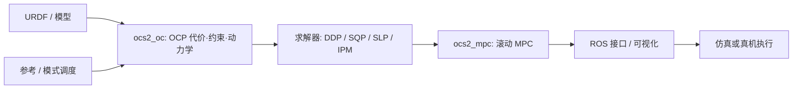
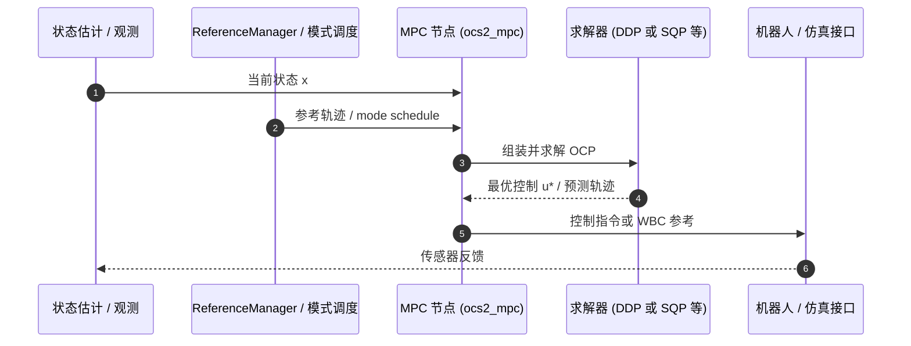

# OCS2

[**OCS2**](https://github.com/leggedrobotics/ocs2)（**O**ptimal **C**ontrol for **S**witched **S**ystems）是 **ETH Robotic Systems Lab (RSL)** 维护的 C++ 最优控制工具箱：面向 **非线性 OCP / 实时 NMPC**，尤其服务 **腿式 locomotion、移动操作与全身 MPC**。官方文档：<https://leggedrobotics.github.io/ocs2/>。

## 一句话定义

**切换系统 + 多求解器 NMPC 框架** — 从 URDF/Pinocchio 动力学与约束出发，在机载算力上滚动求解 DDP/SQP 等，经 ROS 节点下发参考或力矩，是 ETH 系四足/人形 **模型控制栈** 的常见开源底座。

## 英文缩写速查

| 缩写 | 英文全称 | 简要说明 |
|------|----------|----------|
| OCS2 | Optimal Control for Switched Systems | 本工具箱名称与问题类 |
| MPC | Model Predictive Control | 滚动时域最优控制 |
| DDP | Differential Dynamic Programming | SLQ/iLQR 所属 DDP 族 |
| SQP | Sequential Quadratic Programming | 多重打靶 + QP（HPIPM） |
| HPIPM | High-Performance Interior Point Method | OCS2 SQP 默认 QP 后端 |
| CppAD | C++ Algorithmic Differentiation | 动力学/代价/约束自动求导 |
| URDF | Unified Robot Description Format | 机器人模型与 OCS2 建模入口 |

## 为什么重要

- **切换系统原生：** 接触模式、步态相位、jump map 是一等建模对象，不是事后补丁；与足式/人形 **接触切换** 问题结构对齐。
- **求解器可选：** 同一 OCP 可在 **DDP（SLQ/iLQR）**、**SQP（HPIPM）**、**SLP（PIPG）**、**IPM** 间选型，便于在精度、约束处理与实时性之间权衡（详见 [MPC 求解器选型](../queries/mpc-solver-selection.md)）。
- **机器人工具链齐全：** URDF→动力学/代价/自碰撞/末端跟踪、CppAD 求导、ROS 1/2 接口与 **legged robot** 等端到端示例，降低从论文到可跑 MPC 的门槛。
- **与 RL 的分工清晰：** 常作 **System 1** 模型层（见 [MPC vs RL](../comparisons/mpc-vs-rl.md)）；MPC-Net 等学习策略可叠在 OCS2 之上，而非默认替代整段控制。

## 核心原理

### 1. 问题类：切换系统 OCP

OCS2 将 **mode schedule**（何时处于哪一动力学/约束域）与 **状态跳变** 编入 OCP。典型足式场景：支撑相 / 摆动相、接触集变化；移动操作：基座+臂联合约束。

### 2. 路径约束

一般路径约束通过 **增广 Lagrangian** 或 **relaxed barrier** 处理，支持硬/软约束组合，与 DDP/SQP 管线配合。

### 3. 求解器谱系（官方 Overview）

| 求解器 | 域 / 类型 | 典型用途直觉 |
|--------|-----------|--------------|
| SLQ | 连续时间约束 DDP | 平滑动力学、快速 DDP 族迭代 |
| iLQR | 离散时间约束 DDP | 离散化模型、与 RL/跟踪结合 |
| SQP | 多重打靶 + HPIPM | 强约束、结构化 QP 子问题 |
| SLP | PIPG | 线性化链式结构 |
| IPM | 多重打靶内点 | 非线性约束较复杂时 |

### 4. 与 Pinocchio / 质心模型

`ocs2_pinocchio` 提供 kinematics、**centroidal model**、自碰撞（HPP-FCL）等，与 [Pinocchio](./pinocchio.md) 栈一致；常接 [Centroidal NMPC + WBC](../methods/centroidal-nmpc-wbc-stack.md) 叙事。

### 流程总览

## 源码运行时序图

以下对齐 `ocs2_robotic_examples` + ROS 节点的 **典型在线 MPC 环**（具体包名以所跑 example 的 README 为准）：

**复现路径：** 文档 [Getting Started](https://leggedrobotics.github.io/ocs2/) → 选定 `ocs2_robotic_examples`（如 legged robot）→ 按 ROS 1 `main` 或 ROS 2 `ros2` 分支安装说明编译 launch。

## 工程实践

1. **分支与 ROS 版本：** `main` = ROS 1；**ROS 2** 用 [`ros2` 分支](https://github.com/leggedrobotics/ocs2/tree/ros2) 与 `installation.md`。
2. **安装：** 优先跟文档 Installation；依赖含 Pinocchio、HPIPM（SQP）、CppAD 等，按 example 最小集安装。
3. **从简到繁：** double integrator / cartpole → quadrotor / ballbot → mobile manipulator → **legged robot**。
4. **与 acados / crocoddyl 对照：** [acados](./acados.md) 偏嵌入式 RTI-SQP；[crocoddyl](./crocoddyl.md) 偏 shooting / DDP 研究与轨迹优化；OCS2 强调 **切换系统 + ROS 部署 + RSL 腿式栈**（见 [Nonlinear MPC](../methods/nonlinear-model-predictive-control.md)）。
5. **下游 WBC：** OCS2 本体 **不含** 完整 WBC 栈（如 [qiayuanl/legged_control](https://github.com/qiayuanl/legged_control) 在 OCS2 之上补 WBC）；选型时分开评估 MPC 层与力矩层。

| 检查项 | 建议 |
|--------|------|
| 许可 | BSD 3-Clause |
| 求解器 | 约束强 → 先试 SQP；平滑 unconstrained → DDP/SLQ |
| 模型 | URDF 与 Pinocchio 版本与 example 一致 |
| 真机 | 核对 ROS 版本、控制频率与 example 是否含硬件 launch |

## 局限与风险

- **学习曲线：** OCP 建模、模式调度与约束调参需要最优控制背景；非「克隆即跑人形」。
- **WBC 非内置：** 需外接 TSID/WBC 或自研力矩映射（见 [HighTorque hi_dynamic_control](./hightorque-robotics.md) 等 OCS2+WBC 项目）。
- **ROS 双轨：** ROS 1 与 ROS 2 分支维护节奏可能不同，复现前确认分支与文档版本。
- **与主表策展摘要：** 本库曾从 [Humanoid Motion Intelligence](./humanoid-motion-intelligence.md) 主表导入摘要；**技术细节以 GitHub + 官方文档为准**。

## 关联页面

- [Nonlinear Model Predictive Control](../methods/nonlinear-model-predictive-control.md)
- [Centroidal NMPC + WBC stack](../methods/centroidal-nmpc-wbc-stack.md)
- [Pinocchio](./pinocchio.md)
- [acados](./acados.md)
- [MPC solver selection](../queries/mpc-solver-selection.md)
- [MPC vs RL](../comparisons/mpc-vs-rl.md)
- [qm-control](./qm-control.md) — 四足机械臂 OCS2 MPC+WBC 下游参考实现
- [Humanoid Motion Intelligence](./humanoid-motion-intelligence.md)
- [开源主表覆盖索引](../queries/hmi-opensource-projects-coverage.md)

## 参考来源

- [OCS2 仓库归档](../../sources/repos/ocs2.md)
- [OCS2 官方文档归档](../../sources/sites/ocs2-official-docs.md)

## 推荐继续阅读

- GitHub：<https://github.com/leggedrobotics/ocs2>
- 文档 Overview：<https://leggedrobotics.github.io/ocs2/overview.html>
- RSS 2021 MPC Workshop 教程（文档页链接）：OCS2 toolbox / legged locomotion real-time control
