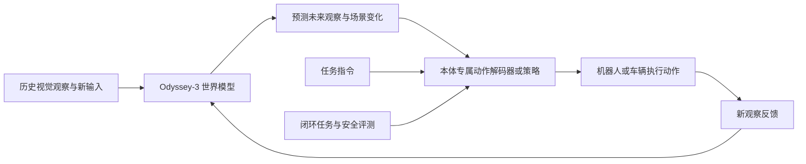

# Odyssey-3

## 一句话定义

**Odyssey-3** 是一个从视觉观察中学习物理演化规律、并据此生成或预测交互环境变化的基础世界模型。

## 英文缩写速查

| 缩写 | 英文全称 | 简要说明 |
|---|---|---|
| WM | World Model | 学习环境状态如何随时间演化的模型 |
| AR | Autoregressive | 自回归生成方式，按序依赖先前输出 |
| DiT | Diffusion Transformer | 将 Transformer 用作扩散生成主干的架构 |
| RGB | Red-Green-Blue | 彩色图像通道 |
| VLA | Vision-Language-Action | 视觉、语言与动作联合策略 |

## 官方定位

Odyssey 官方把 Odyssey-3 描述为一个学习动力学的自回归扩散 Transformer：它根据历史视觉观察和新输入预测物体如何移动、相互作用，以及场景怎样随时间变化。发布文章展示了实时生成的交互环境，并称模型可作为物理世界中不同系统的模拟环境或策略学习基础。

这让它不只是把提示词变成一段固定视频：演示强调用户或 agent 采取动作后，模型继续生成并响应场景变化。不过生成视频中的物理一致性仍需针对具体任务测量，视频真实感本身不能证明动力学足以替代真实机器人或物理仿真器。

## 从世界模型到机器人动作

世界模型预测“世界接下来可能怎样变化”，机器人控制则必须确定“某个本体应发出什么控制命令”。Odyssey 文章把中间适配明确描述为在配对观察与动作数据上训练 action decoder 或 policy：

1. 从目标机器采集观察和动作对。
2. 利用 Odyssey-3 的学习表示，训练适用于该机器与任务的解码器或策略。
3. 让适配后的策略在目标系统闭环执行，并按该系统的安全和任务指标评估。
4. 将环境变化、失败恢复和分布外场景纳入测试。

因此 Odyssey-3 本身不能被等同于一个开箱即用的人形控制策略。官方文章举例包括机器人手臂操作、由 Flexion 适配的人形任务、车辆驾驶及多传感器视频生成；这些是不同适配实验，不表示同一个通用控制器已经覆盖所有本体。

## 运行与适配示意

图中的动作策略是针对目标设备训练的附加组件。生成环境可支持 agent 训练和评估，但其指标应与真实设备上的闭环表现分别报告。

## 开放状态与限制

官方于 2026-10-08 发布研究预览并提供在线体验、API 联系入口。截至本次核查，发布文章没有提供可下载权重或公开训练代码，因而不能按开源项目复现。文中 benchmark 排名和成功率均为 Odyssey 自行报告的特定版本和协议；落地项目应在自己的机器人、任务与扰动条件下复测。

## 关联页面

- [世界-动作模型](../concepts/world-action-models.md)
- [Video Prediction Policy 2（VPP2）](./video-prediction-policy-2.md)

## 参考来源

- [Odyssey-3 官方发布文章归档](../../sources/sites/odyssey-3.md)
- [Meet Odyssey-3](https://odyssey.systems/meet-odyssey-3)
