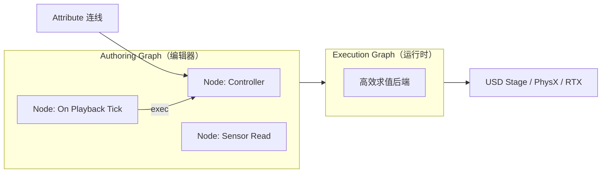
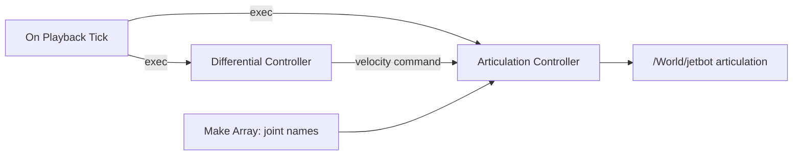

# OmniGraph（Omniverse 可视化脚本）

**OmniGraph** 是 Omniverse 的 **可视化脚本 / 图计算框架**：在 OpenUSD stage 上把静态场景变成可交互、可闭环的仿真世界。它不是单一图类型，而是 **Action Graph、Push Graph、粒子、骨骼动画** 等多类图系统的统一外壳。

## 一句话定义

**在 Omniverse / Isaac Sim 里用节点图编排仿真逻辑的控制层**——机器人差速/关节控制、传感器读出、ROS 2 桥、Replicator 与 UI 都常经 OmniGraph 挂到 timeline 上，而不是全写在 standalone Python 循环里。

## 英文缩写速查

| 缩写 | 英文全称 | 简要说明 |
|------|----------|----------|
| OG | OmniGraph | Omniverse 可视化脚本与图执行框架 |
| USD | Universal Scene Description | 图与机器人 prim 共存的场景描述格式 |
| ROS 2 | Robot Operating System 2 | Isaac Sim 内常用 OmniGraph 做 bridge 与 SIL |
| SIL | Software-in-the-Loop | 仿真中接外部栈验证；OmniGraph 是无代码搭 SIL 路径之一 |
| SDG | Synthetic Data Generation | Replicator 合成数据管线常由 OmniGraph 驱动 |
| Kit | Omniverse Kit | Isaac Sim 运行时；OmniGraph 编辑器为其窗口扩展 |

## 为什么重要

- **把「场景」和「行为」解耦**：资产在 USD stage，控制与传感逻辑在图里迭代，GUI 与脚本 API 共用同一图表示。
- **Isaac Sim 的默认胶水层**：官方文档写明 OmniGraph 是 Replicator、ROS 2 bridge、传感器、控制器、外设与 UI 的 **主引擎**（见 [Isaac Sim 实体页](./isaac-sim.md)）。
- **降低 SIL 门槛**：不必先写完整 Python 控制环，就能用 Action Graph 验证关节/差速/键盘遥操作，再迁到 ROS 2 或 Lab 训练栈。

## 核心原理

### 图类型

| 图类型 | 求值方式 | 典型用途 |
|--------|----------|----------|
| **Action Graph** | 事件驱动（execution 边触发） | 播放 tick 上发关节指令、键盘/按钮、ROS 事件 |
| **Push Graph** | 连续推送求值 | 变形器、粒子、每帧都需更新的数据流 |

### 概念模型

- **Node**：由 node type 定义；带 input / output / state **Attribute**。
- **Connection**：有向边，表示 Attribute 间依赖。
- **Authoring vs Execution**：用户编辑的是 Authoring Graph；运行时映射为 Execution Graph（同一表示可扩展单机到多节点数据中心，见 Omniverse 文档）。

### Isaac Sim 机器人控制主干（Jetbot 教程）

- **Articulation Controller**：对带 articulation root 的 prim 施加力/位姿/速度。
- **Differential Controller**：线速度 + 角速度 → 双轮差速命令。
- **On Playback Tick**：仅在 timeline **Play** 时每帧触发（与 `OnTick` 脚本节点同类思路）。

## 工程实践

| 步骤 | 做法 |
|------|------|
| 打开编辑器 | `Window > Graph Editors > Action Graph` |
| 快捷生成底盘图 | `Tools > Robotics > OmniGraph Controllers` → Differential / Joint Position / Velocity / Gripper |
| 绑定机器人 | 快捷弹窗填 **Articulation Root**（如 `/World/jetbot`）；或 Articulation Controller 设 `robotPath` / `input:targetPrim` |
| 键盘遥操作 | Differential 快捷勾选 **Use Keyboard Control (WASD)** |
| 纯 Python 建图 | `import omni.graph.core as og` → `og.Controller.edit(...)` / `create_node` / `connect` |
| On-Demand 图 | 创建时 `pipeline_stage=GRAPH_PIPELINE_STAGE_ONDEMAND`，用 `graph_handle.evaluate()` 手动触发 |
| 从快捷方式学脚本 | 快捷弹窗底部 **Python Script for Graph Generation** 查看 `make_graph()` |
| 物理/渲染回调 | 参考仓内 `standalone_examples/.../omnigraph_triggers.py` |

**Docker / 容器注意：** 共享内存 `shm_size` 不足时 OmniGraph 易 segfault；Isaac 部署建议 **≥ 4GB**（本仓 [SRU Odin](./sru-odin.md) 默认 16GB）。

### 与 Python Core API 的分工

| 路径 | 何时用 |
|------|--------|
| **OmniGraph** | GUI 迭代控制逻辑、ROS 图、Replicator、无代码 SIL、官方 Robotics 快捷图 |
| **`World` / `SimulationContext` 步进** | standalone 训练脚本、Isaac Lab 环境、批量并行仿真 |
| **扩展模式** | Kit 已启动；用 `omni.graph.core` 或现有 Action Graph，**勿**再 `new SimulationApp()` |

## 局限与风险

- **图冲突无自动检测**：同场景多个图控制同一机器人时，官方 shortcuts **不校验** 重复；需自行禁用/删除旧图。
- **不是 RL 环境 API**：OmniGraph 解决 **单场景控制与 IO 编排**；大规模 PPO / IL 仍看 [Isaac Lab](./isaac-lab.md)。
- **调试可见性**：Print 节点默认 log level 影响终端/控制台是否可见；脚本改 attribute 后可能要等到下一 tick 才生效。
- **版本绑定 Kit**：文档快照 **Isaac Sim 6.0.1**；节点库与类型名随版本变，迁移时对照 Node Library。

## 关联页面

- [Isaac Sim](./isaac-sim.md) — OmniGraph 所在机器人仿真应用
- [NVIDIA Omniverse](./nvidia-omniverse.md) — Kit / USD 底座
- [Software-in-the-Loop](../concepts/software-in-the-loop.md) — ROS 2 + OmniGraph 无代码 SIL
- [ROS 2 基础](../concepts/ros2-basics.md) — bridge 与 SIL 栈
- [NVIDIA Warp](./nvidia-warp.md) — 自定义 OmniGraph 节点可集成 Warp kernel（计算层）
- [SRU Odin](./sru-odin.md) — 容器 `shm_size` 与 OmniGraph 稳定性
- [Reinforcement Learning](../methods/reinforcement-learning.md) — 训练栈在 Lab，不在图编辑器

## 参考来源

- [Omniverse Extensions — OmniGraph 归档](../../sources/sites/nvidia-omniverse-omnigraph.md)
- [Isaac Sim 6.0.1 OmniGraph 教程归档](../../sources/sites/nvidia-isaac-sim-omnigraph.md)
- [Isaac Sim SIL 教程模块](../../sources/sites/nvidia-isaac-sim-sil-tutorial.md)

## 推荐继续阅读

- Omniverse OmniGraph 索引：<https://docs.omniverse.nvidia.com/extensions/latest/ext_omnigraph.html>
- Isaac Sim OmniGraph（6.0.1）：<https://docs.isaacsim.omniverse.nvidia.com/6.0.1/omnigraph/index.html>
- Isaac Sim OmniGraph 教程（Jetbot）：<https://docs.isaacsim.omniverse.nvidia.com/6.0.1/omnigraph/omnigraph_tutorial.html>
- Python 脚本建图：<https://docs.isaacsim.omniverse.nvidia.com/6.0.1/omnigraph/omnigraph_scripting.html>
- Commonly Used Shortcuts：<https://docs.isaacsim.omniverse.nvidia.com/6.0.1/omnigraph/omnigraph_shortcuts.html>
