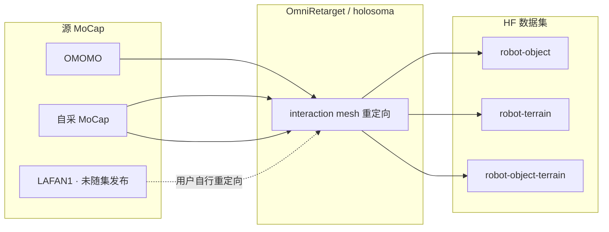

# OmniRetarget Dataset（G1 交互重定向轨迹）

**OmniRetarget Dataset**（<https://huggingface.co/datasets/omniretarget/OmniRetarget_Dataset>）是 Amazon FAR 为 **[OmniRetarget](./paper-hrl-stack-03-omniretarget.md)** 论文发布的 **Unitree G1** 重定向运动轨迹集。轨迹由 interaction-mesh 引擎生成，宣称无常见脚滑与穿透伪影，可直接作为 whole-body tracking RL 的参考运动。

## 英文缩写速查

| 缩写 | 英文全称 | 简要说明 |
|------|----------|----------|
| HF | Hugging Face | 托管数据集与模型的开源平台 |
| G1 | Unitree G1 Humanoid | 宇树教育科研人形实验平台 |
| MoCap | Motion Capture | 动作捕捉，参考动作与演示数据的主要来源 |
| WBT | Whole-Body Tracking | 全身关节/根轨迹跟踪类 RL 任务 |
| RL | Reinforcement Learning | 通过与环境交互最大化长期回报来学习策略的范式 |
| Retargeting | Motion Retargeting | 将人体/动物动作映射到目标机器人骨架 |
| OMOMO | Object Motion with Object interaction | 人–物交互 MoCap 数据集（论文数据源之一） |

## 为什么重要

- **可下载的交互参考：** 相比仅论文视频，提供 **可加载的 `qpos` 序列**，降低复现 OmniRetarget 下游 RL 的数据摩擦。
- **分任务子集：** `robot-object` / `robot-terrain` / `robot-object-terrain` 对应搬运、攀台与联合交互三类场景，与论文任务划分一致。
- **与代码闭环：** LAFAN1 子集因许可未发布，但 **[holosoma](./holosoma.md)** 重定向模块可让用户自行从 [LaFAN1](./lafan1-dataset.md) 生成同类轨迹。

## 子集与规模

| 子目录 | 内容 | 源数据 | 时长 |
|--------|------|--------|------|
| `robot-object/` | 搬运物体 | OMOMO | 3.0 h |
| `robot-terrain/` | 复杂地形动态动作 | 自采 MoCap | 0.5 h |
| `robot-object-terrain/` | 物体 + 地形 | 自采 MoCap | 0.5 h |
| **合计** | | | **4.0 h** |

> 论文/项目页报告重定向总量 **8–9+ 小时**（含 LAFAN1 等）；HF 当前为 **许可允许发布** 的子集。

## 数据格式

每个 `.npz` 文件一条轨迹：

- **`qpos`**：`[T, D]` — 机器人 36D（浮动基 7D + 29 关节）+ 可选物体 7D
- **`fps`**：帧率标量（如 30.0）

`models/` 目录含 URDF/SDF/OBJ 可视化资产，**训练加载轨迹不必需**。

## 流程总览

## 常见误区或局限

- **不是完整 9 小时包：** 公开发布为 **4.0 h**；勿与项目页「9+ 小时」总规模混为一谈。
- **LAFAN1 需自处理：** 页面明确因 licensing **不发布 LAFAN1 重定向结果**。
- **非动力学可行保证：** 轨迹为 **运动学重定向** 输出；上机仍需 RL 或后处理弥合动力学差距（论文用 5 reward WBT 完成此步）。

## 与其他页面的关系

- **生成方法：** [OmniRetarget](./paper-hrl-stack-03-omniretarget.md)
- **代码工具：** [holosoma](./holosoma.md)
- **源数据：** [LaFAN1](./lafan1-dataset.md)（需自行重定向）、[OMOMO](./omomo-dataset.md)（`robot-object/` 主源）
- **问题域：** [Motion Retargeting](../concepts/motion-retargeting.md)

## 参考来源

- [OmniRetarget Dataset Hugging Face 归档](../../sources/sites/omniretarget-dataset-huggingface.md)
- [OmniRetarget 论文归档](../../sources/papers/omniretarget_arxiv_2509_26633.md)

## 推荐继续阅读

- 数据集：<https://huggingface.co/datasets/omniretarget/OmniRetarget_Dataset>
- 代码：<https://github.com/amazon-far/holosoma>
- 论文：<https://arxiv.org/abs/2509.26633>
