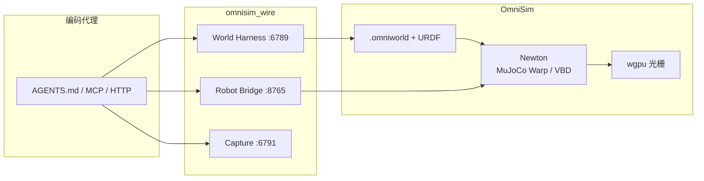
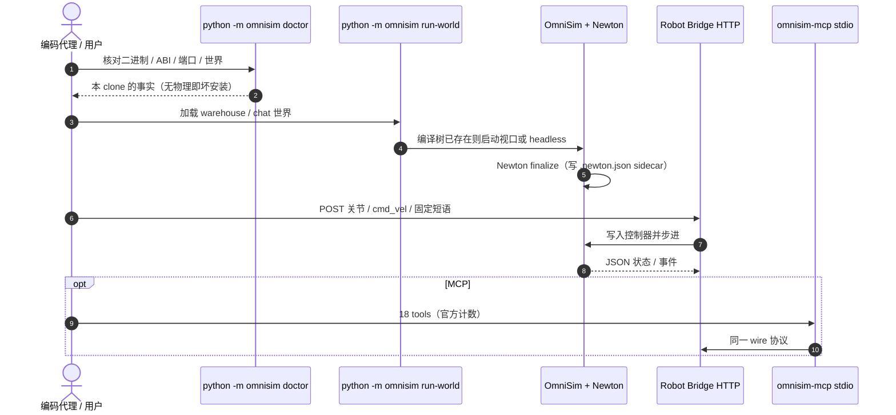

# OmniSim

**OmniSim** 是 [OmniLink](https://www.omnilink-agents.com/omnisim) 面向 **编码代理** 的开源机器人仿真工作台：clone 仓库、打开 `AGENTS.md`，用自然语言让代理安装工具链、生成世界、导入 URDF 并把机器人接到 HTTP 桥。它是 [Webots](./webots.md) 的 **独立 Apache-2.0 fork**（不隶属 Cyberbotics），物理层现以 [Newton](./newton-physics.md) 为 **唯一后端**。

## 一句话定义

把「场景编辑 + 物理步进 + 机器人控制」暴露成 loopback HTTP/JSON 与 MCP，让编码代理在对话里装仿真、改世界、跑 demo——而不是再学一套 GUI 工作流。

## 英文缩写速查

| 缩写 | 英文全称 | 简要说明 |
|------|----------|----------|
| MCP | Model Context Protocol | 一等 stdio server（`packages/omnisim-mcp/`），官方称 18 个会碰到运行中仿真的 tools |
| HTTP | Hypertext Transfer Protocol | `omnisim_wire` 1.0 的传输：loopback HTTP/1.1 + JSON |
| Newton | Newton Physics | Linux Foundation GPU 物理引擎；本仓唯一求解后端 |
| MuJoCo | Multi-Joint dynamics with Contact | 默认 Newton 求解器路径（`mujoco_warp`）；VBD 服务布料 |
| VBD | Vertex Block Descent | Newton 布料/可变形求解器 |
| ROS 2 | Robot Operating System 2 | sidecar 实现 `simulation_interfaces`；MoveIt / Nav2 尚未接上 |
| URDF | Unified Robot Description Format | 原生导入后走同一套 HTTP 桥 |
| PPO | Proximal Policy Optimization | 引擎内批量训练路径；厂商自测单卡 @4096 |
| wgpu | WebGPU native stack | Vulkan / D3D12 / Metal 实时光栅；非 RTX 光追 |
| BATON | （OmniSim 技能编排） | 把 Shadowing 技能编成可复现序列（如 G1 送箱） |

## 为什么重要

- **缺口不在「又一个 GPU sim」**：Isaac Sim / Gazebo 对编码代理几乎没有一等场景 API。OmniSim 把 **34 个 harness 端点 + 机器人桥 + MCP** 当作产品，而不是事后插件。
- **Newton 的「唯一后端」实验**：Isaac Sim 里 Newton 仍偏实验；本仓删除 ODE 后，没有物理就等于坏安装（`python -m omnisim doctor` 是第一诊断）。
- **许可证可读**：仿真器 Apache-2.0、无 NVIDIA ASML 再分发限制；名称与 orb 是商标——改 fork 须改名。
- **诚实的能力边界**：README 把 ROS 2 缺口、非写实渲染、零 sim-to-real、人形吊索演示写进「What OmniSim is worse at」，选型时比营销页更有用。

## 核心原理

### 在栈里的位置

| 层 | OmniSim 做什么 | 不要拿它当 |
|----|----------------|------------|
| 工作台 | `.omniworld` 场景、URDF、Qt/wgpu 视口、截图/电影 | Isaac Sim 级 RTX / Replicator SDG |
| 代理面 | Robot Bridge / World Harness / Capture；MCP stdio | 1 kHz 力矩环或现场总线 |
| 物理 | Newton 1.5.0：MuJoCo Warp + VBD | 已验证的 sim-to-real 接触模型 |
| 学习 | Shadowing（train==deploy 同一求解器）+ BATON | Isaac Lab 式万环境工业 PPO 平台 |
| 中间件 | ROS 2 sidecar（部分话题 + 差速 `ros2_control`） | 完整 Nav2 / MoveIt 实验室栈 |

项目页仍写「Newton GPU + ODE CPU 回退」和更宽的机型名单；**以仓库 README / `AGENTS.md` 为准**：ODE 已于 2026-08-08 删除，`physicsBackend="ode"` 的物体 **不进求解器**。详见 [仓库归档](../../sources/repos/omnisim.md)。

### 流程总览



第四个协议面 **Twin Shadow**（真机关节硬对齐）在 `PROTOCOL.md` 里是保留设计，**仓库内无实现**；不要把它读成已交付的数字孪生。

### 源码运行时序图

入口对齐官方 README / `AGENTS.md`：`python -m omnisim` 与 `packages/omnisim-mcp/`、`scripts/harness/`。



无 CUDA 时走 CPU 求解器，世界仍加载；GPU 批量 PPO / 布料是另一条路径，不要把「能打开 Husky demo」等同于「能复现 README 吞吐表」。

## 工程实践

### 先核开源与安装边界

| 检查项 | 入库日结论 |
|--------|------------|
| 代码 | **已开源** Apache-2.0 · <https://github.com/omnilink-tech/omnisim> |
| 项目页 | <https://www.omnilink-agents.com/omnisim> 链到同一仓库 |
| Windows | 公共 beta 有可下载包 |
| Linux | 已验证 **源码构建**（`scripts/install/linux_bootstrap.sh`） |
| macOS | 物理 **未验证**；无 ODE 回退 |
| 运行时 | 缺 Newton Python runtime（newton / warp / mujoco）= **无物理**，不是场景 bug |

Clone 示例（项目页带 `--recurse-submodules`）：

```bash
git clone --recurse-submodules https://github.com/omnilink-tech/omnisim.git
python -m omnisim doctor
```

### 推荐复现顺序

1. 让编码代理按 `AGENTS.md` 装依赖并构建（README 称首次 5–25 分钟）。
2. **每次**先 `doctor`：报告的是这棵 clone 的真实路径，而不是文档里的「应该」。
3. 入门世界：仓库 demo 启动器默认 warehouse Husky；chat 世界右键机器人 → Show Robot Window，离线路由吃固定短语，不需要 `OMNI_KEY`。
4. 加载检查用 `python -m omnisim run-headless --until-finalized --fail-on-warning`（`--duration` 是墙钟 sleep，不是 finalize 目标）。
5. 热改世界：`python -m omnisim harness` + `POST /world/load` 带 `"light": true`，之后默认 `POST /world/sync`。
6. 足式策略：`python -m omnisim policy list` / `sequence …`；引用数字前读 `docs/developer/rl-current-state.md`，并核对机器指纹。

### 厂商吞吐怎么读

README 对比表 **全部自测、按 GPU 分列、不跨机平均**。RTX 4090 上 GPU-batched @4096 约 **5.35×10⁵ env-steps/s**、引擎内 PPO 约 **5.00×10⁵**；相对 raw MuJoCo-Warp 约 **1.24–1.44×**。Isaac / Gazebo 单元格来自对方文档。RAM/VRAM 未公布。约束行超过 `newtonNjmax`（默认 256）会 **静默丢约束且 exit 0**。

### 已核机器人（README 表，非营销页名单）

OmniArm 6/7（6 号在重力下持姿已核）、OmniTug 500（**无碰撞体**，纯运动学摆位）、Unitree Go2/B2/G1/H1、OmniQuad、Clearpath Husky/Jackal、UR3e/UR5e/UR10e、Husarion Rosbot/XL、TurtleBot3、DJI Mavic 2 Pro。营销页额外列出的 Spot / Digit / Valkyrie / Franka 等 **不要当成当前 README 已交付机型**。

## 局限与风险

- **Sim-to-real 未证明**：官方写 zero physical-robot transfer；Twin Shadow 未实现。
- **人形「走路」演示多为吊索**：flagship G1 承重平衡架向上拉力可达约 2× 体重；楼梯 demo 关掉垂直钢丝。Unitree 原策略重托管可以无辅助走——**自训无辅助步态仍开放**。
- **ROS 2 实验室栈仍选 Gazebo**：无相机、IMU 的陀螺/加计不可用、MoveIt 轨迹会被拆碎、Nav2 未对接。
- **不是写实渲染**：wgpu 烘焙 GI，对不上 Isaac Sim RTX。
- **运行时场景变异非物理**：删除节点仍碰撞，新 spawn 不注册进求解器；复合 collider 默认只留第一子形状。
- **单卡训练**：无多 GPU / 多机梯子。
- **商标**：代码可商用，改名后再分发修改 fork。
- **公共 beta**：仓库在找前十名外部开发者做 20 分钟安装挑战；生态小于 Gazebo。

## 关联页面

- [Webots](./webots.md) — 上游桌面仿真器；本页是独立 fork
- [Newton Physics](./newton-physics.md) — 本仓唯一物理后端
- [Isaac Sim](./isaac-sim.md) — 对照：USD/RTX/ROS 2 SIL 工作台
- [Gazebo Sim](./gazebo-sim.md) — 对照：ROS 生态集成更深
- [mjlab](./mjlab.md) — 对照：MuJoCo Warp 上的 manager-based RL，不走 Webots 世界格式
- [仿真器选型指南](../queries/simulator-selection-guide.md)
- [Model Context Protocol](../concepts/model-context-protocol.md)
- [Sim2Real](../concepts/sim2real.md)
- [Reinforcement Learning](../methods/reinforcement-learning.md)
- [Agent Reach](./agent-reach.md) — 另一类「给编码代理的 doctor + 脚手架」（信息接入，非物理仿真）

## 参考来源

- [OmniSim 仓库归档](../../sources/repos/omnisim.md)
- [OmniSim 产品页归档](../../sources/sites/omnilink-agents-omnisim.md)
- [Webots 仓库归档](../../sources/repos/webots.md)
- [Newton Physics 仓库归档](../../sources/repos/newton-physics.md)

## 推荐继续阅读

- [omnilink-tech/omnisim](https://github.com/omnilink-tech/omnisim) — README、对比表与 beta 说明
- [PROTOCOL.md](https://github.com/omnilink-tech/omnisim/blob/main/PROTOCOL.md) — `omnisim_wire` 规范
- [AGENTS.md](https://github.com/omnilink-tech/omnisim/blob/main/AGENTS.md) — 编码代理入口
- [产品页](https://www.omnilink-agents.com/omnisim)
- [Newton](https://github.com/newton-physics/newton)
