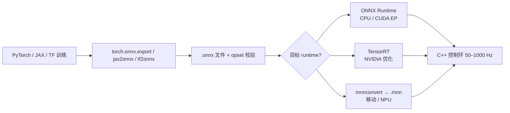

# ONNX

**ONNX**（**Open Neural Network Exchange**）是由社区维护、托管于 **LF AI & Data Foundation**（Linux Foundation 旗下）的 **开放模型交换标准**。它定义可扩展的 **计算图 IR**、内置 **operators** 与 **`.onnx` 文件格式**，让开发者在 [PyTorch](./pytorch.md)、TensorFlow、JAX 等框架中训练后，将同一模型交给 [ONNX Runtime](./onnxruntime.md)、TensorRT、[MNN](./mnn.md) 等运行时与硬件优化栈执行。在机器人研究与工程中，ONNX 最常作为 **Sim2Real 部署层的格式契约**——训练仍在 Python，机载控制环在 C++ 中以固定频率调用推理。

## 一句话定义

跨框架的 **神经网络模型中间表示（IR）与文件格式**：解耦「在哪训练」与「在哪推理」。

## 英文缩写速查

| 缩写 | 英文全称 | 简要说明 |
|------|----------|----------|
| ONNX | Open Neural Network Exchange | 开放神经网络交换格式 |
| IR | Intermediate Representation | 中间表示，计算图与算子的规范描述 |
| ORT | ONNX Runtime | 微软主导的 ONNX 兼容推理引擎 |
| EP | Execution Provider | ORT 中对接 CPU/GPU/TensorRT 等的后端插件 |
| ML | Machine Learning | ONNX-ML 扩展覆盖经典 ML 算子 |
| RL | Reinforcement Learning | 人形策略常经 ONNX 导出上机 |
| Sim2Real | Simulation to Real | 仿真训练策略迁移真机，ONNX 为常见导出格式 |

## 为什么重要？

- **训练框架解耦**：机器人学习代码多默认 PyTorch/JAX；真机栈多为 C++/Rust + 固定控制周期。ONNX 是二者之间最通用的 **标准化桥梁**。
- **硬件优化入口**：NVIDIA TensorRT、Intel OpenVINO、移动端 MNN 等均可直接或经一步转换消费 ONNX，便于触达 **FP16/INT8** 与算子融合。
- **生态成熟**：本库大量实体（[AMP_mjlab](./amp-mjlab.md)、[wbc-fsm 源](../../sources/repos/wbc_fsm.md)、[Open Duck Playground](./open-duck-playground.md)、[RF-DETR](./rf-detr.md)）的 README 均以 **导出 ONNX** 作为部署里程碑。
- **规范透明**：算子、版本与 IR 文档公开，便于排查「导出成功但 runtime 缺算子」类问题。

## 核心结构（规范归纳）

1. **ONNX IR**：`ModelProto` 描述图、权重与元数据；节点由标准 **Operator** 组成，边传递 **Tensor**。
2. **算子集（Operator Sets）**：随规范版本演进；导出时需指定 **opset** 并与目标 runtime 对齐。
3. **ONNX vs ONNX-ML**：前者覆盖神经网络推理核心；**ONNX-ML** 额外纳入经典 ML 算子，服务非深度模型标准化。
4. **Python 参考包**：`pip install onnx` 用于读写、校验与简单图变换；**不等于**推理引擎本身。
5. **周边资源**：[Model Zoo](https://github.com/onnx/models)、[tutorials](https://github.com/onnx/tutorials)、[supported-tools 列表](https://onnx.ai/supported-tools)。

## 与机器人研究与工程的关系

- **人形 RL / tracking**：[Whole-Body Tracking Pipeline](../concepts/whole-body-tracking-pipeline.md) 真机层普遍写「**ONNX / TensorRT @ ~50 Hz**」；策略冻结，观测构造需与训练 **字节级一致**。
- **感知**：[RF-DETR](./rf-detr.md) 等工作流 `model.export(format="onnx")` 后再接 TensorRT/Jetson。
- **浏览器 Demo**：[BotLab MotionCanvas](../entities/botlab-motioncanvas.md) 用 **ONNX Runtime WASM/WebGPU** 在浏览器跑 policy。
- **格式 ≠ 运行时**：`.onnx` 文件需由 [ONNX Runtime](./onnxruntime.md)、TensorRT、MNN 等 **执行**；选型见 [ONNX Runtime vs MNN vs TensorRT](../comparisons/onnxruntime-vs-mnn-vs-tensorrt.md)。

## 常见误区或局限

- **导出图 ≠ 训练图**：动态控制流、自定义 autograd、部分 RNN/注意力实现可能无法无损导出；应在目标 EP 上做 **代表性输入 benchmark**。
- **opset 与算子覆盖**：新算子可能仅部分 runtime 支持；Jetson/ARM 上尤需提前验证。
- **观测预处理不在 ONNX 内**：许多机器人仓库（如 [ProtoMotions](./protomotions.md)）选择把 obs 计算 bake 进 ONNX，或在外部 C++ 复刻；混用会导致 sim2real 隐性 gap。
- **版本锁定**：机载项目常固定 `onnxruntime==x.y.z`（见 [jackhan-feap-mujoco-deployment](./jackhan-feap-mujoco-deployment.md)）；升级需回归全链路。

## 流程总览（训练框架 → 机载推理）

## 关联页面

- [ONNX Runtime](./onnxruntime.md)
- [MNN](./mnn.md)
- [PyTorch](./pytorch.md)
- [TensorFlow](./tensorflow.md)
- [Sim2Real](../concepts/sim2real.md)
- [Whole-Body Tracking Pipeline](../concepts/whole-body-tracking-pipeline.md)
- [ONNX Runtime vs MNN vs TensorRT](../comparisons/onnxruntime-vs-mnn-vs-tensorrt.md)

## 参考来源

- [ONNX 官方站点与规范索引](../../sources/repos/onnx-official.md)

## 推荐继续阅读

- [ONNX 官网](https://onnx.ai/)
- [ONNX 文档（Python / IR）](https://onnx.ai/onnx/)
- [ONNX Operators 索引](https://onnx.ai/onnx/operators/index.html)
- [Supported Tools](https://onnx.ai/supported-tools)
