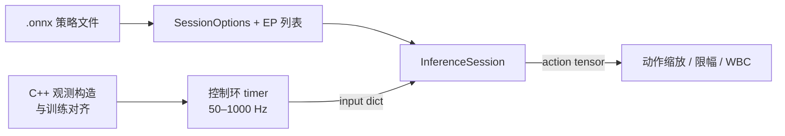

# ONNX Runtime

**ONNX Runtime**（常缩写 **ORT**）是由 **Microsoft** 主导的开源 **ONNX 推理与训练加速引擎**。它提供 **Python、C++、C#、Java、JavaScript** 等 API，运行于 **Linux、Windows、macOS、iOS、Android 与 Web 浏览器**，并通过 **Execution Provider（EP）** 将算子调度到 CPU、CUDA、TensorRT、OpenVINO、CoreML、NNAPI 等后端。在机器人栈中，ORT 是 **「PyTorch 训练 → ONNX 导出 → C++ 机载 50–1000 Hz 控制环」** 路径上最常见的 **生产级 runtime**。

## 一句话定义

**执行 `.onnx` 模型的跨平台推理引擎**：用统一 Session API + 可插拔 EP，把同一模型跑到数据中心 GPU、Jetson、x86 工控机或浏览器 WASM。

## 英文缩写速查

| 缩写 | 英文全称 | 简要说明 |
|------|----------|----------|
| ORT | ONNX Runtime | ONNX 开源推理/训练加速引擎 |
| EP | Execution Provider | 算子后端插件（CPU、CUDA、TensorRT 等） |
| ONNX | Open Neural Network Exchange | ORT 消费的开放模型格式 |
| GPU | Graphics Processing Unit | CUDA / TensorRT EP 的算力基础 |
| WASM | WebAssembly | ORT Web 在浏览器中的执行载体 |
| RL | Reinforcement Learning | 策略网络机载推理的主要应用场景 |
| FP16 | 16-bit Floating Point | 半精度推理，降延迟与显存 |

## 为什么重要？

- **机器人 C++ 部署事实标准**：本库 [wbc-fsm 源](../../sources/repos/wbc_fsm.md)（G1 WBC）、[AMP_mjlab](./amp-mjlab.md)、[Unitree RL mjlab 源](../../sources/repos/unitree_rl_mjlab.md) 等均默认 **ONNX Runtime** 在 x86/aarch64 上跑策略。
- **跨平台一份模型**：同一 `.onnx` 可在仿真工作站（CUDA EP）与真机 Orin/PC2（CPU 或 TensorRT EP）复用，降低 sim2real 分叉。
- **性能调优纵深**：除默认优化外，支持图优化、量化与 EP 特有配置；NVIDIA 场景常叠加 **TensorRT EP** 进一步融合算子。
- **Web / 边端扩展**：**ONNX Runtime Web**（WASM/WebGPU）支撑浏览器内 policy 演示（如 [BotLab MotionCanvas](./botlab-motioncanvas.md)）。

## 核心结构（官方能力归纳）

1. **InferenceSession**：加载 `.onnx`，`session.run()` 喂入输入名→张量字典，得输出列表。
2. **Execution Providers**：按优先级注册；算子无法在首选 EP 执行时 **回退** 到次选 EP（行为以版本文档为准）。
3. **包分发**：
   - `pip install onnxruntime` — CPU 默认构建
   - `onnxruntime-gpu` — CUDA 路径（须匹配 CUDA/cuDNN）
   - `onnxruntime-genai` — 生成式/LLM 扩展
4. **语言绑定**：C++ 适合机载实时环；Python 适合导出后数值对齐与回归测试。
5. **训练分支**：ONNX Runtime Training 面向大模型训练加速与 on-device training（机器人控制环较少直接用）。

## 与机器人研究与工程的关系

- **全身控制**：[Whole-Body Tracking Pipeline](../concepts/whole-body-tracking-pipeline.md) 推理层常与 TensorRT 并列；ORT 负责 **通用 ONNX 算子执行**，TensorRT 负责 **NVIDIA 图优化**。
- **版本钉扎**：工程 README 常固定 minor 版本（如 `onnxruntime==1.19.2` / `1.22.0`），因算子支持与 ABI 随版本变化。
- **观测对齐**：ORT 只执行网络前向；**关节顺序、history stack、归一化** 须在 C++ 侧与训练脚本一致（见 [robot-policy-debug-playbook](../queries/robot-policy-debug-playbook.md)）。
- **与格式分工**：[ONNX](./onnx.md) 定义文件；ORT 执行文件——勿混淆二者。

## 常见误区或局限

- **「装了 onnxruntime-gpu 就一定走 GPU」**：须确认 `session.get_providers()`、CUDA 驱动与 EP 注册顺序。
- **TensorRT EP ≠ 纯 TensorRT**：仍经 ORT 调度；极致延迟场景可能选择 **trtexec 独立引擎**（见对比页）。
- **动态 shape**：部分导出图带动态轴；机载实时环通常 **固定 batch=1 与固定输入 shape** 以利于 EP 优化。
- **浏览器与机载差异**：WebGPU/WASM 算子覆盖与桌面 CUDA 不同，不能假设 demo 与真机数值完全一致。

## 流程总览（导出 → Session → 控制环）

## 关联页面

- [ONNX](./onnx.md)
- [TensorRT](./tensorrt.md)
- [MNN](./mnn.md)
- [OpenVINO](./openvino.md)
- [PyTorch](./pytorch.md)
- [AMP_mjlab](./amp-mjlab.md)
- [jackhan-feap-mujoco-deployment](./jackhan-feap-mujoco-deployment.md)
- [BotLab MotionCanvas](./botlab-motioncanvas.md)
- [Sim2Real](../concepts/sim2real.md)
- [ONNX Runtime vs MNN vs TensorRT](../comparisons/onnxruntime-vs-mnn-vs-tensorrt.md)

## 参考来源

- [ONNX Runtime 官方站点与文档索引](../../sources/repos/onnxruntime-official.md)

## 推荐继续阅读

- [ONNX Runtime 官网](https://onnxruntime.ai/)
- [文档：Execution Providers](https://onnxruntime.ai/docs/execution-providers/)
- [ONNX Runtime Web](https://onnxruntime.ai/docs/tutorials/web/)
- [microsoft/onnxruntime（GitHub）](https://github.com/microsoft/onnxruntime)
