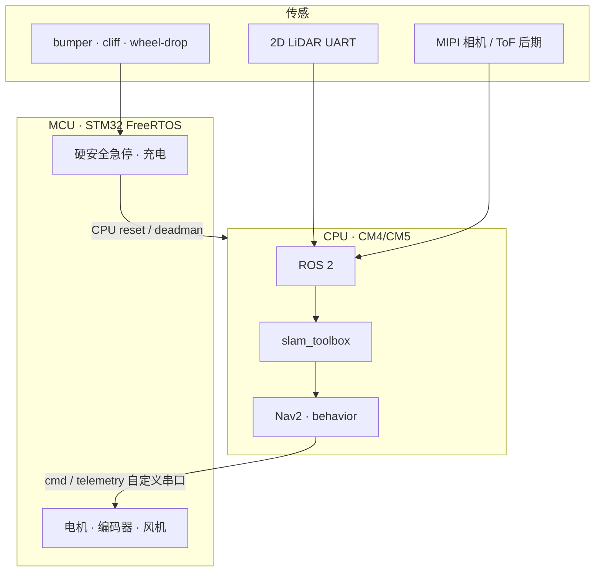

# OOMWOO

## 一句话定义

**OOMWOO** 是 **Maker's Pet** 发起的 **可自建开源家用扫地机器人**：以 **ROS 2 + 2D LiDAR + Nav2 / slam_toolbox** 做室内建图与导航，硬件走 **3D 打印 + 外购件**，软件 **本地优先**（可选 Home Assistant），主入口在 **[makerspet/oomwoo](https://github.com/makerspet/oomwoo)** 与 **[oomwoo.com](https://oomwoo.com/)**。

## 英文缩写速查

| 缩写 | 英文全称 | 简要说明 |
|------|----------|----------|
| ROS 2 | Robot Operating System 2 | 机器人中间件；OOMWOO 高层导航与行为运行层 |
| Nav2 | Navigation2 | ROS 2 标准导航栈（规划、代价地图、恢复行为） |
| SLAM | Simultaneous Localization and Mapping | 同步定位与建图；默认搭档 slam_toolbox |
| LiDAR | Light Detection and Ranging | 2D 激光雷达，室内占据栅格建图主传感器 |
| MCU | Microcontroller Unit | 实时/安全控制器；硬急停不依赖 Linux |
| BOM | Bill of Materials | 物料清单；OOMWOO 整机成本与外购件清单仍在推进 |
| CM4/CM5 | Compute Module 4/5 | 树莓派计算模块；消费档默认机载算力 |

## 为什么重要

- **把消费级扫地机接到 ROS 2 教学主线**：相对 [MuSHR](./mushr.md)（阿克曼竞速教学）与 [myAGV](./elephantrobotics-myagv.md)（麦克纳姆移动平台），OOMWOO 对准 **家用清扫形态 + 覆盖路径 / 回充 / 本地家居集成** 叙事。
- **仿真优先、接口契约**：贡献者可先在 Gazebo（[oomwoo-one](https://github.com/makerspet/oomwoo-one)）上做 `clean-and-map`、`nav-localize` 等模块，不绑死未定型机械。
- **安全分层可借鉴**：MCU 管 bumper / cliff / wheel-drop / 电流限制 / CPU 看门狗；ROS 2 崩溃不应拖垮硬安全——与量产扫地机常见做法一致。

## 核心结构/机制

| 组成 | 说明 |
|------|------|
| **总仓** | [makerspet/oomwoo](https://github.com/makerspet/oomwoo)：架构、`SOFTWARE_INTERFACES`、模块贡献表 |
| **仿真** | [oomwoo-one](https://github.com/makerspet/oomwoo-one) URDF + Gazebo；住宅布局世界 |
| **安装** | [oomwoo-install](https://github.com/makerspet/oomwoo-install) ROS 2 / Docker 环境 |
| **算力双档** | 消费档：机载 CM4/CM5 跑完整栈；教育档：ESP32-S3 + micro-ROS，SLAM 离机 |
| **公共话题** | `/scan`、`/odom`、`/cmd_vel`、`/map` 与标准 TF（`map`/`odom`/`base_link`/`base_scan`） |
| **后期路线** | 回充坞、Home Assistant、近场视觉避障、Podman 应用层、可选 LeRobot 集成 |

## 工程实践

| 项 | 建议 |
|----|------|
| **从哪开始** | 跟 [oomwoo-install](https://github.com/makerspet/oomwoo-install) + [Gazebo 教程](https://makerspet.com/blog/simulate-oomwoo-one-robot-vacuum-in-gazebo-with-ros-2/)；先跑通 teleop + 手动 SLAM |
| **占位真机** | 硬件未齐前可用 [Proscenic M6 Pro ↔ ROS 2](https://makerspet.com/blog/tutorial-connect-robot-vacuum-cleaner-to-ros-2-proscenic-m6-pro/) 做 bring-up |
| **内存目标** | 文档以 **4 GB CM** 为现实基线，社区在追 **2 GB**（composable nodes 等）；选型前先看 `compute-benchmark` 模块结论 |
| **贡献方式** | 代码模块可在个人仓开发后向总仓链入；文档/规格可 in-tree `contributions/<module>/` |
| **开源状态（2026-07-27）** | **部分开源 / 早期开发**：仿真与安装 **已开源**；完整 BoM / CAD / I/O 板与固件 **进行中** |

## 局限与风险

- **不是成品家电**：状态徽章为 early development；完整可复现硬件清单与装配说明仍未齐。
- **2D LiDAR 盲区**：官方明确低矮障碍（线缆、袜子）需后期相机 + ToF；MVP 依赖 bumper。
- **教育档 Wi-Fi 依赖**：ESP32 + 离机 SLAM 受家用无线环境影响，不宜当消费成品默认路径。
- **电池 / 充电**：使用带 BMS 的外购 4S2P 包可降低风险，但充电路径仍需维护者安全审查——社区 PR 不能替代安全门。

## 关联页面

- [Navigation2](./navigation2.md) — 规划 / 代价地图 / 恢复行为中枢
- [SLAM Toolbox](./slam-toolbox.md) — 架构文档默认 2D lifelong SLAM
- [导航·SLAM·自动驾驶栈总览](../overview/navigation-slam-autonomy-stack.md) — 室内 AMR 栈分层
- [ROS 2 基础](../concepts/ros2-basics.md)
- [MuSHR](./mushr.md) — 低成本 ROS 移动平台对照
- [大象 myAGV](./elephantrobotics-myagv.md) — 另一类开源移动底盘

## 参考来源

- [sources/repos/oomwoo.md](../../sources/repos/oomwoo.md)
- [sources/sites/oomwoo-com.md](../../sources/sites/oomwoo-com.md)
- [makerspet/oomwoo](https://github.com/makerspet/oomwoo)
- [oomwoo.com](https://oomwoo.com/)

## 推荐继续阅读

- [OOMWOO Architecture Brief](https://github.com/makerspet/oomwoo/blob/main/docs/ARCHITECTURE.md)
- [Nav2 官方文档](https://docs.nav2.org/)
- [在 Gazebo 中仿真 OOMWOO One](https://makerspet.com/blog/simulate-oomwoo-one-robot-vacuum-in-gazebo-with-ros-2/)
