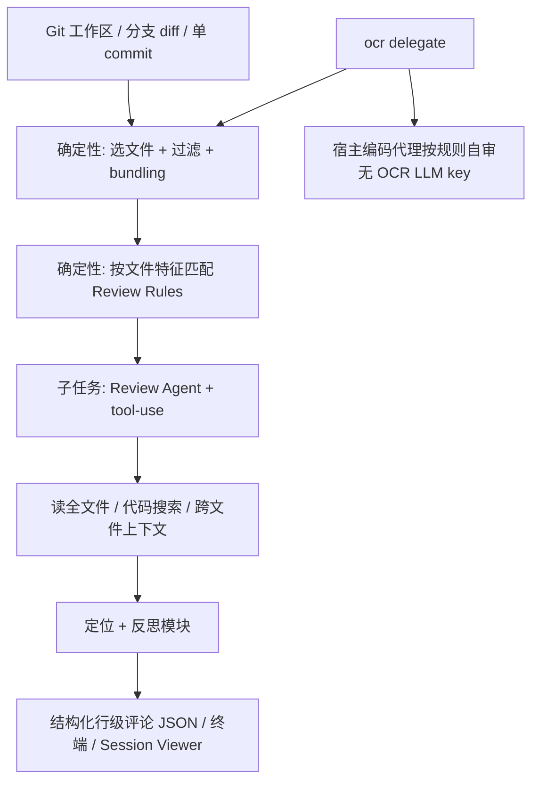
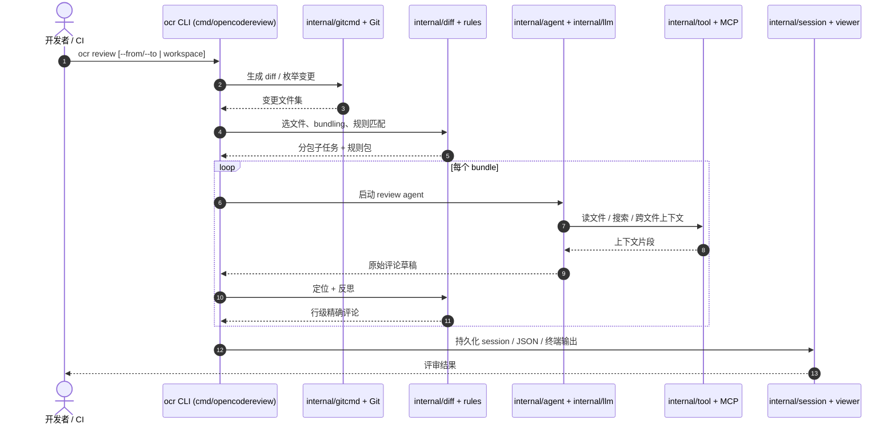

# Open Code Review（Alibaba OCR）

**Open Code Review**（仓库 [alibaba/open-code-review](https://github.com/alibaba/open-code-review)，npm `@alibaba-group/open-code-review`，全局命令 **`ocr`**）是阿里巴巴从内部官方 AI 代码评审助手孵化并开源的 CLI 工具。它读取 Git diff（或 `ocr scan` 全文件），在 **确定性工程步骤** 保证覆盖与规则匹配的前提下，调用可配置 LLM Agent 产出 **行级结构化评审意见**，并可通过插件嵌入 Cursor、Codex、Claude Code 等宿主。

## 一句话定义

用 **「硬约束管线 + 专用 Review Agent」** 替代纯自然语言 code-review skill，在 **更少 token** 下换取 **更高 Precision 的行级缺陷评论**，并可选 **Delegation Mode** 让宿主编码代理自行执行评审。

## 英文缩写速查

| 缩写 | 英文全称 | 简要说明 |
|------|----------|----------|
| OCR | Open Code Review | 本工具简称；CLI 命令为 `ocr`（勿与光学字符识别混淆） |
| LLM | Large Language Model | 评审 Agent 的后端模型；可 OpenAI / Anthropic 等 |
| MCP | Model Context Protocol | 可扩展 review agent 的外部工具协议 |
| CI/CD | Continuous Integration / Continuous Delivery | GitHub Actions / GitLab CI / Gerrit 等流水线集成 |
| AACR-Bench | Alibaba AI Code Review Benchmark | 官方公开基准：50 仓库 × 200 PR × 10 语言 |

## 核心信息

| 字段 | 内容 |
|------|------|
| 机构 | 阿里巴巴（Alibaba） |
| 许可 | Apache-2.0 |
| Stars（入库日） | ~37k（GitHub，以克隆时为准） |
| 官方站 | [open-codereview.ai](https://open-codereview.ai) |
| 开源状态 | **已开源** — 代码、规则、插件与 CI 文档均在 GitHub；见 [项目页核查](../../sources/sites/open-codereview-ai.md) |

## 为什么重要（对本知识库读者）

- **与 Superpowers「requesting-code-review」互补：** [Superpowers（obra）](superpowers-obra.md) 把 **何时请人/代理做评审** 写进交付管线；OCR 把 **怎么做 diff 级评审** 工程化为 CLI + 规则 + 定位模块，降低「skill 漂移、漏文件、行号不准」三类高频失败。
- **维护本 wiki 时的直接可用性：** 本仓库由 Cloud Agent 推 PR、跑 `make ci-preflight`；在 Cursor / Codex 环境可装 OCR 插件或 `ocr review --format json`，作为 **PR 前第二意见**（仍须以人类 curator 与 CI 为准）。
- **Agent 生态对照：** 与 [Agent Reach](agent-reach.md)（外网读搜脚手架）、[Hermes Agent](hermes-agent.md)（常驻运行时）不同，OCR 是 **垂直于 code review 的可审计工具链**；与 [Agentic Coding 时代的软件工程基础](../concepts/agentic-coding-software-fundamentals.md) 中「生产可靠 / 评审」项同向。
- **Recall 取舍透明：** 官方基准刻意 **牺牲 Recall 换 Precision**，适合 **降噪 triage** 而非「找尽所有问题」；选型时需与团队 SLA 对齐。

## 核心结构

| 层次 | 内容 |
|------|------|
| **分发** | npm 全局包 `ocr`；GitHub Release 二进制；各 harness 插件目录 `plugins/open-code-review/` |
| **确定性工程** | 精确文件选择；相关文件 bundling + 子 agent 分治；模板引擎规则匹配（`.opencodereview` 规则）；评论定位与反思模块 |
| **Agent** | 场景化 review prompt；从生产 trace 蒸馏的 toolset（读全文件、repo 搜索、跨变更文件上下文） |
| **执行模式** | **OCR-managed**（自配 provider/model）；**Delegation Mode**（`ocr delegate`，宿主 LLM 执行，OCR 只做选择与规则） |
| **扩展** | MCP Server；Review Rules 路径过滤；Session Viewer；OpenTelemetry |
| **实现** | Go — `cmd/opencodereview` CLI；`internal/agent`、`internal/diff`、`internal/llm`、`internal/delegate`、`internal/scan` 等 |

### 流程总览（`ocr review` 概念级）

## 工程实践

| 场景 | 建议入口 | 备注 |
|------|----------|------|
| 本地改完自查 | `ocr review` | workspace 模式覆盖 staged/unstaged/untracked |
| PR 范围 | `ocr review --from main --to feature` | merge-base 模式 |
| 接手陌生目录 | `ocr scan --path internal/agent` | 无 diff 时全文件审计 |
| Cursor 集成 | 插件 README § Cursor | 与本站 Cloud Agent 流程可并用 |
| CI | [cicd 文档](https://open-codereview.ai/docs/cicd) | GitHub Actions / GitLab / Gerrit |
| 宿主 agent 消费 | `ocr review --format json --output result.json` | 与 Delegation Mode 二选一或组合 |

### 源码运行时序图

官方仓 **已开源** 且 CLI 可运行；下列时序对齐 README 与 `cmd/opencodereview` / `internal/*` 模块边界（非逐函数摘录）：

**复现路径：** `npm install -g @alibaba-group/open-code-review` → `ocr config provider` → 在目标仓库执行 `ocr review`（需 Git ≥ 2.41 与 LLM 配置，Delegation Mode 除外）。

## 局限与风险

- **Recall 低于通用 Agent 是设计取舍：** 官方 AACR-Bench 叙事强调 **少误报**；不能假设「所有真实缺陷都会被列出」。
- **仍依赖 LLM 与 API 成本：** OCR-managed 模式需配置 provider；规则再强也不能消除模型偶发幻觉，**不能替代** 人类 maintainer 与 CI 测试。
- **机器人代码栈非专属优化：** 内置规则覆盖通用缺陷类（NPE、并发、XSS 等）；对本库 **Python wiki 工具链 / Makefile / 导出脚本** 的收益需实际试用验证，不宜 extrapolate 论文级结论。
- **Delegation Mode 质量回退到宿主：** 文件选择仍由 OCR 保证，但评审深度取决于 Cursor/Codex 等自身 skill 与上下文窗口。

## 关联页面

- [Superpowers（obra）](superpowers-obra.md) — 交付管线中的 **requesting-code-review** 与 TDD 节奏
- [HumanLayer Skills](humanlayer-skills.md) — 迭代代理维护与 **control-loop** 式评审
- [Skills For Real Engineers（mattpocock）](mattpocock-skills.md) — 轻量日常工程 skill，与 OCR **垂直工具** 对照
- [Agent Reach](agent-reach.md) — 外网读搜脚手架；与 OCR **仓库内评审** 互补
- [Agentic Coding 时代的软件工程基础](../concepts/agentic-coding-software-fundamentals.md) — 人如何用取舍语言 **转向** agent
- [LLM Wiki（Karpathy 模式）](../references/llm-wiki-karpathy.md) — 本库 **ingest/lint** 与 OCR **PR 评审** 可并行
- [Ingest Workflow](../../schema/ingest-workflow.md) — 本仓库维护规范

## 参考来源

- [Open Code Review 仓库源归档（本站）](../../sources/repos/open-code-review.md)
- [open-codereview.ai 项目页核查（本站）](../../sources/sites/open-codereview-ai.md)
- [alibaba/open-code-review（GitHub）](https://github.com/alibaba/open-code-review)
- [Open Code Review 文档](https://open-codereview.ai/docs)

## 推荐继续阅读

- [AACR-Bench 数据集（Hugging Face）](https://huggingface.co/datasets/Alibaba-Aone/aacr-bench) — 官方 code review 质量基准与标注规模说明
- [Delegation Mode 文档](https://open-codereview.ai/docs/delegate) — 在 Cursor/Codex 等宿主上免 OCR API key 的集成路径
- [Review Rules 文档](https://open-codereview.ai/docs/review-rules) — 路径过滤与自定义规则模板
