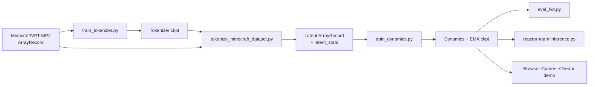
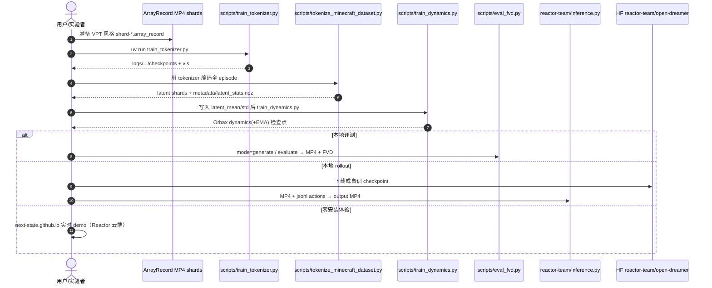

# Open Dreamer

**Open Dreamer**（[next-state/open-dreamer](https://github.com/next-state/open-dreamer)，2026-07）是面向 **Dreamer 4**（Hafner et al., arXiv:2509.24527）的开源 **JAX/Flax NNX** 实现：以 Minecraft/VPT 风格游戏视频为域，提供可训练的 **因果视频 tokenizer**、**动作条件潜动力学**、FVD 评测，以及浏览器内 **Game ⟷ Dream** 实时 demo。

## 一句话定义

把 Dreamer 4 世界模型管线拆成可复现的 tokenizer→tokenize→dynamics→FVD 训练链，并开放本地 rollout 与云端可玩 demo——侧重 **可训练的交互式视频世界模型**，而非已完成的完整智能体 RL 环。

## 英文缩写速查

| 缩写 | 英文全称 | 简要说明 |
|------|----------|----------|
| WM | World Model | 学习环境动态以供想象 / 规划 / 交互的模型 |
| Dreamer 4 | Dreamer version 4 | Hafner 等「在可扩展世界模型内训练智能体」的最新一代 |
| MAE | Masked Autoencoder | Open Dreamer tokenizer 所用的掩码自编码结构 |
| FVD | Fréchet Video Distance | 生成视频质量评测指标 |
| VPT | Video PreTraining | OpenAI Minecraft 承包商数据格式（mp4 + 动作） |
| MFU | Model FLOPs Utilization | 训练算力利用率；博客报约 57–58% |
| EMA | Exponential Moving Average | 扩散式动力学推理常用的参数平滑 |
| BC | Behaviour Cloning | Roadmap 中尚未开源的完整 agent 训练目标之一 |

## 为什么重要

- **补齐 Dreamer 谱系的可复现缺口：** 库内已有 [DreamerV3](./paper-shenlan-wm-13-dreamerv3.md) 策展页；Open Dreamer 把 **Dreamer 4** 落到可跑的 JAX 管线 + 工程博客，便于对照「潜空间想象 → 可扩展交互式视频 WM」。
- **训练 / 推理 / 权重 / demo 分层清晰：** 训练在 `next-state`，本地 rollout 在 `reactor-team`，Orbax 检查点在 HF，实时玩法在项目页——选型时不易把「能训」和「能玩」混为一谈。
- **稳定性与算力经验可迁移：** 博客把 Muon vs LaProp、EMA、精度边界、x-prediction 损失加权、OT、预 tokenize 等写成可操作 checklist，对其他长视频 WM 训练同样有参考价值。
- **挂接沙盒路线：** 与 [虚拟沙盒](../overview/world-models-route-03-virtual-sandbox.md) 同构——目标是可交互想象环境；但当前开源面以 **世界模型本身** 为主，完整「在模型内训 agent」仍待齐。

## 核心信息

| 字段 | 内容 |
|------|------|
| 机构 | 下一状态（Next State）；实时推理平台（Reactor）赞助 / 推理与云端 demo |
| 上游 | Dreamer 4 — [danijar.com/project/dreamer4](https://danijar.com/project/dreamer4/) · [arXiv:2509.24527](https://arxiv.org/abs/2509.24527) |
| 训练仓 | <https://github.com/next-state/open-dreamer> |
| 推理仓 | <https://github.com/reactor-team/open-dreamer> |
| 权重 | <https://huggingface.co/reactor-team/open-dreamer> |
| 项目页 / Demo | <https://next-state.github.io/open-dreamer/> |
| 栈 | Python 3.11 · `uv` · JAX CUDA 12 · Flax · Hydra · Grain/ArrayRecord · Orbax |
| 域 | Minecraft / VPT 风格；CoinRun 作单卡原型路径（博客） |

## 核心原理

### 两段式世界模型

1. **Tokenizer（因果 MAE）**  
   Transformer Masked Autoencoder 把 RGB 帧压到潜空间（博客称约 **100×** 压缩）。Masking 使 latent 更易被扩散动力学使用；相对经典 VAE，强调 **无 KL / 无对抗损失、训练更快**。

2. **Dynamics（动作条件 latent 生成）**  
   在 latent 上做下一帧预测：训练用 **diffusion forcing + flow matching + shortcut models**。骨干为 **block-causal transformer**——空间层处理单帧 token，因果时间层跨帧传播。

### 时间块折叠（与 agent token 同骨干）

博客将一步写成块 \(B_t = (a_{t-1}, s_t, \pi_t)\)：空间注意实现 \(a_{t-1} \to s_t \to \pi_t\)，时间注意连接各块。状态侧含噪声/shortcut 条件 token、空间 latent、register；**世界 token 不可读 \(\pi\)**，策略信息只能通过下一动作回流——这是 Dreamer 4「世界与行为共享 transformer」的开源对照实现要点。

### 流程总览

## 源码运行时序图

训练仓与推理仓分工如下（节点对齐官方 README / `scripts/`）：

**复现捷径：** 只想看效果 → 项目页 demo；只想本地生成 → `reactor-team/open-dreamer` + HF/自训 Orbax；要从头训 → `next-state/open-dreamer` 六步工作流（见参考来源 README）。

## 工程实践

| 步骤 | 命令 / 入口 | 注意 |
|------|-------------|------|
| 环境 | `uv sync` && `source .venv/bin/activate` | Python **3.11**；CUDA 12 JAX；换加速器需另装 JAX wheel |
| Tokenizer | `uv run scripts/train_tokenizer.py` | 编辑 `configs/tokenizer.yaml` + `configs/dataset/minecraft_vpt.yaml`（路径、`index_max`、pixel mean/std） |
| Tokenize | `uv run scripts/tokenize_minecraft_dataset.py` | 输出 latent shards + `latent_stats.npz`；把 mean/std 拷进 `minecraft_vpt_latent.yaml` |
| Dynamics | `uv run scripts/train_dynamics.py` | `configs/dynamics.yaml` |
| FVD | `uv run scripts/eval_fvd.py` | `mode=generate` 或 `evaluate` |
| 本地推理 | `uv run python inference.py ...`（推理仓） | 需 `jax.devices("gpu")`；建议 `--use_ema`；样例 `download_vpt_sample.py` |
| 权重 | HF `reactor-team/open-dreamer` | Orbax 目录（如 `250000/dynamics_ema`）；推理 README 亦支持自训路径 |

**调试信号（博客）：** 损失下降 ≠ 生成变好——优先查 EMA、精度边界、优化器尖峰、OT/损失加权；长视频务必 **预 tokenize**，避免 ffmpeg 解码饿死 GPU。

## 开源状态

| 资产 | 状态（截至 2026-07-25） |
|------|-------------------------|
| 训练代码 | **已开源** — [next-state/open-dreamer](https://github.com/next-state/open-dreamer) |
| 推理代码 | **已开源** — [reactor-team/open-dreamer](https://github.com/reactor-team/open-dreamer) |
| 检查点 | **已开源** — [HF reactor-team/open-dreamer](https://huggingface.co/reactor-team/open-dreamer) |
| 项目页 / 实时 demo | **已发布** — [next-state.github.io/open-dreamer](https://next-state.github.io/open-dreamer/) |
| 完整 BC/RL agent 环 | **待发布** — 训练仓 Roadmap 未勾选；CoinRun 侧 BC/RL 代码明确未放出 |
| 根目录 LICENSE | **未检出** — GitHub `license: null`；商用/再分发前需自行核实 |

## 局限与风险

- **不是「一键 Dreamer 4 智能体」：** 当前开源覆盖 WM 训练与交互式 rollout；论文标题中的「在世界模型内训练 agents」完整环仍缺。
- **域与数据门槛：** 默认 Minecraft/VPT ArrayRecord 管线；换域需重算像素/latent 统计并改 Hydra 配置。
- **硬件与栈绑定：** CUDA 12 JAX + 长序列 activation checkpointing；博客规模化叙事面向高端 GPU（如 B200 MFU 分析），单卡只能先走 CoinRun 级原型。
- **许可不透明：** 无根 LICENSE 时，权重与代码的再分发条款需人工确认。
- **与机器人栈的距离：** 动作是游戏键鼠（VPT），不是关节/末端空间；迁移到人形/机械臂需另做动作接口与数据格式，不可直接当机器人控制器。

## 与其他工作对比

| 维度 | Open Dreamer（Dreamer 4 复现） | [DreamerV3](./paper-shenlan-wm-13-dreamerv3.md) | 机器人视频 WM（如 [Ctrl-World](./paper-ctrl-world.md) / [τ₀-WM](./tau0-world-model.md)） |
|------|-------------------------------|-----------------------------------------------|----------------------------------------------------------------------------------------|
| 目标 | 可扩展交互式游戏世界模型 + 开源训练 | 潜空间想象中通用 RL | 操纵/具身闭环或策略评估 |
| 表征 | MAE latent + flow/shortcut 动力学 | RSSM + symlog 等 | 多为视频扩散 / VAM |
| 开源重点 | tokenizer→dynamics→FVD + demo | 论文/官方实现生态（策展） | 机器人数据与部署 |
| Agent 环 | Roadmap | 核心卖点 | 视项目而定 |

## 关联页面

- [世界模型路线 03：虚拟沙盒](../overview/world-models-route-03-virtual-sandbox.md)
- [世界模型 15 开源项目技术地图](../overview/world-models-15-open-source-technology-map.md)
- [DreamerV3](./paper-shenlan-wm-13-dreamerv3.md)
- [Latent Imagination](../concepts/latent-imagination.md)
- [Model-Based RL](../methods/model-based-rl.md)
- [Generative World Models](../methods/generative-world-models.md)
- [World-Action Models](../concepts/world-action-models.md)
- [Video-as-Simulation](../concepts/video-as-simulation.md)

## 参考来源

- [sources/repos/open-dreamer.md](../../sources/repos/open-dreamer.md) — 训练仓归档
- [sources/repos/reactor-team-open-dreamer.md](../../sources/repos/reactor-team-open-dreamer.md) — 推理仓归档
- [sources/sites/open-dreamer.md](../../sources/sites/open-dreamer.md) — 项目页 / 博客归档
- 上游：<https://github.com/next-state/open-dreamer>
- Dreamer 4：<https://arxiv.org/abs/2509.24527>

## 推荐继续阅读

- 项目博客与交互 demo：<https://next-state.github.io/open-dreamer/>
- Dreamer 4 官方项目页：<https://danijar.com/project/dreamer4/>
- Jasmine（README 引用的 JAX WM 代码基）：<https://github.com/p-doom/jasmine>
