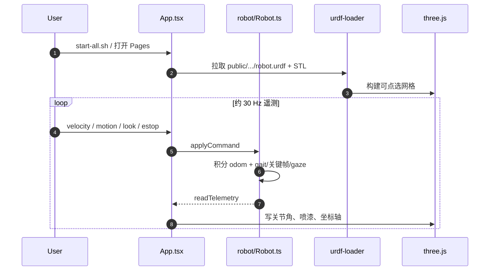

# Open Duck Mini Viewer

**Open Duck Mini Viewer**（[mertcookimg/Open_Duck_Mini_Viewer](https://github.com/mertcookimg/Open_Duck_Mini_Viewer)）是面向 [Open Duck Mini](./open-duck-mini.md) **V2** 的 **纯浏览器产品 GUI**：在网页里走路、摆 pose、喷漆和拆开 CAD，不需要 Python、仿真器或真机。

## 英文缩写速查

| 缩写 | 英文全称 | 简要说明 |
|------|----------|----------|
| URDF | Unified Robot Description Format | 本页加载的官方 v2 网格与关节树 |
| GUI | Graphical User Interface | 摇杆、动作库、滑条与 3D 视口组成的操作面 |
| IMU | Inertial Measurement Unit | 本页面板里的姿态/加速度是脚本合成，不是 BNO055 |
| CAD | Computer-Aided Design | 爆炸图 / 线框 / X-ray 检查的打印件网格 |
| ONNX | Open Neural Network Exchange | Playground 真策略格式；本查看器 **不加载** |
| WASM | WebAssembly | [Robot Viewer](./robot-viewer.md) 用它跑 MuJoCo；本页 **不用** |

## 为什么重要

- **零安装看整机：** 官方四仓（Hub / Playground / 参考运动 / Runtime）都要求打印、训练或 Pi；本工具把「这只鸭长什么样、关节怎么动」降到打开 [GitHub Pages](https://mertcookimg.github.io/Open_Duck_Mini_Viewer/)。
- **社区传播锚点：** 2026-05-09 [IEEE Spectrum Video Friday](https://spectrum.ieee.org/video-friday-robotic-hand-dexterity) 写明「you can play with it in your browser」，是 Open Duck 对外演示的轻入口。
- **对照通用查看器：** 与 [Robot Viewer](./robot-viewer.md)（多格式 + MuJoCo WASM）分工不同——这里是 **单机型操作台**（摇杆、动作、喷漆、E-stop），不是通用模型调试器。

## 开源状态

**已开源（Apache-2.0）。** 项目页即静态部署的 Viewer；源码、`public/assets/open_duck_mini_v2/`（官方 URDF + STL 再分发）与 `scripts/start-all.sh` 均可运行。无策略权重、无数据集。官方 Pages 开了 GA4；本地与 fork 不向该属性送数。

## 核心原理

浏览器里只有一条闭环：**命令 → 脚本 `Robot` → 关节角 → URDF 姿态**。没有接触力、没有策略网络。

`Robot.readTelemetry()` 每帧做四件事：

1. **里程计：** 速度指令按 `0.25 m/s`、`90 deg/s` 积分，夹在 ±1.8 m 场地内。
2. **脚本步态：** `gaitAngle` 用相位正弦推髋/膝/踝/横滚/偏航；膝角只向屈曲侧加幅，避免过伸。
3. **关键帧混合：** `motions.ts` 对 `home` / `stand` / `bow` / `wave` / `headbang` / `dance` 做线性插值，走路时动作被关掉。
4. **Gaze：** 头/颈目标角做临界阻尼式平滑，叠在步态或动作之上。

关节限位与 home pose 写在 `joints.ts`，README 声明对齐 [Runtime](./open-duck-mini-runtime.md) 与 [Playground](./open-duck-playground.md)。头/颈/天线若干关节标了 `in_urdf: false`：GUI 能编，网格树不一定有对应轴。

## 源码运行时序图

复现：`./scripts/start-all.sh` → `localhost:5173`；或直接打开 Pages。改动作看 `src/robot/motions.ts`，改限位看 `joints.ts`。

## 工程实践

| 目标 | 入口 |
|------|------|
| 本地跑 | Node LTS；`./scripts/start-all.sh`（Windows 用 `start-all.ps1`） |
| 加动作 | `MOTIONS` 里加 `Motion`（关键帧 + `blend_in_s`） |
| 改 home / 限位 | `src/robot/joints.ts` |
| 改步态手感 | `Robot.ts` 的 `gaitAngle` / `WALK_SPEED_MPS` |
| 加面板 | 新组件 → `PanelVisibilityPicker` 注册 → `App.tsx` 渲染 |
| 上线 | 合入 `main` 触发 Pages；PR 不自动部署 |
| 门禁 | `npm run typecheck && npm run format:check && npm run build` |

**机构：** 社区工具，作者 Masato Kobayashi；生态标签走 [开源鸭子机器人（Open Duck Mini）](./open-duck-mini.md)，不是 Disney 或 apirrone 官方仓。

## 局限与风险

- **不是 sim2real 回放：** 看不到 [Playground](./open-duck-playground.md) 的 ONNX，也不能代替 [Runtime](./open-duck-mini-runtime.md) 上机。
- **不是物理：** IMU / 电量 / CPU 温度是装饰噪声；脚接触标志只按相位翻转。
- **不要和 Robot Viewer 混用预期：** 要测碰撞、惯量或 MJCF 步进，去 [Robot Viewer](./robot-viewer.md) / [MuJoCo WASM](./mujoco-wasm.md)。
- **URDF 覆盖不全：** `in_urdf: false` 的头颈天线在 3D 里可能「滑条动了、网格没轴」。
- **官方 demo 有分析脚本：** 若在意遥测，用本地或自己的 Pages。

## 关联页面

- [Open Duck Mini](./open-duck-mini.md)
- [Open Duck Playground](./open-duck-playground.md)
- [Open Duck Mini Runtime](./open-duck-mini-runtime.md)
- [Robot Viewer](./robot-viewer.md)
- [URDF Studio](./urdf-studio.md)
- [Locomotion](../tasks/locomotion.md)
- [Disney Olaf 角色机器人](../methods/disney-olaf-character-robot.md)
- [Sim2Real](../concepts/sim2real.md)

## 参考来源

- [Open Duck Mini Viewer 仓库归档](../../sources/repos/open_duck_mini_viewer.md)
- [GitHub Pages 项目页归档](../../sources/sites/open-duck-mini-viewer-github-io.md)

## 推荐继续阅读

- [在线 demo](https://mertcookimg.github.io/Open_Duck_Mini_Viewer/)
- [GitHub：mertcookimg/Open_Duck_Mini_Viewer](https://github.com/mertcookimg/Open_Duck_Mini_Viewer)
- [IEEE Spectrum Video Friday（2026-05-09）](https://spectrum.ieee.org/video-friday-robotic-hand-dexterity)
- [apirrone/Open_Duck_Mini](https://github.com/apirrone/Open_Duck_Mini)（官方 CAD / BOM 入口）
