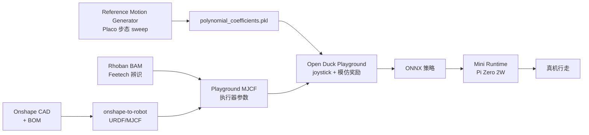
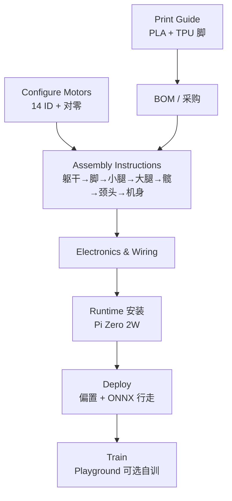

---

type: entity
tags: [biped, open-source, hardware, entertainment-robotics, sim2real, diy, disney-bdx, disney, open-duck]
status: complete
updated: 2026-07-01
related:
  - ./open-duck-playground.md
  - ./open-duck-reference-motion-generator.md
  - ./open-duck-mini-runtime.md
  - ./tnkr.md
  - ../methods/disney-olaf-character-robot.md
  - ../concepts/sim2real.md
  - ../tasks/locomotion.md
  - ./open-source-humanoid-hardware.md
sources:
  - ../../sources/repos/open_duck_mini.md
  - ../../sources/sites/tnkr-open-duck-mini-v2.md
summary: "Open Duck Mini 是 Disney BDX 双足角色的开源迷你复刻（v2 约 42 cm、BOM 目标 <$400）：Onshape CAD + Feetech 舵机 + 四仓分工（Hub / Playground / 参考运动 / Runtime），完整覆盖 CAD→MJX→RL→Pi Zero 2W 真机。"
---

# Open Duck Mini

**Open Duck Mini** 是社区驱动的 **BDX 风格迷你双足机器人**：在娱乐角色外形下，把 **低成本舵机硬件** 与 **MuJoCo Playground RL + Disney 式模仿奖励** 串成可复现的 sim2real 闭环。v2 为当前主线（`Open_Duck_Mini` 的 `v2` 分支）。

## 英文缩写速查

| 缩写 | 英文全称 | 简要说明 |
|------|----------|----------|
| Sim2Real | Simulation to Real | 把仿真中学到的策略迁移落地真机的工程主线 |
| BOM | Bill of Materials | 物料清单，硬件零部件列表 |
| CAD | Computer-Aided Design | 计算机辅助设计，硬件结构建模 |
| MJX | MuJoCo JAX | MuJoCo 的 JAX/XLA 后端，支持可微与批量仿真 |
| RL | Reinforcement Learning | 通过与环境交互最大化长期回报来学习策略的范式 |
| MuJoCo | Multi-Joint dynamics with Contact | 接触丰富的刚体物理仿真引擎 |
| MJCF | MuJoCo XML Format | MuJoCo 的模型与场景描述格式 |
| JAX | JAX | 支持自动微分与 XLA 编译的数值计算库 |
| ONNX | Open Neural Network Exchange | 跨框架神经网络模型交换格式 |
| Locomotion | Robot Locomotion | 足式/人形等无轮移动能力的总称 |

## 为什么重要

- **完整 DIY 栈：** 机械（Onshape/BOM）→ 准确 MJCF + BAM 电机辨识 → JAX 并行训练 → Pi Zero 2W 部署，适合学习「廉价执行器上的 sim2real」。
- **与 Disney 研究线对齐：** 参考运动与 imitation reward 直接承接 [BDX 论文](https://la.disneyresearch.com/publication/design-and-control-of-a-bipedal-robotic-character/) 思路，可与 [Disney Olaf 角色机器人](../methods/disney-olaf-character-robot.md) 对照阅读。
- **生态拆分清晰：** Hub、训练、运动生成、Runtime 分仓，便于单独 fork 或替换某一环。

## 四仓分工

| 仓库 | 职责 |
|------|------|
| [Open_Duck_Mini](https://github.com/apirrone/Open_Duck_Mini) | CAD、BOM、组装文档、社区入口、预训练 ONNX |
| [Open_Duck_Playground](./open-duck-playground.md) | MuJoCo Playground RL 环境与训练 |
| [Open_Duck_reference_motion_generator](./open-duck-reference-motion-generator.md) | Placo 参数化步态 → 模仿奖励系数 |
| [Open_Duck_Mini_Runtime](./open-duck-mini-runtime.md) | Raspberry Pi Zero 2W 机载推理与硬件驱动 |

## 流程总览

## 硬件要点（v2）

- **尺寸：** 腿伸展约 **42 cm**；BOM 目标 **低于 $400**。
- **执行器：** Feetech 总线舵机（腿部 `xc330-M288-T` 等）；辨识参数见 [BAM STS3215 7.4V](https://github.com/Rhoban/bam/tree/main/params/feetech_sts3215_7_4V)。
- **制造：** 3D 打印 + 公开 BOM；**v2 主线装配**见 [Tnkr 项目文档](https://tnkr.ai/open-duck-mini/open-duck-mini-v2)（Print → BOM → 分步 Assembly → 线束 → Runtime/部署/训练）；GitHub `assembly_guide.md` 仍 incomplete，与 Tnkr 步骤对齐。社区 Discord 与 [Tnkr](./tnkr.md) Pull Requests 可跟进改版。

## Tnkr 文档树（v2 复现导航）

[Tnkr Open Duck Mini V2](https://tnkr.ai/open-duck-mini/open-duck-mini-v2) 把 Hardware 与 Software 收在同一项目页，推荐按下列顺序阅读：

| 分区 | 节点 | 作用 |
|------|------|------|
| Hardware | Print Guide | PLA 15% infill；`foot_bottom_tpu.stl` 用 TPU 40% |
| Hardware | Bill of Materials | 物料表；Files 页可下 STL（tnkr-cdn） |
| Hardware | Assembly Instructions | **交互式分步装配**（见下） |
| Hardware | Electronics & Wiring | 全局线束、Servo Map、Pi Zero 2W |
| Software | Open Duck Mini Runtime | OS、venv、udev、标定脚本 |
| Software | Deploy / Train | 上机 checklist、ONNX 预演、Playground 训练链 |

**装配前置（不可跳过）：** 在拧任何结构件之前，用 [Runtime](https://github.com/apirrone/Open_Duck_Mini_Runtime) 的 `configure_motor.py` 为 **14 路 Feetech 写 ID 并对零**；金属对金属螺钉用 Loctite 243（塑料螺钉禁用）。详见 [Open Duck Mini Runtime](./open-duck-mini-runtime.md) 电机 ID 表。

## Sim2Real 关键步骤

1. **结构质量：** 切片器估算质量覆盖 Onshape 材料表（见 Hub 仓 `docs/sim2real.md`）。
2. **电机模型：** BAM 导出 `damping` / `kp` / `frictionloss` / `armature` / `forcerange` 写入 MJCF。
3. **策略训练：** Playground 中启用 BDX 风格 imitation reward + 域随机化；详见 [Open Duck Playground](./open-duck-playground.md)。
4. **部署：** 关节偏置标定 + Runtime checklist → ONNX 上机。

## 常见误区或局限

- **不是研究级人形：** 舵机扭矩与背隙限制动态性能；sim2real 高度依赖 BAM 与奖励调参。
- **v1 已过时：** alpha 版机械间隙大；新入门应直接跟 v2 与 Playground 栈。
- **文档仍在完善：** 表情功能（眼 LED、相机、麦克风）在路线图中，不影响核心行走闭环。

## 参考来源

- [sources/repos/open_duck_mini.md](../../sources/repos/open_duck_mini.md)
- [Tnkr Open Duck Mini V2 项目文档](../../sources/sites/tnkr-open-duck-mini-v2.md)
- [apirrone/Open_Duck_Mini](https://github.com/apirrone/Open_Duck_Mini)（v2 分支）
- Disney Research：[Design and Control of a Bipedal Robotic Character (BDX)](https://la.disneyresearch.com/publication/design-and-control-of-a-bipedal-robotic-character/)

## 关联页面

- [Open Duck Playground](./open-duck-playground.md)
- [Open Duck Reference Motion Generator](./open-duck-reference-motion-generator.md)
- [Open Duck Mini Runtime](./open-duck-mini-runtime.md)
- [Tnkr](./tnkr.md) — 平台级文档与 Open Duck v2 范例项目
- [Disney Olaf 角色机器人](../methods/disney-olaf-character-robot.md)
- [Sim2Real](../concepts/sim2real.md)
- [Locomotion](../tasks/locomotion.md)

## 推荐继续阅读

- [Tnkr Open Duck Mini V2 项目文档](https://tnkr.ai/open-duck-mini/open-duck-mini-v2) — v2 主线装配/线束/部署
- [MuJoCo Playground 官方站点](https://playground.mujoco.org/)
- [Haonan Yu — Sim2Real 实践博客](https://www.haonanyu.blog/post/sim2real/)
- [开源人形机器人硬件方案对比](./open-source-humanoid-hardware.md)（全尺寸人形选型对照）
