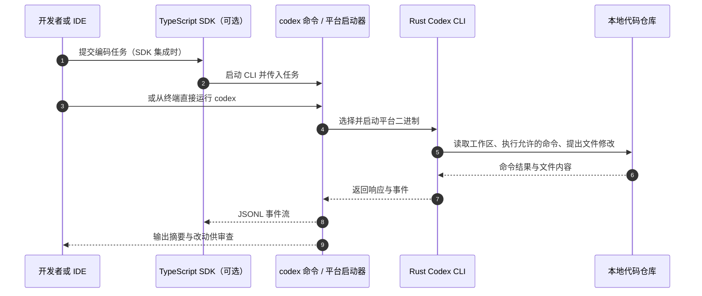

# OpenAI Codex CLI（openai/codex）

## 一句话定义

**Codex CLI** 是一个在本机开发环境中运行的编码代理：命令行负责连接模型与当前工作区，CLI 能力由开源 Rust 程序提供，也可经 TypeScript SDK 从应用中调用。

## 英文缩写速查

| 缩写 | 英文全称 | 简要说明 |
|------|----------|----------|
| CLI | Command-Line Interface | 用户启动本地 Codex 编码代理的命令行入口 |
| SDK | Software Development Kit | TypeScript SDK 通过 CLI 将 Codex 接入自有应用 |
| JSONL | JSON Lines | SDK 与 CLI 以逐行 JSON 事件交换输入、输出和进度 |
| API | Application Programming Interface | README 支持 ChatGPT 登录或 API key 认证 |

## 为什么重要

机器人项目的工作区常同时包含 ROS 节点、仿真配置、训练脚本、模型部署和工具代码。Codex CLI 代表一种**在现有代码仓库上下文中工作的开发代理**：开发者可以从终端进入工程，让代理检查代码、提出或实施改动，再由 Git diff、测试和人工审查把改动纳入工程流程。

它对机器人研发的价值在于软件工程协作层，不替代仿真验证、控制器验收或真机安全测试。开源 CLI 让团队能审查启动器与本地客户端实现；模型推理服务与模型权重不因 CLI 仓库开源而自动开放。

## 核心结构

| 层 | 位置 / 行为 |
|----|-------------|
| 命令入口 | `codex-cli/bin/codex.js` 根据系统平台和 CPU 架构定位平台二进制，再启动 Codex executable |
| 代理实现 | `codex-rs/` 是 Rust workspace，包含 CLI 与多个执行、配置、协议等 crate |
| 程序化接入 | `sdk/typescript/` 启动 `@openai/codex` CLI，并经 stdin/stdout 收发 JSONL 事件 |
| 工作区 | 代理以本地项目目录为主要代码上下文；命令执行与文件写入受配置的沙箱和审批策略约束 |
| 认证服务 | 可通过 ChatGPT 登录或 API key 使用；CLI 源码不包含在线模型权重 |

## 运行路径

## 工程实践

| 场景 | 建议 |
|------|------|
| 修改机器人软件 | 在独立 Git 分支或 worktree 中执行，让 diff 保持可审查 |
| 测试与仿真 | 先运行 lint、单测和仿真回归，再进入真机验证 |
| 真机相关仓库 | 将物理急停、人员看护与设备安全流程保持在模型代理权限之外；软件测试通过不等于真机验收通过 |
| 应用集成 | TypeScript SDK 会拉起 CLI 子进程并使用 JSONL 事件；集成端需管理工作目录、环境变量和事件消费 |
| 访问控制 | 先了解所选沙箱和审批策略，尤其是允许写文件、访问网络或执行 shell 命令时 |

## 开源状态

- **已开源：** [openai/codex](https://github.com/openai/codex) 为 Apache-2.0 项目，包含 Rust CLI、平台分发启动器、TypeScript SDK 与文档。
- **不是 Codex Web 的源代码：** Codex Web / ChatGPT 内的云端体验与此 CLI 仓库应区分；[Codex Security](./codex-security.md) 是另一个聚焦应用安全扫描的产品。

## 局限与风险

- **依赖外部推理：** 该仓库是客户端与代理运行时，不含模型权重；使用需要 ChatGPT 登录或 API key 及可用模型服务。
- **权限仍由环境决定：** 代理可以在工作目录中执行开发任务；实际访问边界取决于启用的 sandbox 与 execution policy，不能仅凭“本地运行”推断其没有外部副作用。

## 与相邻代理的区别

| 维度 | Codex CLI | Hermes Agent |
|------|-----------|--------------|
| 主要入口 | 本地终端、IDE、TypeScript SDK | CLI、即时通讯平台、ACP 与后台 gateway |
| 核心重点 | 在代码仓库中完成软件开发任务 | 持久记忆、技能闭环、长驻多通道代理 |
| 运行状态 | 面向单个开发工作流 | 面向常驻服务、调度和多入口 |
| 可对照阅读 | [Codex Security](./codex-security.md) 是同生态的专用 AppSec 工具 | [Hermes Agent](./hermes-agent.md) 是可配置多通道代理运行时 |

## 关联页面

- [Hermes Agent](./hermes-agent.md) — 长驻、多通道、带持久记忆的代理运行时
- [Codex Security](./codex-security.md) — Codex agent 驱动的应用安全扫描 CLI 与 SDK
- [OpenClaw](./openclaw.md) — 个人代理与工具编排项目
- [Model Context Protocol](../concepts/model-context-protocol.md) — 代理接入外部工具与数据源的开放协议

## 参考来源

- [openai/codex 仓库归档](../../sources/repos/openai-codex-cli.md)
- [Codex CLI README](https://github.com/openai/codex/blob/main/README.md)
- [Codex CLI 官方文档](https://developers.openai.com/codex)
- [Codex TypeScript SDK README](https://github.com/openai/codex/blob/main/sdk/typescript/README.md)
- [Codex 执行策略文档](https://github.com/openai/codex/blob/main/docs/execpolicy.md)

## 推荐继续阅读

- [openai/codex](https://github.com/openai/codex)
- [Codex CLI 官方文档](https://developers.openai.com/codex)
- [Codex Security](https://github.com/openai/codex-security)
