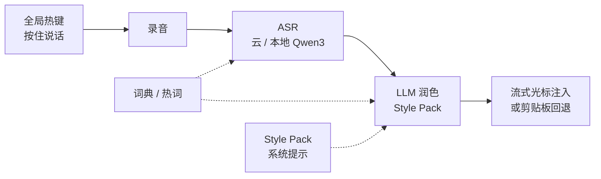

# OpenLess

**OpenLess**（[openless.top](https://openless.top/)，[GitHub: Open-Less/openless](https://github.com/Open-Less/openless)）是 **本地优先的跨平台语音输入应用**：在任意文本框按住全局热键口述，松开后经 **ASR 转写 + LLM 润色**，将结果 **流式写入当前光标**（失败则回退剪贴板）。与闭源订阅产品 Typeless、Wispr Flow 同类，但代码开源、数据与词典留在本机、可 **自带 ASR/LLM 凭证**。

## 一句话定义

**把「脑子里的话」在桌面任意输入框变成可直接使用的书面文本（尤其是结构化 AI Prompt），而不是替 AI 回答问题。**

## 英文缩写速查

| 缩写 | 英文全称 | 简要说明 |
|------|----------|----------|
| ASR | Automatic Speech Recognition | 语音 → 文本转写 |
| LLM | Large Language Model | 润色 / 结构化输出 |
| TTS | Text-to-Speech | 文本 → 语音（本工具不做 TTS） |
| VAD | Voice Activity Detection | 端点检测；本工具以按住/松开热键为主 |
| BYO | Bring Your Own | 自带云 API 凭证，无厂商锁定 |

## 为什么重要

- **研究与工程写作侧：** 机器人论文笔记、Cursor 提示词、长规格、commit message 等场景，口述往往比打字快；OpenLess 的 **AI-Prompt 模式** 把松散口语整理成带约束与条目的 Prompt，可直接贴进 ChatGPT / Claude / Cursor。
- **ASR 管线参照：** 云 ASR（火山、讯飞、百炼、OpenAI 兼容等）+ 可选本地 Qwen3-ASR；与 [人形智能语音交互](../methods/humanoid-voice-interaction.md) 中 **桌面侧 ASR 选型** 可对照，但 **不做唤醒→技能→TTS 机器人闭环**。
- **与 OpenClaw 边界清晰：** [OpenClaw](./openclaw.md) 是 **个人 AI 助手 / 技能路由控制平面**；OpenLess **只整理文本并插入光标**，不执行任务、不积累对话上下文。

## 核心结构/机制

| 模块 | 职责 |
|------|------|
| **热键层** | macOS CGEventTap / Windows 低级键盘钩子；Toggle 或 Push-to-talk |
| **ASR** | 十余家云提供商 + macOS 本地 Qwen3-ASR（子模块 `qwen-asr`） |
| **润色** | 原文 / 轻润色 / **结构化 AI-Prompt** / 正式；可选翻译热键 |
| **Style Pack** | 可切换系统提示；应用内市场安装社区包 |
| **词典** | 用户纠错可一键入库；注入 ASR hotwords 与润色语义提示 |
| **凭证** | OS 密钥库；明文 JSON 仅作迁移源 |

## 工程实践

| 场景 | 做法 |
|------|------|
| 端到用户安装 | [GitHub Releases](https://github.com/Open-Less/openless/releases) DMG/EXE；或 `brew install --cask openless` |
| macOS 首次启动 | 授予麦克风 + **辅助功能** 后 **退出重开**；ad-hoc 签名需 `xattr -cr /Applications/OpenLess.app` |
| 最小可用配置 | Settings 填入火山流式 ASR + Ark（或任意已支持的 ASR + 润色端点） |
| 开发构建 | `git submodule update --init --recursive` → `openless-all/app` → `npm ci` → `npm run tauri dev` |
| 与机器人栈关系 | 真机语音交互见 [语音交互流水线](../queries/humanoid-voice-interaction-pipeline.md)；OpenLess 仅服务 **开发者本机写作** |

## 局限与风险

- **不是机器人语音助手：** 无唤醒词、无 NLU/技能路由、无 TTS 反馈；不能替代 [OpenClaw](./openclaw.md) 或机载 ASR 栈。
- **云依赖：** 默认路径需自备 ASR/LLM API；本地 ASR 以 macOS Qwen3 为主，Windows/Linux 本地路径仍标为实验性。
- **权限面：** 全局热键与辅助功能/无障碍权限敏感；企业环境需合规评估。
- **许可：** GitHub 显示 AGPL-3.0，官网页脚写 MIT——部署或二次分发前以仓库 `LICENSE` 为准。

## 关联页面

- [人形智能语音交互](../methods/humanoid-voice-interaction.md) — 机器人端 ASR→NLU→技能→TTS 方法页
- [人形语音交互流水线](../queries/humanoid-voice-interaction-pipeline.md) — 可打断闭环工程拆解
- [OpenClaw](./openclaw.md) — 语音/IM → 技能与个人助手（对照：执行 vs 写作）
- [Agent Reach](./agent-reach.md) — 编码代理外网读搜脚手架（互补）
- [MOSS Transcribe Diarize](./paper-moss-transcribe-diarize.md) — 长时多说话人 ASR+分离（研究向对照）

## 参考来源

- [OpenLess 官网](../../sources/sites/openless.md)
- [Open-Less/openless 代码仓](../../sources/repos/openless.md)

## 推荐继续阅读

- 仓库 README：<https://github.com/Open-Less/openless/blob/main/README.md>
- 用户指南：`USAGE.md`（同仓库）
- 官网下载：<https://openless.top/>
