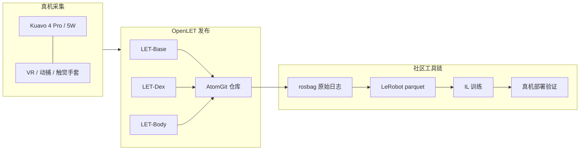

# OpenLET 具身智能开源数据集社区

**OpenLET**（<https://openlet.openatom.tech/>）是由 **开放原子开源基金会** 孵化、**乐聚机器人**牵头运营的 **具身智能真机数据枢纽**：遵循开放协作原则，发布 **LET** 系列数据集并提供 **AtomGit 仓库、挑战赛与 LeRobot 工具链示例**，目标是把工业/商零/家庭场景下的 **高质量操作与运控小时** 变成可下载、可训练、可真机复现的公共资源。

## 一句话定义

**以 Kuavo 全尺寸人形为采集本体的开源真机数据社区：>60,000 分钟 LET 多模态轨迹 + 赛事牵引 + LeRobot 端到端范例。**

## 英文缩写速查

| 缩写 | 英文全称 | 简要说明 |
|------|----------|----------|
| LET | — | OpenLET 发布的乐聚人形真机数据集系列前缀 |
| VR | Virtual Reality | 轮臂/全身采集使用的沉浸式遥操界面 |
| IL | Imitation Learning | 社区 `kuavo-manip-open` 提供的模仿学习流水线 |
| ICRA | IEEE International Conference on Robotics and Automation | REAL-I 挑战赛背书会议 |
| AtomGit | — | 开放原子旗下代码与数据集托管平台 |

## 为什么重要

- **真机而非纯仿真：** 与 GRAIL 等合成轨迹或 HumanNet 等互联网人视频不同，LET 强调 **Kuavo 上采集的可执行机器人轨迹**，直接服务 **VLA/IL 后训练**。
- **多技能覆盖：** 分 **全身运控**（行走/下蹲/转腰）、**灵巧手精细操作**（捏扣握 + 触觉阵列）、**轮臂基础操作**（抓拿放/工业分拣）三条主线，对应 loco-manipulation 不同子问题。
- **工具链闭环：** [kuavo-manip-open](https://atomgit.com/OpenLET/kuavo-manip-open) 覆盖 **rosbag→parquet→训练→仿真→真机**，降低「只有数据、没有训练脚本」的断层。

## LET 数据集族（策展）

| 仓库 | 采集系统 | 技能侧重 |
|------|----------|----------|
| [LET-Base-Dataset](https://atomgit.com/OpenLET/LET-Base-Dataset) | Kuavo 4 Pro / 5W + VR 全身增量遥操 | 抓/拿/放；工业分拣、搬运、上下料 |
| [LET-Dex-Dataset](https://atomgit.com/OpenLET/LET-Dex-Dataset) | 外骨骼 + 力触觉灵巧手（6×12×10 触觉 + 腕部六维力） | 捏、扣、握等精细操作 |
| [LET-Body-Dataset](https://atomgit.com/OpenLET/LET-Body-Dataset) | VR + 全身动捕重定向 | 行走、下蹲、转腰、双足跟随 |

社区首页称三大领域合计 **>60,000 分钟** 高质量数据（工业 / 商业零售 / 家庭生活）；具体子集规模与许可以各 AtomGit 模型卡为准。

## 流程总览（采集 → 发布 → 训练）

## 赛事与社区运营

- **REAL-I 具身智能挑战赛** — ICRA 背书，工业真任务（动态抓取、双臂协调等）。
- **乐聚具身智能操作任务挑战赛 & 创业启航营** — 「真实任务 + 开源数据 + 真机评测」。
- **CRAIC 人形机器人挑战赛** — Kuavo 教程与备赛专栏。

## 常见误区或局限

- **误区：OpenLET = 只有 Base 一个仓库。** 运控与灵巧手子集技能分布与传感器模态不同，选型需读各 README。
- **误区：下载即可喂给任意 VLA 预训练。** 多数仓库面向 **LeRobot v2/v3 IL 后训练**；与 [LingBot-VLA](./lingbot-vla.md) 等 **自定义 robot config** 仍需特征映射与 norm stats。
- **局限：** 采集本体以 **Kuavo** 为主，跨 [Unitree G1](./unitree-g1.md) 等平台需重定向或再采集；子集许可与署名要求以 AtomGit 为准。

## 关联页面

- [乐聚机器人](./leju-robotics.md) — 硬件本体与运营方
- [LeRobot](./lerobot.md) — 数据格式与训练框架
- [HumanNet](./humannet.md) — 另一「大规模小时」但偏 **人视频** 的预训练来源对照
- [LingBot-VLA](./lingbot-vla.md) — 真机双臂 VLA；可与 LET 操作数据组成「基础模型 + 领域后训练」链路
- [Manipulation](../tasks/manipulation.md) / [Loco-Manipulation](../tasks/loco-manipulation.md)

## 推荐继续阅读

- 社区首页：<https://openlet.openatom.tech/>
- LET-Base：<https://atomgit.com/OpenLET/LET-Base-Dataset>
- Kuavo + LeRobot 范例：<https://atomgit.com/OpenLET/kuavo-manip-open>

## 参考来源

- [openlet-openatom.md](../../sources/sites/openlet-openatom.md) — 社区栏目与仓库索引
- [openlet-let-base-dataset.md](../../sources/repos/openlet-let-base-dataset.md) — 旗舰 Base 子集归档
