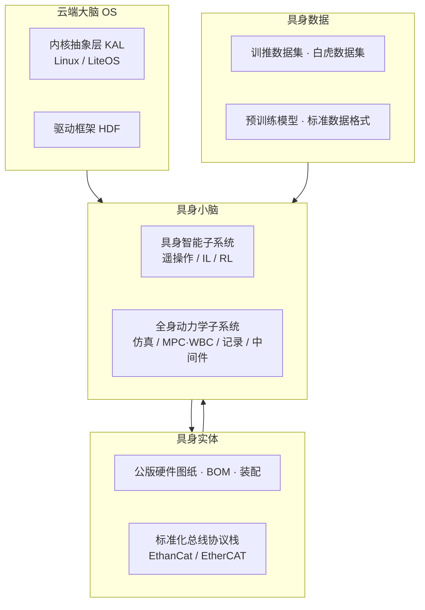

# OpenLoong（青龙·公版机）

## 一句话定义

**OpenLoong** 是面向「青龙」全尺寸公版人形机器人的 **四层全栈开源** 项目（云端大脑 / 具身小脑 / 具身实体 / 具身数据），由 [OpenLoong 社区](https://www.openloong.org.cn/cn/projects/openloong) 与 [loongOpen](https://github.com/loongOpen) 组织维护；硬件以 AtomGit/GitHub 图纸包发布，软件以 **自研 C++ 控制框架** 与 **MuJoCo 上的 MPC+WBC** 双主线支撑仿真到实机部署。

## 为什么重要

- **全尺寸公版硬件公开**：[`OpenLoong-Hardware`](https://github.com/loongOpen/OpenLoong-Hardware) / [AtomGit 镜像](https://atomgit.com/openloong/OpenLoongHardware/tree/main) 提供腰、胸、头、腿足等 **PDF 工程图** 与总装说明，README 给出 **43 DOF**、**EtherCAT** 关节总线与感知配置，适合作为「强对标人」整机系统工程参照。
- **软件栈分层且可裁剪**：主 README 按 **系统集 → 子系统 → 软件包** 组织；[`OpenLoong-Framework`](https://github.com/loongOpen/OpenLoong-Framework) 强调 **ROS-free**、仿真—实机接口一致；[`OpenLoong-Dyn-Control`](https://github.com/loongOpen/OpenLoong-Dyn-Control) 提供可复现的 **行走 / 跳跃 / 盲踩障碍** MuJoCo demo，并在样机验证行走与盲踩。
- **生态位独特**：与 [Asimov v1](./asimov-v1.md)（1.2 m 级 DIY + 单仓 MuJoCo）、[天工](./tienkung-humanoid-open-source.md)（中心制 ROS 文档站）、商业 **Unitree** 等形成对照——OpenLoong 更贴近 **国家级公版机 + 工业总线 + 开放原子运营** 路线。
- **数据与上层能力并进**：[`OpenLoong-Dataset`](https://github.com/loongOpen/OpenLoong-Dataset) 在 Hugging Face 逐步发布真机操作 episode；[`OpenLoong-Brain`](https://github.com/loongOpen/OpenLoong-Brain) 探索大模型技能调度与多模态交互，便于 loco-manipulation 与 VLA 方向衔接。

## 全栈架构总览

OpenLoong 主仓将能力划分为四层（自下而上，数据与实体向上支撑小脑应用）：

| 层级 | 读者应关注什么 | 典型入口 |
|------|----------------|----------|
| **云端大脑** | 多内核 OS、驱动抽象、云端数字孪生与多机编排 | [OpenLoong 主 README](https://github.com/loongOpen/OpenLoong/blob/main/README.md) |
| **具身小脑** | 实机 C++ 控制框架 + 研究向 MPC/WBC + RL/IL 训练栈 | [OpenLoong-Framework](https://github.com/loongOpen/OpenLoong-Framework)、[OpenLoong-Dyn-Control](https://github.com/loongOpen/OpenLoong-Dyn-Control) |
| **具身实体** | 机械/电气/感知布置、EtherCAT 关节控制 | [OpenLoong-Hardware](https://github.com/loongOpen/OpenLoong-Hardware)、[AtomGit 硬件仓](https://atomgit.com/openloong/OpenLoongHardware/tree/main) |
| **具身数据** | 真机轨迹、XSENS、仿真训练数据 | [OpenLoong-Dataset](https://github.com/loongOpen/OpenLoong-Dataset)、社区「训推/白虎」数据集页 |

> **许可**：主项目声明以 **Apache-2.0** 为主（各子仓 LICENSE 为准）。第三方 LGPL 组件（如 EtherCAT 相关）见 `loong_third_party` 说明。

## 硬件架构（具身实体）

### 公版机指标

| 指标 | 公开数值 | 备注 |
|------|----------|------|
| 身高量级 | **约 1.85 m**（开放原子页）/ 外形 2192×1850×300 mm（硬件 README） | 不同文档测量口径可能略有差异 |
| 质量 | **80 kg**（硬件 README）/ **约 85 kg**（开放原子页） | 以所用 **v2.5** 硬件包为准 |
| 自由度 | **43** | 含五指灵巧手 |
| 行走速度 | **≥ 5 km/h** | |
| 负载 | **≥ 20 kg** | |
| 续航 | **≥ 3 h** | |
| 算力 | 控制与感知 **最大约 400 TOPS** | README 级描述 |
| 关节总线 | **EtherCAT** | 高实时多关节同步 |
| 感知 | 3D LiDAR、深度相机、环视相机等 | 头/胸/腰部分模块含补盲与环视支架 |

### 机械子系统与图纸目录

硬件开源树按 **TA 代号** 分模块（PDF 二维图 + 总成说明；社区页标注 **v2.5**）：

| 代号 | 子系统 | 工程内容（摘要） |
|------|--------|------------------|
| **TA00-03-00** | 腰部组件 | 腰关节、侧摆/前摆电机支架、支撑转轴、前后补盲相机支架 |
| **TA00-04-00** | 胸腔系统 | 前胸机架、主控/电池/云盒固定、环视、雷达/WiFi 散热、交换机 |
| **TA00-07-00** | 头部感知系统 | 视/听/触/嗅/动觉相关零件图（TA00-07-01-xxxx 系列） |
| **TA00-12-00-00** | 腿足系统 | 髋/膝/踝、十字轴、连杆、足端等 40+ PDF + 脚部总成 |
| 根目录 | `青龙全尺寸通用人形机器人硬件开源内容.pdf` | 总说明文档 |

**仓库入口**

- AtomGit（用户常用）：https://atomgit.com/openloong/OpenLoongHardware/tree/main  
- GitHub（规范名 `OpenLoong-Hardware`，`OpenLoongHardware` 会 301 重定向）：https://github.com/loongOpen/OpenLoong-Hardware  

与 [Asimov v1](./asimov-v1.md) 等「单仓 CAD + MuJoCo + BOM」不同，青龙硬件公开包以 **分模块 PDF 工程图** 为主；三维 STEP、完整 BOM 表是否随版本追加，以 **main** 分支实际文件为准。

### 总线与计算布局

- **关节层**：**EtherCAT** 实现高实时、高可靠多关节同步（硬件 README）；与 [`loong_driver_sdk`](https://github.com/loongOpen/loong_driver_sdk) 中 ECAT/485/IMU/灵巧手接口描述一致。
- **协议栈层**：主 README 另述 **EthanCat** 分布式总线数据通讯协议栈——读者应区分 **物理总线（EtherCAT）** 与 **项目级消息/协议品牌（EthanCat）**，以各子系统文档为准。
- **胸腔布置**：主控固定件、电池、云盒、环视与网络设备支架（TA00-04）体现「** onboard 运控实时 + 云端/边缘重感知**」的典型工业人形布局，可与 [开源人形机器人“大脑”选型](./open-source-humanoid-brains.md) 对照。

## 软件架构（具身小脑）

OpenLoong 软件以 **`loongOpen` GitHub 组织** 与 **AtomGit `openloong` 组织** 为多仓生态；逻辑层级为 **系统集 → 子系统 → 软件包**，可按场景裁剪。

### 1. 实机 / 全链仿真：OpenLoong-Framework（ROS-free C++）

**索引仓**：[OpenLoong-Framework](https://github.com/loongOpen/OpenLoong-Framework)（readme 为小写 `readme.md`）

**设计原则（官方 readme）**

- **完整且独立**：除与内核绑定的 IGH EtherCAT 主站外，自集成主要运行依赖。
- **干净而朴素**：免 ROS，朴素 C++，高性能通信。
- **隔离亦统一**：模块化严封装；**仿真—实机接口与操作一致**；跨 x64/aarch64 一套代码验证+部署。

**子组件与产物**

| 仓库 | 生成物 | 用途 |
|------|--------|------|
| [loong_utility](https://github.com/loongOpen/loong_utility) | （静态链接基础库） | 矩阵/日志/UDP 等 |
| [loong_third_party](https://github.com/loongOpen/loong_third_party) | `libethercat.so`、`libmodbus.so` 等 | LGPL 第三方独立编译 |
| [loong_driver_sdk](https://github.com/loongOpen/loong_driver_sdk) | `libloong_driver_sdk_x64(a64).so` | EtherCAT/485/IMU/灵巧手等 |
| [loong_ctrl_locomotion](https://github.com/loongOpen/loong_ctrl_locomotion) | `libnabo_x64(a64).so` | 状态机 + 全身关节控制 |
| [loong_base](https://github.com/loongOpen/loong_base) | `loong_driver_*` / `loong_interface_*` / `loong_locomotion_*` | 控制业务主程序 |
| [loong_sim](https://github.com/loongOpen/loong_sim) | `loong_share_sim_*` | 算法级 MuJoCo 仿真 |
| [loong_sim_sdk_release](https://github.com/loongOpen/loong_sim_sdk_release) | 预编译 SDK | 全链仿真 + Python 示例 |
| [loong_deployment](https://github.com/loongOpen/loong_deployment) | 预编译部署包 | 拷贝到实机运行 |

**典型工作流**

1. 各子仓 **独立 clone、独立打开**（Framework readme 提醒：VS Code 多根工作区会导致补全失效）。  
2. 在 `tools/make.sh` 编译 → 生成 `nabo_output` 并自动拷贝到依赖目标。  
3. **算法仿真**：`loong_sim` → `./run_mujoco_loco.sh`（wasd 移动，q 踏步，e 停止）。  
4. **全链仿真**：`loong_sim_sdk_release` readme；模拟实机驱动+控制完整链路。  
5. **实机**：`loong_deployment` 预编译包部署到 onboard 计算机。

### 2. 研究向运控：OpenLoong-Dyn-Control（MuJoCo + MPC + WBC）

| 项 | 说明 |
|----|------|
| **GitHub** | [OpenLoong-Dyn-Control](https://github.com/loongOpen/OpenLoong-Dyn-Control) |
| **AtomGit** | [openloong-dyn-control](https://atomgit.com/openloong/openloong-dyn-control) |
| **算法** | [MPC](../concepts/mpc-wbc-integration.md) + [WBC](../concepts/whole-body-control.md) |
| **仿真** | 内置 MuJoCo、Pinocchio、Eigen、Quill、GLFW、JsonCpp 等 |
| **Demo** | `walk_wbc`、`jump_mpc`、`walk_mpc_wbc`；joystick 版支持转弯 |
| **样机** | README：已实现 **行走**、**盲踩障碍** |
| **环境** | Ubuntu 22.04.4 LTS，g++ 11.4.0 |
| **文档** | [API](https://www.openloong.org.cn/pages/api/html/index.html)、[Wiki](https://www.openloong.org.cn/pages/wiki/html/index.html) |

与 Framework 的分工：**Dyn-Control** 偏 **算法透明、MuJoCo 研究复现**；**Framework** 偏 **实机/全链工程部署**。二者可视为 OpenLoong 运控的「实验室栈」与「产品化栈」。

### 3. 并行 / 历史软件路线

| 路线 | 仓库 | 说明 |
|------|------|------|
| **Isaac Gym RL** | [OpenLoong-Gymloong](https://github.com/loongOpen/OpenLoong-Gymloong) | AzureLoong + Isaac Gym 训练行走；需 CUDA，推荐 Ubuntu 20.04 |
| **ROS1 + Gazebo** | [OpenLoong-ROS](https://github.com/loongOpen/OpenLoong-ROS) | `azureloong_control` / `azureloong_description`；AtomGit 亦托管 [OpenLoongROS](https://atomgit.com/openloong/OpenLoongROS.git) |
| **Unity RL** | [Unity-RL-Playground](https://github.com/loongOpen/Unity-RL-Playground) | Unity 侧 RL 与 embodied 仿真 |
| **大模型技能** | [OpenLoong-Brain](https://github.com/loongOpen/OpenLoong-Brain) | 客户端/服务端 Agent、图像流、机器人 IP 指令下发 |
| **操作 / 导航** | [manipulation](https://github.com/loongOpen/manipulation)、[navigation](https://github.com/loongOpen/navigation) | 上肢操作与导航子系统 |
| **小型衍生** | [MiniLoong](https://github.com/loongOpen/MiniLoong)、[NanoLoong-Bipedal](https://github.com/loongOpen/NanoLoong-Bipedal) | 缩小版/双足开源线 |

### 4. 数据集（具身数据）

- **索引**：[OpenLoong-Dataset](https://github.com/loongOpen/OpenLoong-Dataset)  
- **Hugging Face 示例**（README 列出的 koch 系列）：抓胶带入盒、关盖、拿薯条、开盖等 10-episode 包。  
- **社区页**：训推数据集（两类末端、五大场景、30+ 任务类型）、**白虎数据集**——与 IL/RL/VLA 数据格式标准一并发布。  
- **XSENS 动捕 / 仿真训练数据**：Dataset README 标注「逐步更新中」。

## 社区与运营入口

| 角色 | 链接 |
|------|------|
| **社区门户** | [青龙·公版机](https://www.openloong.org.cn/cn/projects/openloong) |
| **项目总览** | [loongOpen/OpenLoong](https://github.com/loongOpen/OpenLoong) |
| **GitHub 组织** | https://github.com/loongOpen |
| **AtomGit 组织** | https://atomgit.com/openloong |
| **开放原子基金会** | [OpenLoong 项目页](https://www.openatom.org/project/ho1LksJyAPBU) |
| **文档中心** | https://www.openloong.org.cn/cn/docs |
| **联系** | web@openloong.org.cn |

运营主体（README / 开放原子）：**人形机器人（上海）有限公司**、**国家地方共建人形机器人创新中心**、**开放原子开源基金会**。

## 常见误区或局限

- **误区：OpenLoong = 只有 Dyn-Control。** 实机部署应同时理解 Framework 多仓与 `loong_deployment`；Dyn-Control 是 MuJoCo 研究入口，不是唯一 onboard 栈。
- **误区：硬件仓即完整 BOM 电商清单。** 当前公开包以 **PDF 图纸 + 总说明** 为主，采购级 BOM 需对照 PDF 与社区 v2.5 更新，不宜与 Asimov 式表格 BOM 直接类比。
- **局限：多栈并存（Framework / Dyn-Control / ROS / Isaac Gym）** 环境版本不一致（Ubuntu 20.04 vs 22.04），集成前需固定一条主线。
- **局限：全尺寸制造门槛** 仍远高于 Berkeley/Roboto 等 lab 方案，更适合有加工与 EtherCAT 经验的团队。

## 与其他页面的关系

| 对比轴 | OpenLoong 青龙 | 参考页 |
|--------|----------------|--------|
| 尺寸与定位 | 全尺寸公版、43 DOF | [开源人形硬件对比](./open-source-humanoid-hardware.md) |
| 运控范式 | MPC+WBC + 自研 C++ 框架 | [whole-body-control](../concepts/whole-body-control.md)、[humanoid-control-roadmap](../roadmaps/humanoid-control-roadmap.md) |
| 仿真迁移 | MuJoCo / 全链 sim SDK | [sim2real](../concepts/sim2real.md)、[mujoco](./mujoco.md) |
| 国内同类 | 天工、灵犀 X1、傅利叶 N1 | [天工](./tienkung-humanoid-open-source.md)、[灵犀 X1](./agibot-lingxi-x1.md) |

## 参考来源

- [sources/repos/openloong.md](../../sources/repos/openloong.md)
- [sources/repos/openloong_hardware.md](../../sources/repos/openloong_hardware.md)
- [sources/sites/openloong_community.md](../../sources/sites/openloong_community.md)
- [OpenLoong-Hardware README](https://github.com/loongOpen/OpenLoong-Hardware/blob/main/README-zh.md)
- [OpenLoong-Framework readme](https://github.com/loongOpen/OpenLoong-Framework/blob/main/readme.md)
- [OpenLoong-Dyn-Control README-zh](https://github.com/loongOpen/OpenLoong-Dyn-Control/blob/main/README-zh.md)

## 推荐继续阅读

- [OpenLoong 社区 · 青龙公版机](https://www.openloong.org.cn/cn/projects/openloong)
- [OpenLoong Dynamics Control API 文档](https://www.openloong.org.cn/pages/api/html/index.html)
- [开源人形机器人硬件方案对比](./open-source-humanoid-hardware.md)
- [人形机器人控制路线图](../roadmaps/humanoid-control-roadmap.md)
