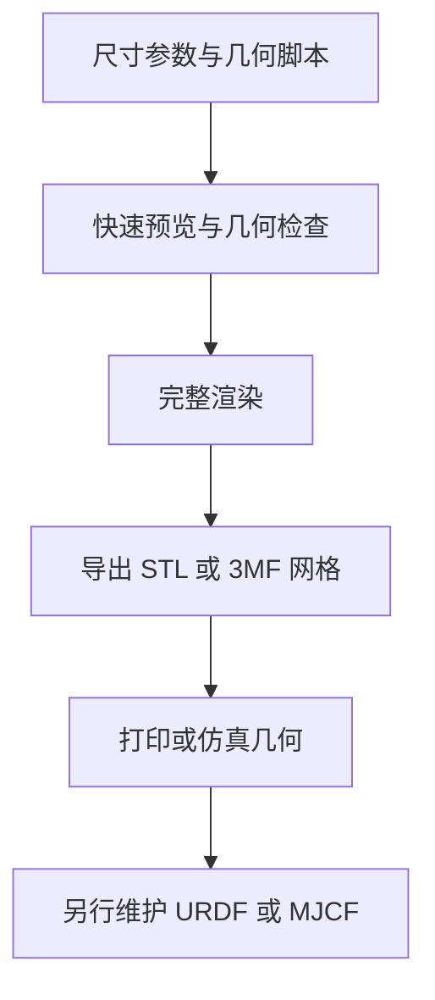

# OpenSCAD（脚本化参数 CAD）

**一句话定义**：OpenSCAD 是一款以脚本构造参数化 2D/3D 实体的开源 CAD 工具，核心是 CSG 布尔建模与二维轮廓挤出，而不是传统鼠标式特征树编辑。

## 英文缩写速查

| 缩写 | 英文全称 | 简要说明 |
|------|----------|----------|
| CAD | Computer-Aided Design | 计算机辅助设计；OpenSCAD 专注可编程实体几何 |
| CSG | Constructive Solid Geometry | 用基本体及并、差、交操作组合实体 |
| STL | Standard Tessellation Language | 三角网格格式，常用于打印与仿真几何输入 |
| DXF | Drawing Exchange Format | 常见 2D 轮廓交换格式，可作为拉伸输入或导出 |
| CLI | Command-Line Interface | 可无 GUI 执行脚本并批量导出模型 |

## 为什么重要

OpenSCAD 把模型本身变成文本程序：尺寸、阵列、间距和几何组合都可参数化，并能随代码一起提交、审查和复现。对于机器人团队，这种方式适合快速迭代传感器支架、外壳、法兰、孔位阵列和简单实验夹具，尤其当同一零件需要生成多个尺寸或左右对称版本时。

它和传统参数 CAD 的差异也很重要：OpenSCAD 主要生成实体网格，不提供 FreeCAD/Fusion 一类可编辑 B-rep 特征历史或完整装配约束工作流。

## 核心原理

### 脚本驱动的几何构造

.scad 文件把模型写成语句和模块。以立方体、圆柱、球体和多边形等基本对象为起点，通过 translate、rotate、scale 等变换定位，再用 union、difference、intersection 构成 CSG 树。二维图形可通过 linear_extrude 或 rotate_extrude 扩展为三维几何。

参数、循环、条件和用户模块可封装设计规则。例如“安装孔直径”“孔到边的距离”“板厚”可作为顶层参数，让同一脚本生成不同板件尺寸；该过程的可重复性来自脚本，而非隐藏在 GUI 中的操作状态。

### 预览、渲染与命令行

GUI 快速预览适合交互式检查形状和相对位置，但可能出现显示伪影；完整渲染用于计算最终几何，复杂 CSG 模型会明显更慢。命令行可在不启动 GUI 的情况下读取脚本、注入参数并导出文件，因此能用于批量零件生成或简单 CI 检查。不同版本的导出格式和选项可能变化，应先查对应安装版本的帮助输出。

### 建模到机器人资产的流程

导出网格只是几何环节：仿真资产还需要坐标系、质量/惯量、关节连接、碰撞几何和接触参数，不能由 STL 文件自动推出。

## 工程实践

| 需求 | 建议用法 | 注意事项 |
|---|---|---|
| 参数化支架/外壳 | 暴露尺寸变量，以 module 复用安装孔和重复结构 | 参数组合需加范围检查，避免薄壁、重叠面或退化几何 |
| 版本控制 | 把 .scad 与依赖库一起提交，固定外部模块版本 | 用 Git diff 审查参数与结构变化 |
| 批量生成 | 用 CLI 注入参数并按文件名导出 | 用当前版本 --help 核实导出选项；CI 中显式检查进程返回码与文件存在性 |
| 3D 打印 | 完整渲染后导出 STL/3MF 并用切片器验证 | 检查封闭性、薄壁、孔径补偿和单位 |
| 机器人仿真 | 导出简化网格作为视觉或碰撞几何，再配置 URDF/MJCF | 不能把网格导出等同于完整机器人描述或动力学辨识 |

## 与其他工具的边界

- [FreeCAD](./freecad.md) 提供参数化 B-rep、草图约束与装配/工程工作台；适合需要 STEP、装配关系和制造工程细节的任务。OpenSCAD 的脚本几何可先生成概念件，但进入 STEP/B-rep 链路时要在支持实体转换的工具中验证或重建。
- [文字生成 CAD](../concepts/text-to-cad.md) 中 OpenSCAD 属于“LLM 生成脚本，再执行并检查”的路线，与直接生成网格或 B-rep 的模型服务不同。
- [URDF（机器人描述格式）](../concepts/urdf-robot-description.md) 负责关节、连杆和惯性等机器人结构语义；OpenSCAD 只产几何，二者位于不同层。

## 局限与风险

- 代码化几何并不自动保证制造正确性；承载件仍需结构、材料、公差和加工审查。
- CSG 树复杂度上升会增加完整渲染时间；预览画面也可能和最终实体不一致。
- 网格文件难以保留参数语义和 B-rep 特征；若下游需要 STEP、复杂装配或工程图，优先考虑制造向参数 CAD。
- 导出物不包含完整机器人动力学描述；质量、惯量、关节、碰撞组及控制器接口必须在机器人描述/仿真中另行建立。
- OpenSCAD 主程序为 GPLv2 系列自由软件；集成或再分发时应核对当前官方许可文本和第三方依赖许可。

## 关联页面

- [文字生成 CAD（Text-to-CAD）](../concepts/text-to-cad.md) — 脚本生成与制造向 CAD 的工具谱系。
- [FreeCAD](./freecad.md) — 对比 B-rep、STEP、装配与工程化工作流。
- [URDF（统一机器人描述格式）](../concepts/urdf-robot-description.md) — 几何进入机器人描述后的关节与惯性语义。

## 参考来源

- [OpenSCAD 官方项目页与文档归档](../../sources/sites/openscad.md)
- [OpenSCAD 官方源码仓库归档](../../sources/repos/openscad.md)
- [OpenSCAD 官方 README](https://github.com/openscad/openscad/blob/master/README.md)
- [OpenSCAD User Manual](https://files.openscad.org/documentation/manual/OpenSCAD_User_Manual.html)
- [OpenSCAD 命令行环境说明](https://files.openscad.org/documentation/manual/Using_OpenSCAD_in_a_command_line_environment.html)

## 推荐继续阅读

- [OpenSCAD 官方文档入口](https://openscad.org/documentation.html) — 用户手册、语言参考与命令行说明。
- [OpenSCAD Cheat Sheet](https://openscad.org/cheatsheet/index.html) — 内置几何、变换与语言语法速查。
