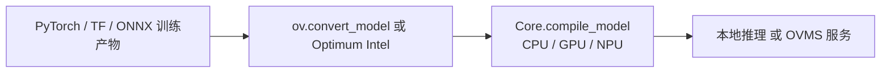
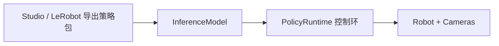
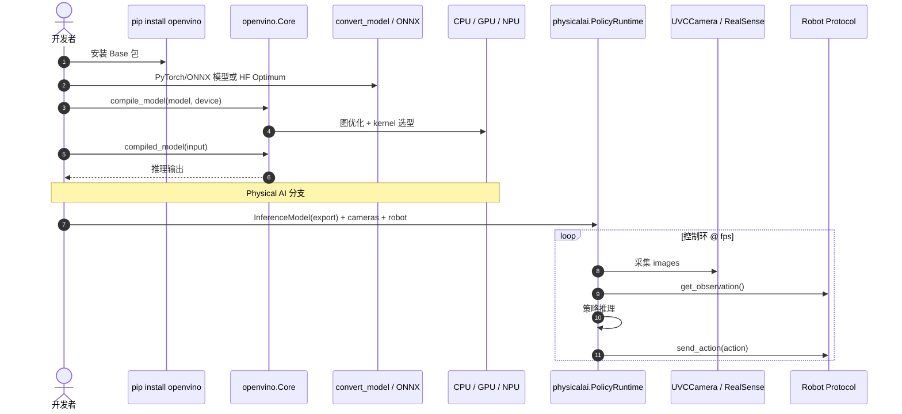

# OpenVINO

**OpenVINO**（Open Visual Inference and Neural network Optimization）是 **Intel** 开源的 **AI 推理优化与部署工具包**（Apache 2.0），面向 **云、AI PC、边端与 Physical AI（机器人等）**。它将 **ONNX、PyTorch、TensorFlow、PaddlePaddle、JAX/Flax、TFLite** 等模型 **转换或直连** 为 OpenVINO 表示，在 **Intel CPU / GPU / NPU**（及 ARM CPU）上执行硬件加速推理，并通过 **NNCF** 做压缩。**2026.3** 文档将产品线拆为 **Base / GenAI / Physical AI / Model Server** 四条线；其中 **OpenVINO Physical AI** 提供相机 + 机器人 + VLA 策略的 **统一部署运行时**，并与 [LeRobot](./lerobot.md) 导出链对齐。OpenVINO 也是 [ONNX Runtime](./onnxruntime.md) 的 **OpenVINO Execution Provider** 之一。

## 一句话定义

**Intel 硅上的推理优化栈**：一次开发、多 Intel 设备部署；机器人侧可选 **Physical AI 控制环** 跑 VLA 策略。

## 英文缩写速查

| 缩写 | 英文全称 | 简要说明 |
|------|----------|----------|
| OV | OpenVINO | Intel 开源推理工具包 |
| IR | Intermediate Representation | OpenVINO 内部模型表示 |
| NNCF | Neural Network Compression Framework | 量化/稀疏化压缩工具 |
| OVMS | OpenVINO Model Server | 服务端推理组件 |
| ONNX | Open Neural Network Exchange | 可直接加载或转换的输入格式 |
| ORT | ONNX Runtime | 可通过 OpenVINO EP 调用 |
| VLA | Vision-Language-Action | Physical AI 专章覆盖的机器人策略类型 |
| NPU | Neural Processing Unit | Intel AI Boost 等加速单元 |
| GenAI | Generative AI | OpenVINO GenAI 子产品线 |
| EP | Execution Provider | ORT 中对接硬件后端的插件机制 |

## 为什么重要？

- **Intel 机器人/Physical AI 叙事**：**OpenVINO Physical AI** 提供 `InferenceModel` → `PolicyRuntime` → `Robot` 的标准部署路径，支持 ACT、SmolVLA、PI0.5 等 VLA 架构单参数切换，与纯 Jetson/CUDA 栈形成硬件对照。
- **ORT 生态一环**：同一 `.onnx` 可在 ORT 内注册 **OpenVINO EP**，无需重写应用即可触达 Intel 优化。
- **PC/工控机常见**：无独显或 Intel Arc 的 **开发机、小型工控** 上，OpenVINO 是 ONNX 落地的自然选项。
- **GenAI 扩展**：**OpenVINO GenAI** + Hugging Face **Optimum Intel** 覆盖本地 LLM / 多模态，与机载 VLA 探索相关。
- **感知导出链成熟**：[Ultralytics](./ultralytics.md) 等支持 `export(format="openvino")`，边端视觉在 Intel 上路径清晰。

## 核心结构（2026.3 文档归纳）

### 四大产品线

| 产品线 | 角色 |
|--------|------|
| **OpenVINO Base** | 常规 CV / ASR / 分类检测等推理 |
| **OpenVINO GenAI** | LLM、扩散、多模态生成式管线 |
| **OpenVINO Physical AI** | 机器人 VLA 策略 onboard（[physicalai](https://github.com/openvinotoolkit/physicalai) 运行时） |
| **OpenVINO Model Server** | Kubernetes / 微服务化推理 |

### 运行时机制

1. **模型准备**：`ov.convert_model()` 或直连 ONNX/TF/Paddle；Hugging Face 可用 Optimum Intel 免手动转换。
2. **编译与设备**：`ov.Core().compile_model(model, device)` — 支持 `CPU`、`GPU`、`NPU`；**CPU 先行编译 + 异步切换 GPU/NPU** 降低首帧延迟。
3. **压缩**：NNCF 后训练/训练时量化与稀疏化。
4. **PyTorch 集成**：`torch.compile` OpenVINO 后端；ExecuTorch 亦提供 OpenVINO backend。
5. **服务化**：OVMS 将同一优化栈扩展到服务端。

### 生态子仓（主 README）

- [nncf](https://github.com/openvinotoolkit/nncf) — 压缩
- [openvino.genai](https://github.com/openvinotoolkit/openvino.genai) — GenAI 样例与 API
- [model_server](https://github.com/openvinotoolkit/model_server) — OVMS
- [physicalai](https://github.com/openvinotoolkit/physicalai) — 机器人部署运行时
- [openvino_notebooks](https://github.com/openvinotoolkit/openvino_notebooks) — 教程（YOLOv11、LLM Chatbot、Whisper 等）

## 流程总览（训练产物 → Intel 推理）

**Physical AI 分支（VLA onboard）：**

## 与机器人研究与工程的关系

- **硬件对照**：[TensorRT](./tensorrt.md) 绑定 NVIDIA；OpenVINO 绑定 **Intel**——选型先锁板卡。
- **VLA 部署**：Physical AI 面向 **ACT / SmolVLA / PI0.5** 等；与 [LeRobot](./lerobot.md) 训练导出链衔接，适合 Intel AI PC / 工控机真机 demo。
- **感知 on Intel**：IoT/工控视觉在 Intel CPU+NPU 上常用 OpenVINO；与 [ncnn](./ncnn.md)/[MNN](./mnn.md) 的 ARM 移动路径不同。
- **跨框架**：与 [ONNX](./onnx.md) 标准格式互补；不必替换 PyTorch 训练栈。
- **与人形 WBC 默认栈**：本库人形高频控制文献更多写 **ORT/TRT**；OpenVINO 更常出现在 **Intel 边端感知 / VLA Physical AI** 叙事。

## 常见误区或局限

- **非 Intel 硬件收益有限**：AMD/NVIDIA 独显场景应优先 ORT CUDA/TRT。
- **IR 转换可能有数值差**：须在目标设备上用固定输入回归。
- **Physical AI CLI 仍属 preview**：文档注明 CLI 为计划 API；生产优先 Python `PolicyRuntime`。
- **VLA 生态仍在快速迭代**：架构切换虽「单参数」，但观测 schema 与相机标定仍须按策略包对齐。

## 工程实践

| 项 | 建议 |
|----|------|
| **最短路径（通用推理）** | `pip install -U openvino` → `import openvino as ov` → `convert_model` → `compile_model(..., 'CPU')` |
| **Hugging Face** | `optimum-intel` 加载预优化 OV 模型，免手动 `convert_model` |
| **ORT 集成** | 注册 OpenVINO EP，保留现有 `InferenceSession` 代码 |
| **YOLO 感知** | Ultralytics `model.export(format="openvino")` 或 openvino_notebooks YOLOv11 教程 |
| **VLA 真机** | Studio/LeRobot 导出 → `physicalai` 的 `InferenceModel` + `PolicyRuntime`；实现 Robot 协议 |
| **压缩** | 延迟敏感路径用 NNCF INT8，须代表性校准集 |
| **遥测** | 默认开启；合规环境可 `opt_in_out --opt_out` |

### 源码运行时序（通用推理 vs Physical AI）

- **通用复现**：主仓 README 的 PyTorch `shufflenet` 示例即可验证安装。
- **VLA 复现**：见 [Physical AI Quickstart](https://docs.openvino.ai/2026/physical-ai.html) 与 [physicalai 仓库](https://github.com/openvinotoolkit/physicalai)。

## 关联页面

- [ONNX](./onnx.md)
- [ONNX Runtime](./onnxruntime.md)
- [TensorRT](./tensorrt.md)
- [MNN](./mnn.md)
- [ncnn](./ncnn.md)
- [Ultralytics](./ultralytics.md)
- [LeRobot](./lerobot.md)
- [ONNX Runtime vs MNN vs TensorRT](../comparisons/onnxruntime-vs-mnn-vs-tensorrt.md)

## 参考来源

- [openvinotoolkit/openvino 主仓库](../../sources/repos/openvino.md)
- [OpenVINO 官网与文档门户](../../sources/sites/openvino.md)
- [Intel OpenVINO 官方文档索引](../../sources/repos/openvino-official.md)
- [openvinotoolkit/physicalai 运行时](../../sources/repos/openvino-physicalai.md)

## 推荐继续阅读

- [OpenVINO 文档](https://docs.openvino.ai/)
- [Physical AI 专章](https://docs.openvino.ai/2026/physical-ai.html)
- [openvinotoolkit/openvino](https://github.com/openvinotoolkit/openvino)
- [openvinotoolkit/physicalai](https://github.com/openvinotoolkit/physicalai)
- [OpenVINO Notebooks](https://github.com/openvinotoolkit/openvino_notebooks)
