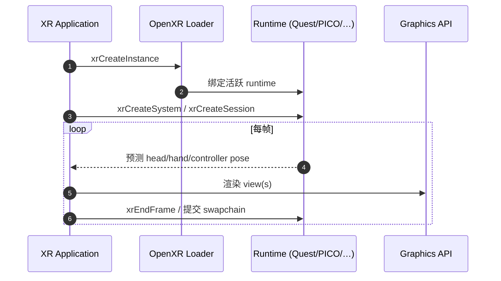

# OpenXR

## 一句话定义

**OpenXR** 是 [Khronos Group](https://www.khronos.org/openxr/) 维护的 **免版税、跨平台 XR（AR/VR）开放标准**：用一套 C API 连接 **应用** 与各厂商 **runtime**，统一访问 HMD、控制器、手/眼/物体/全身追踪、触觉与图形 **view** 提交，减少「每款头显一套私有 SDK」的碎片化。

## 英文缩写速查

| 缩写 | 英文全称 | 简要说明 |
|------|----------|----------|
| OpenXR | Open Extended Reality | 本页标准（开放 XR API） |
| XR | Extended Reality | AR + VR 统称 |
| HMD | Head-Mounted Display | 头戴显示设备 |
| API | Application Programming Interface | 应用调用的 C 函数集合 |
| CTS | Conformance Test Suite | Khronos 一致性测试，认证 Conformant runtime |
| ICD | Installable Client Driver | Loader 加载的厂商 runtime 实现 |

## 为什么重要

- **机器人遥操作与示范采集**：头显侧姿态、手关节、立体视觉回传 increasingly 走 OpenXR 约定（[XRoboToolkit](./paper-xrobotoolkit.md) 以 OpenXR JSON @90 Hz 为窄腰；[Isaac Teleop](./isaac-teleop.md) Device I/O + CloudXR 亦对齐 OpenXR 运行时）。
- **硬件可替换**：同一 PC 中间层可对接 **Meta Quest 3**、**PICO 4 Ultra** 等不同 Conformant runtime，而不重写整套追踪语义。
- **与仿真栈收敛**：Isaac Lab 3.x XR 主线取代旧 `isaaclab.devices.openxr` 分叉，Televiz 合成层使用 **Vulkan + OpenXR + CUDA**（见 Isaac Teleop 实体页）。

## 核心原理

### 角色分层

| 角色 | 职责 |
|------|------|
| **Application** | 游戏/遥操作 Client；调用 `xrCreateInstance` → `xrCreateSession` → 帧循环 |
| **Loader** | Khronos [OpenXR-SDK](../../sources/repos/khronos_openxr_sdk.md) 提供；枚举 runtime、解析扩展、转发 API |
| **Runtime（ICD）** | 厂商实现：Meta、PICO、Valve SteamVR、Collabora **Monado** 等；映射 API 到驱动与合成 |
| **API Layers** | 可选拦截层（调试、性能、重定向） |

### 典型生命周期

一手流程摘要见 [Khronos 门户](../../sources/sites/khronos-openxr.md)「OpenXR for Programmers」。

### 输入与追踪（机器人相关）

| 能力 | 规范/扩展层面 | 机器人栈用法 |
|------|----------------|--------------|
| Head / View pose | Core reference space | 第一人称视角、相机外参 |
| Controller | Interaction profile | 夹爪/臂相对运动遥操作 |
| Hand joints | 常见为 hand tracking **扩展**（实现相关） | 26 关节流 → dex retargeting（XRoboToolkit、PICO 采数） |
| Body / object tracker | 扩展 + 厂商能力 | PICO Motion Tracker 24 点等 **超出** 核心全身模型时需文档化局限 |

**坐标系**：OpenXR 使用 **右手系**；转机器人 URDF / 相机系必须在中间层显式变换，不可假设与 ROS 默认一致。

### OpenXR 1.1

Khronos 将大量 **vendor extensions** 并入 **1.1 core**，降低「功能仅在某扩展存在」的不确定性；新能力仍可通过扩展试验后并入 core（见 [门户说明](../../sources/sites/khronos-openxr.md)）。

## 核心信息

| 字段 | 内容 |
|------|------|
| 机构 | 图形标准工作组（Khronos Group） |
| 类型 | 开放标准 + Loader/SDK |
| 最新主线 | OpenXR 1.1（Registry 随 Khronos 发布迭代） |

## 工程实践

### 开源与一手入口（2026-09-27）

| 组件 | 状态 | 链接 |
|------|------|------|
| 规范 | 公开 | [Registry 1.1 HTML](https://registry.khronos.org/OpenXR/specs/1.1/html/xrspec.html) |
| Loader / SDK | **已开源** Apache-2.0 | [KhronosGroup/OpenXR-SDK](https://github.com/KhronosGroup/OpenXR-SDK) |
| CTS | **已开源** | [OpenXR-CTS](https://github.com/KhronosGroup/OpenXR-CTS) |
| Monado runtime | **已开源** | [collabora/monado](../../sources/repos/collabora_monado.md) |
| Quest / PICO runtime | Conformant，**闭源预装** | 设备系统更新 |

### 选型提示（遥操作 / 采数）

1. **优先 Conformant runtime**：门户列出的 Quest、PICO 4 Ultra、SteamVR 等，减少「API 存在但行为不一致」。
2. **引擎路径**：Unity OpenXR Plugin / Unreal OpenXR — 适合快速 Client；机器人侧常另建 **PC Service** 消费姿态流（见 XRoboToolkit 架构）。
3. **仿真 / NVIDIA**：工作站 [Isaac Teleop](./isaac-teleop.md) + CloudXR 仍属 OpenXR 生态，但与「裸 Quest 直连臂」部署模型不同。
4. **Linux 开发机**：可装 **Monado** 做 API 调试，**不能**替代目标头显 runtime 做最终延迟标定。

### 源码运行时序图

**不适用**（OpenXR 为标准与 Loader/SDK 集合，非单一可运行应用仓库；实现分散在各 vendor runtime 与 Monado。复现入口见 [OpenXR-SDK 示例](https://github.com/KhronosGroup/OpenXR-SDK) HelloXR。）

## 局限与风险

- **扩展碎片化（1.0 遗留）**：手/全身追踪能力仍因 runtime 与扩展支持而异；论文中「OpenXR 无标准全身模型」类结论需按 **目标头显 + 扩展表** 核对。
- **Latency 不在规范内**：OpenXR 定义 API 与 pose 预测接口，**不保证** 端到端遥操作延迟；需单独测量（cf. XRoboToolkit 与 Open-TeleVision 对比）。
- **与 ROS 2 无直接互操作**：姿态流需经中间层（JSON、DDS、shared memory 等）接入控制栈。
- **Cloud / 瘦客户端**：CloudXR 等增加网络与解码环节，标定与采数分布与本地 USB/Wi-Fi 直连不同。

## 关联页面

- [遥操作（任务）](../tasks/teleoperation.md)
- [XRoboToolkit（论文实体）](./paper-xrobotoolkit.md) — OpenXR JSON 中间层实例
- [Isaac Teleop](./isaac-teleop.md) — 仿真/真机 XR 与 CloudXR
- [PICO 4 Ultra 第一人称采数](./pico-4-ultra-egocentric-capture.md) — OpenXR 手/身关节字段

## 参考来源

- [Khronos OpenXR 门户](../../sources/sites/khronos-openxr.md)
- [OpenXR SDK（Loader）](../../sources/repos/khronos_openxr_sdk.md)
- [Monado 开源 runtime](../../sources/repos/collabora_monado.md)

## 推荐继续阅读

- Khronos 门户：<https://www.khronos.org/openxr/>
- 规范：<https://registry.khronos.org/OpenXR/specs/1.1/html/xrspec.html>
- SDK：<https://github.com/KhronosGroup/OpenXR-SDK>
- 教程（Khronos 博客链自门户）：Cross-platform OpenXR on Unity / Unreal / Godot
