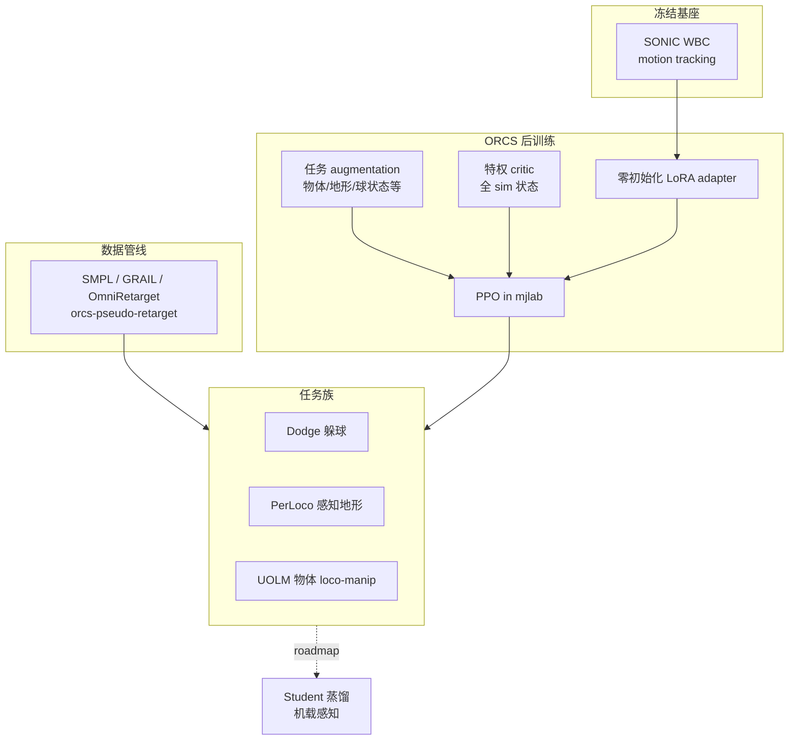
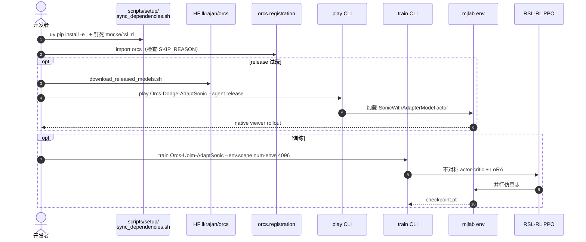

# ORCS（Oracle Robot Control Synthesis）

**ORCS**（*Optimize, Retarget, Control Suite*，[GitHub](https://github.com/lok-i/orcs)，[HF 权重](https://huggingface.co/lkrajan/orcs)）是 USC **Lokesh Krishna** 团队发布的 **任务后训练人形全身控制器工具包**：在 **冻结 [SONIC](../methods/sonic-motion-tracking.md)** 运动跟踪基座上挂 **零初始化 LoRA 适配器**，用 mjlab + RSL-RL PPO 训练 **特权 oracle 策略**（全仿真状态 critic + 任务条件 augmentation），并附带 **SMPL 运动学重定向** 与三类示范任务。工程上为 [ViBe](./paper-vibe.md) 研究线配套；**可部署 student 蒸馏仍在 roadmap**。

## 一句话定义

**先训看得见的 oracle，再（计划）蒸馏给机载感知 student——ORCS 把「在 SONIC 上 LoRA 后训练特权全身任务」做成可 `play` / `train` 的任务包与数据管线。**

## 英文缩写速查

| 缩写 | 英文全称 | 简要说明 |
|------|----------|----------|
| ORCS | Oracle Robot Control Synthesis | 本工具包全称 |
| SONIC | Supersizing Motion Tracking… | 冻结运动跟踪基座（AdaptSonic 任务） |
| LoRA | Low-Rank Adaptation | 任务适配器；零初始化时应复现基座 |
| PPO | Proximal Policy Optimization | 默认 on-policy 训练算法 |
| UOLM | Uni-Object Loco-Manipulation | 全向物体移动操作任务族 |
| PerLoco | Perceptive Locomotion | 地形高度扫描条件感知 locomotion |
| SMPL | Skinned Multi-Person Linear Model | 人体运动重定向与 seed 状态来源 |

## 为什么重要

- **特权训练的可复现样板：** `docs/ethos.md` 把「全 sim 状态 oracle」与「机载 student」拆开；当前 release 覆盖 **oracle 阶段 + LoRA 适配**，比纯博客叙事更可核对。
- **SONIC 后训练入口：** 官方 [GR00T-WholeBodyControl](./gr00t-wholebodycontrol.md) 侧重 SONIC 预训练与部署；ORCS 补 **任务级 adapter 后训练**（躲球、感知地形、物体 loco-manip）。
- **与 ViBe 分工：** ViBe 论文讲 **视觉后训练**；ORCS 已开源 **特权控制与重定向栈**，视觉模块与 oracle→student 蒸馏 **尚未随仓发布**。

## 核心信息

| 项 | 内容 |
|----|------|
| **机构** | 南加州大学（USC） |
| **代码** | [lok-i/orcs](https://github.com/lok-i/orcs) — **BSD-3-Clause** |
| **权重** | [lkrajan/orcs](https://huggingface.co/lkrajan/orcs) `v0.1.0`（含 SONIC 权重；**NVIDIA Open Model License**） |
| **仿真** | mjlab 1.4 + MuJoCo 3.8；Python **≥3.11** |
| **机器人** | Unitree G1 形态（任务资产与 SONIC 契约） |
| **开源边界** | **已开源** 代码 + 4 个 release checkpoint；ViBe 视觉与 student 蒸馏 **未发布** |

## 流程总览

## 核心原理

### 1. Adapt, don't retrain

- 每个任务在构造时 **bit-exact** 复现冻结 SONIC（`play <task> --agent initial` 可验）。
- PPO 只更新 **LoRA adapter**；`policy` / `tokenizer` 通道保持 SONIC 契约。

### 2. 特权放在哪里

| 流 | 内容 | 部署时 |
|----|------|--------|
| Actor 输入 | proprio history + **任务 augmentation**（物体/地形/球） | augmentation 在真机需感知替代（roadmap） |
| Critic | **全仿真状态** | 不部署 |
| 参考 | future reference window（tokenizer） | 冻结 SONIC 契约 |

### 3. 任务一览

| 任务 ID | 场景 | 数据源 |
|---------|------|--------|
| `Orcs-Dodge-AdaptSonic` | 全身躲球 | 生成 nominal stand（**无外部运动集**） |
| `Orcs-PerLoco-*-AdaptSonic` | 地形高度扫描 locomotion | GRAIL / OmniRetarget |
| `Orcs-Uolm-AdaptSonic` | 物体 loco-manipulation | 重建人体-物体运动 |
| `*-Smpl` 变体 | SMPL command space | `orcs-pseudo-retarget` seed |

缺数据时任务 **优雅跳过**：检查 `orcs.SKIP_REASON`。

## 源码运行时序图

## 工程实践

| 项 | 要点 |
|----|------|
| **安装顺序** | `sync_dependencies.sh` 必须 **最后** 执行，否则 PyPI 会覆盖 `mocke`/`rsl_rl` fork → `SonicWithAdapterModel` 丢失 |
| **快速试玩** | `play Orcs-Dodge-AdaptSonic --agent release --viewer native`（无需 PerLoco 数据） |
| **PerLoco** | `uv pip install -e ".[perloco]"` + `perceptive_locomotion.sh`；需 **SMPL-X 许可** 模型 |
| **路径** | `ORCS_DATA_ROOT` / `ORCS_DEPS_ROOT` / `ORCS_RELEASE_ROOT` 覆盖数据与 HF 缓存 |
| **许可** | 代码 BSD-3；**公开发布 ckpt 含 SONIC → NVIDIA Open Model License** |

## 局限与风险

- **非端到端 ViBe：** 视觉后训练与 **oracle→student 蒸馏未发布**；勿把 ORCS 等同于论文全部能力。
- **特权依赖仿真：** 任务 augmentation 在真机需感知栈；当前 release 是 **sim oracle**。
- **依赖脆弱：** `mocke`/`rsl_rl` 可编辑 fork 与 mjlab 版本钉死；混装其他包易坏环境。
- **硬件验证：** README 要求仿真验证后再上真机；公开发布 ckpt 为 **特殊用途控制模型**。

## 关联页面

- [ViBe（论文实体）](./paper-vibe.md) — 研究出处与视觉后训练叙事
- [SONIC（规模化运动跟踪）](../methods/sonic-motion-tracking.md) — 冻结基座
- [Privileged Training](../concepts/privileged-training.md) — 不对称 actor-critic
- [GR00T-WholeBodyControl](./gr00t-wholebodycontrol.md) — 官方 SONIC 训练/部署
- [Whole-Body Control](../concepts/whole-body-control.md)
- [Loco-Manipulation](../tasks/loco-manipulation.md)
- [Unitree G1](./unitree-g1.md)

## 参考来源

- [lok_i_orcs.md](../../sources/repos/lok_i_orcs.md)
- [GitHub lok-i/orcs](https://github.com/lok-i/orcs)
- [HF lkrajan/orcs](https://huggingface.co/lkrajan/orcs)

## 推荐继续阅读

- [ORCS ethos（设计哲学）](https://github.com/lok-i/orcs/blob/main/docs/ethos.md)
- [Perceptive locomotion 设置](https://github.com/lok-i/orcs/blob/main/docs/perceptive_locomotion.md)
- [ViBe arXiv:2609.09918](https://arxiv.org/abs/2609.09918)
