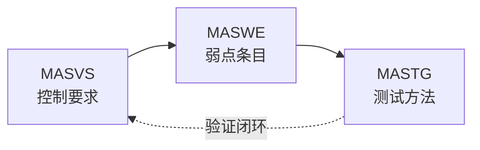

# OWASP MAS（Mobile Application Security）

## 一句话定义

**OWASP Mobile Application Security (MAS)** 是 OWASP 旗舰项目，用 **MASVS**（该满足哪些控制）、**MASWE**（常见弱点是什么）和 **MASTG**（如何一致地测出来）定义移动应用安全的行业默认语言。

## 英文缩写速查

| 缩写 | 英文全称 | 简要说明 |
|------|----------|----------|
| MAS | Mobile Application Security | OWASP 移动安全旗舰项目总称 |
| MASVS | Mobile Application Security Verification Standard | 移动应用安全验证标准 |
| MASTG | Mobile Application Security Testing Guide | 移动应用安全测试指南 |
| MASWE | Mobile Application Security Weakness Enumeration | 移动应用安全弱点枚举 |
| OWASP | Open Web Application Security Project | 开放 Web 应用安全项目（基金会） |
| ASVS | Application Security Verification Standard | OWASP **通用**应用验证标准（非移动专用） |

## 为什么重要

- 机器人 / 具身产品普遍有 **手机端**：遥操作、设备配网、地图与任务、账号与家庭共享；攻击面在 **本地存储、平台 API、证书钉扎、逆向篡改**，不能只用服务端 [软件安全基础](../concepts/software-security-basics.md) 覆盖。
- **MASVS** 被平台与政府机构广泛引用，适合作为 App 安全评审、渗透测试范围与合规对照的 **检查表**。
- 与 **ASVS** 分工明确：后端与 Web 管理台走 ASVS；**iOS/Android 客户端** 走 MAS。

## 核心原理

三件套关系：

**MASVS 控制组（主干）：**

| ID 前缀 | 关注点 |
|---------|--------|
| MASVS-STORAGE | 静态敏感数据 |
| MASVS-CRYPTO | 密码学用法 |
| MASVS-AUTH | 认证与授权 |
| MASVS-NETWORK | 传输安全 |
| MASVS-PLATFORM | 平台交互与 IPC |
| MASVS-CODE | 安全开发与更新 |
| MASVS-RESILIENCE | 反篡改 / 逆向韧性 |
| MASVS-PRIVACY | 隐私控制 |

一手结构见 [mas.owasp.org 归档](../../sources/sites/owasp-mas.md)。

## 工程实践

### 开源状态（2026-09-29）

| 组件 | 状态 | 入口 |
|------|------|------|
| 文档门户 | 公开 | https://mas.owasp.org/ |
| MASVS | **已开源** | [OWASP/owasp-masvs](https://github.com/OWASP/owasp-masvs) |
| MASTG | **已开源** | [OWASP/owasp-mastg](https://github.com/OWASP/owasp-mastg) |
| MASWE | **已开源** | [OWASP/maswe](https://github.com/OWASP/maswe) |

### 机器人 companion App 落地顺序（建议）

1. **威胁建模**：区分「仅局域网遥操作」与「经公网账号体系」——后者必查 NETWORK + AUTH。
2. **对照 MASVS**：按上表八组做 gap 分析；勿把 Web API 清单直接当移动清单。
3. **测试范围**：用 MASWE 条目排优先级；执行细节跟 MASTG（静/动态分析、存储、网络、平台权限）。
4. **与 OTA 分工**：[模型版本管理与 OTA](../concepts/model-versioning-ota.md) 管 **机载/边缘制品** 验签；App Store / sideload 渠道、内置更新逻辑对照 MASVS-CODE / RESILIENCE。
5. **与 CI AppSec 叠用**：PR 静态扫描（如 [Codex Security](./codex-security.md)）不替代 MASTG 中的 **设备上** 测试。

## 局限与风险

- MAS 针对 **通用移动 App**；深度嵌入式 HMI（纯 Qt 机载屏、无 App Store 形态）只有部分控制组适用。
- RESILIENCE 与 root/jailbreak 检测易误伤合法调试；需在研发版与量产版策略分离。
- 标准迭代快于产品发布周期——锁定评审时注明 **MASVS 版本号**。

## 关联页面

- [软件安全基础](../concepts/software-security-basics.md)
- [边缘–云端协同](../concepts/edge-cloud-robotics.md)
- [模型版本管理与 OTA](../concepts/model-versioning-ota.md)
- [系统工程 Hub](../overview/hub-systems-engineering.md)

## 参考来源

- [OWASP MAS 门户归档](../../sources/sites/owasp-mas.md)
- [owasp-masvs 仓库归档](../../sources/repos/owasp-masvs.md)
- [owasp-mastg 仓库归档](../../sources/repos/owasp-mastg.md)
- [owasp-maswe 仓库归档](../../sources/repos/owasp-maswe.md)

## 推荐继续阅读

- OWASP MAS 门户：<https://mas.owasp.org/>
- MASVS 索引：<https://mas.owasp.org/MASVS/>
- OWASP ASVS（服务端/Web 对照）：<https://owasp.org/www-project-application-security-verification-standard/>
